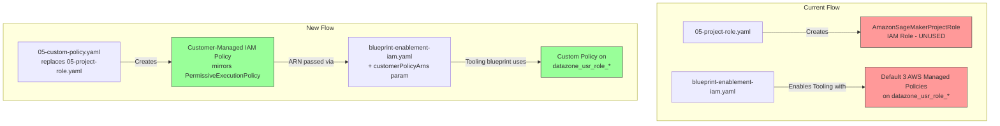
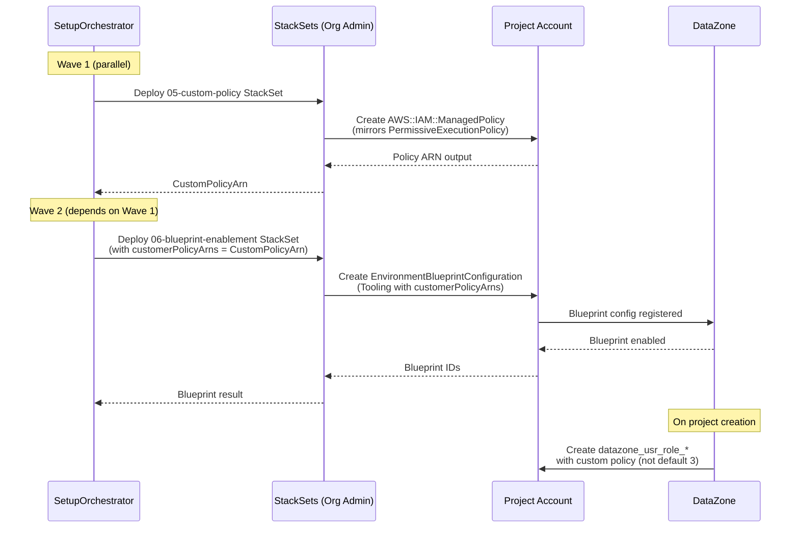
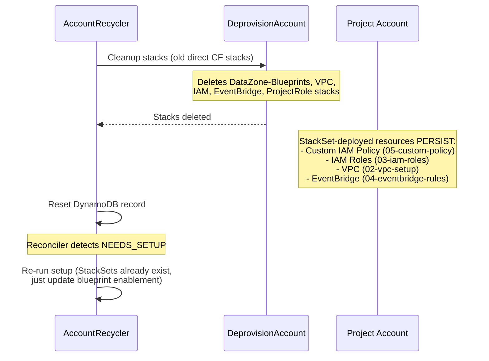

# Design Document: Custom Project Policies

## Overview

The AccountPoolFactory currently deploys an `AmazonSageMakerProjectRole` IAM role in each project account (via `05-project-role.yaml`), but this role is unused. The actual project user roles are `datazone_usr_role_*` roles created by DataZone during project provisioning, and they receive three default AWS managed policies.

This feature replaces the unused IAM role with a customer-managed IAM policy called `MySageMakerStudioAdminIAMPermissiveExecutionPolicy` that mirrors the AWS managed `SageMakerStudioAdminIAMPermissiveExecutionPolicy` (v16, 37 statements). The policy ARN is passed to the Tooling blueprint via the `customerPolicyArns` regional parameter, triggering the `useCustomerProvidedManagedPolicies` condition in the DataZone blueprint template. This makes the `datazone_usr_role_*` roles use our custom policy instead of the three defaults — giving us full control to customize permissions later.

The change touches both deployment paths (standalone deploy and StackSet-driven) and must be backward-compatible with the account recycler flow.

## Validated Assumptions

The following were validated against live AWS accounts during design:

1. **Blueprint template supports `customerPolicyArns`**: Confirmed in the Tooling blueprint template (`DataZone-Amazon-SageMaker-ToolingDefault-prod-20260225.template.json`):
   - Parameter `customerPolicyArns` (Type: String, Default: "") at line 421
   - Condition `useCustomerProvidedManagedPolicies` (true when `customerPolicyArns != ""`) at line 865
   - When true: `ManagedPolicyArns` on `datazone_usr_role_*` = `Fn::Split(",", customerPolicyArns)` at line 1931
   - When false: default three policies (`SageMakerStudioProjectUserRolePolicy`, `SageMakerStudioProjectRoleMachineLearningPolicy`, `SageMakerStudioBedrockKnowledgeBaseServiceRolePolicy`)

2. **DataZone API accepts `customerPolicyArns` as a regional parameter**: Tested via `put-environment-blueprint-configuration` on domain `dzd-4h7jbz76qckoh5` — the API accepted the parameter and returned it in the response.

3. **Current `datazone_usr_role_*` policies confirmed**: Checked role `datazone_usr_role_65shd8xgbi4d61_cg7uecsp1k6wmh` in account `451721889570` — has the three default policies, no inline policies.

4. **Current `AmazonSageMakerProjectRole` confirmed unused**: Deployed in project accounts via StackSet `SMUS-AccountPoolFactory-ProjectRole` with `SageMakerStudioAdminIAMPermissiveExecutionPolicy` attached, but DataZone never references it.

5. **AWS managed policy document fetched**: `SageMakerStudioAdminIAMPermissiveExecutionPolicy` v16 has 37 statements across 22,298 bytes. Key Sids: DataAccess, ComputeAccess, CfnManage, ValidateCfn, GlueSessionIsolation, IamSts, CreateSLR, PassRole, LFAccess, etc.

6. **`EnvironmentBlueprintConfiguration` CF resource passes `RegionalParameters` through**: The existing parameters (VpcId, Subnets, S3Location) in our `blueprint-enablement-iam.yaml` are passed as CF parameters to the blueprint template. Adding `customerPolicyArns` follows the same mechanism.

## Still Needs Validation (Exit Criteria)

The following must be validated during implementation by running an end-to-end test on a real project account:

1. **Create customer-managed policy** `MySageMakerStudioAdminIAMPermissiveExecutionPolicy` in a project account (e.g., `682839842827`) via CloudFormation
2. **Update the Tooling blueprint config** in that account to include `customerPolicyArns` pointing to the new policy ARN
3. **Create a test project** targeting that account via DataZone API
4. **Verify the `datazone_usr_role_*`** created for the project has ONLY `MySageMakerStudioAdminIAMPermissiveExecutionPolicy` (not the default three)
5. **Delete the test project** and clean up

## Architecture



## Sequence Diagrams

### Setup Workflow — New Flow




### Account Recycling — Policy Persistence



## Components and Interfaces

### Component 1: Custom Policy CloudFormation Template (05-custom-policy.yaml)

Replaces `05-project-role.yaml`. Creates a customer-managed IAM policy called `MySageMakerStudioAdminIAMPermissiveExecutionPolicy` instead of an IAM role.

**Interface** (CloudFormation Parameters/Outputs):
```yaml
Parameters:
  PolicyName:
    Type: String
    Default: MySageMakerStudioAdminIAMPermissiveExecutionPolicy
Outputs:
  CustomPolicyArn:
    Value: !Ref CustomProjectPolicy  # AWS::IAM::ManagedPolicy returns ARN
```

**Responsibilities**:
- Create a customer-managed IAM policy with the same permissions as `SageMakerStudioAdminIAMPermissiveExecutionPolicy` (v16, 37 statements)
- Output the policy ARN for consumption by the blueprint enablement template
- Tag with `ManagedBy: AccountPoolFactory` for traceability
- Name makes it clear this is NOT the AWS managed policy (prefix `My`)

### Component 2: Updated Blueprint Enablement Template (blueprint-enablement-iam.yaml)

Modified to accept and pass `customerPolicyArns` to the Tooling blueprint configuration.

**Interface** (new parameter):
```yaml
Parameters:
  CustomerPolicyArns:
    Type: String
    Default: ""
    Description: Comma-separated customer-managed policy ARNs for project user roles

Resources:
  Tooling:
    Properties:
      RegionalParameters:
        - Parameters:
            customerPolicyArns: !Ref CustomerPolicyArns  # NEW
```

**Responsibilities**:
- Accept customer policy ARNs as a parameter
- Pass them through to the Tooling blueprint's `customerPolicyArns` regional parameter
- When non-empty, DataZone's `useCustomerProvidedManagedPolicies` condition activates

### Component 3: Updated SetupOrchestrator (lambda_function.py)

Modified `deploy_project_role` → `deploy_custom_policy` and updated `enable_blueprints` to pass the policy ARN.

**Responsibilities**:
- Deploy the custom policy StackSet instead of the project role StackSet
- Read the `CustomPolicyArn` output from the custom policy stack
- Pass the ARN to `enable_blueprints` which includes it in the blueprint enablement parameters
- Maintain backward compatibility with the `ProjectRoleEnabled` config flag

### Component 4: Updated domain-config.yaml

```yaml
project_policy:
  enabled: true
  policy_name: AccountPoolFactory-ProjectUserPolicy
```

Replaces the old `project_role` section.

## Data Models

### Custom Policy Document

The customer-managed policy `MySageMakerStudioAdminIAMPermissiveExecutionPolicy` is an exact copy of the AWS managed `SageMakerStudioAdminIAMPermissiveExecutionPolicy` (v16). The actual document was fetched via:

```bash
aws iam get-policy-version \
  --policy-arn arn:aws:iam::aws:policy/SageMakerStudioAdminIAMPermissiveExecutionPolicy \
  --version-id v16 --query "PolicyVersion.Document"
```

Key characteristics:
- 37 statements with specific Sids (DataAccess, ComputeAccess, CfnManage, GlueSessionIsolation, IamSts, CreateSLR, PassRole, LFAccess, etc.)
- 22,298 bytes — within the IAM managed policy size limit (6,144 bytes for inline, but managed policies support up to 6,144 characters after whitespace removal)
- Includes Deny statements for session isolation (Glue, Athena)
- Includes conditional KMS grants scoped by ViaService
- The full document must be embedded in the CloudFormation template `05-custom-policy.yaml`

> **IMPORTANT**: The policy document is ~22KB as JSON. IAM managed policies have a 6,144 character limit after whitespace removal. The actual policy may need to be split or the whitespace-stripped version verified to fit. This must be validated during implementation.

### StackSet Naming Convention

| Old | New |
|-----|-----|
| `SMUS-AccountPoolFactory-ProjectRole` | `SMUS-AccountPoolFactory-CustomPolicy` |

### Config Schema Change

```yaml
# OLD
project_role:
  enabled: true
  role_name: AmazonSageMakerProjectRole
  managed_policy_arn: arn:aws:iam::aws:policy/SageMakerStudioAdminIAMPermissiveExecutionPolicy

# NEW
project_policy:
  enabled: true
  policy_name: MySageMakerStudioAdminIAMPermissiveExecutionPolicy
```


## Key Functions with Formal Specifications

### Function 1: deploy_custom_policy()

```python
def deploy_custom_policy(account_id: str, config: Dict[str, Any]) -> Dict[str, Any]:
    """Deploy customer-managed IAM policy via StackSet instance."""
```

**Preconditions:**
- `account_id` is a valid 12-digit AWS account ID
- `config` contains `project_policy.enabled` (bool) and `project_policy.policy_name` (str)
- StackSet `SMUS-AccountPoolFactory-CustomPolicy` exists in the org admin account
- The target account has the StackSet execution role

**Postconditions:**
- If `project_policy.enabled` is false: returns empty dict, no resources created
- If enabled: a customer-managed IAM policy exists in the target account
- Return dict contains `customPolicyArn` key with the policy ARN value
- The policy document matches `SageMakerStudioAdminIAMPermissiveExecutionPolicy`

**Loop Invariants:** N/A (no loops)

### Function 2: enable_blueprints() — updated signature

```python
def enable_blueprints(account_id: str, config: Dict[str, Any], iam_result: Dict[str, Any],
                      vpc_result: Dict[str, Any] = None, s3_result: Dict[str, Any] = None,
                      custom_policy_result: Dict[str, Any] = None) -> Dict[str, Any]:
    """Enable DataZone blueprints via StackSet instance, with optional custom policy ARNs."""
```

**Preconditions:**
- `iam_result` contains `manageAccessRoleArn` and `provisioningRoleArn`
- If `custom_policy_result` is provided, it contains `customPolicyArn` (a valid IAM policy ARN)
- The Tooling blueprint template supports the `customerPolicyArns` parameter

**Postconditions:**
- Blueprint enablement StackSet instance is deployed with `CustomerPolicyArns` parameter
- If `customPolicyArn` is provided: `CustomerPolicyArns` = the ARN string
- If not provided: `CustomerPolicyArns` = "" (empty, default behavior)
- All blueprint configurations are created/updated successfully

**Loop Invariants:**
- For retry loop: each attempt either succeeds or cleans up the failed instance before retrying

## Algorithmic Pseudocode

### Setup Workflow — Updated Wave 1

```python
# Wave 1: Foundation (all parallel)
vpc_result, iam_result, custom_policy_result, eb_result, s3_result, ram_result = \
    execute_wave_parallel([
        lambda: deploy_vpc(account_id, config),
        lambda: deploy_iam_roles(account_id, config),
        lambda: deploy_custom_policy(account_id, config),      # CHANGED: was deploy_project_role
        lambda: deploy_eventbridge_rules(account_id, config),
        lambda: create_s3_bucket(account_id, config),
        lambda: create_ram_share_and_verify_domain(account_id, config)
    ])

# Wave 2: Blueprint Enablement — now passes custom policy ARN
bp_result = enable_blueprints(
    account_id, config, iam_result, vpc_result, s3_result,
    custom_policy_result=custom_policy_result                   # NEW parameter
)
```

### deploy_custom_policy Algorithm

```python
def deploy_custom_policy(account_id, config):
    # Check if feature is enabled
    enabled = config.get('ProjectPolicyEnabled', 'true').lower()
    if enabled != 'true':
        return {}

    policy_name = config.get('ProjectPolicyName', 'MySageMakerStudioAdminIAMPermissiveExecutionPolicy')

    stackset_name = 'SMUS-AccountPoolFactory-CustomPolicy'
    params = [
        {'ParameterKey': 'PolicyName', 'ParameterValue': policy_name},
    ]

    org_cf = _get_org_cf_client()
    op_id = _add_stackset_instance(org_cf, stackset_name, account_id, params)
    if op_id != 'ALREADY_EXISTS':
        _wait_stackset_operation(org_cf, stackset_name, op_id)

    outputs = _read_stack_outputs(account_id, stackset_name)
    return {'customPolicyArn': outputs.get('CustomPolicyArn', '')}
```

### enable_blueprints — Updated Parameter Construction

```python
def enable_blueprints(account_id, config, iam_result, vpc_result=None,
                      s3_result=None, custom_policy_result=None):
    # ... existing parameter construction ...

    # NEW: Add customer policy ARNs if available
    customer_policy_arns = (custom_policy_result or {}).get('customPolicyArn', '')

    params = [
        # ... existing params ...
        {'ParameterKey': 'CustomerPolicyArns', 'ParameterValue': customer_policy_arns},  # NEW
    ]

    # ... rest of existing logic unchanged ...
```

## Example Usage

### CloudFormation Template: 05-custom-policy.yaml

```yaml
AWSTemplateFormatVersion: '2010-09-09'
Description: 'Customer-managed IAM policy for DataZone project user roles v1'

Parameters:
  PolicyName:
    Type: String
    Default: MySageMakerStudioAdminIAMPermissiveExecutionPolicy
    Description: Name of the customer-managed policy (NOT the AWS managed one)

Resources:
  CustomProjectPolicy:
    Type: AWS::IAM::ManagedPolicy
    Properties:
      ManagedPolicyName: !Ref PolicyName
      Description: >-
        Customer-managed policy mirroring AWS managed SageMakerStudioAdminIAMPermissiveExecutionPolicy (v16).
        Attached to datazone_usr_role_* via Tooling blueprint customerPolicyArns parameter.
      PolicyDocument:
        # Full 37-statement document from:
        # aws iam get-policy-version --policy-arn arn:aws:iam::aws:policy/SageMakerStudioAdminIAMPermissiveExecutionPolicy --version-id v16
        Version: '2012-10-17'
        Statement:
          # ... all 37 statements from the AWS managed policy ...
      Tags:
        - Key: ManagedBy
          Value: AccountPoolFactory
        - Key: MirroredFrom
          Value: arn:aws:iam::aws:policy/SageMakerStudioAdminIAMPermissiveExecutionPolicy
        - Key: MirroredVersion
          Value: v16

Outputs:
  TemplateVersion:
    Description: Template version
    Value: "1"
  CustomPolicyArn:
    Description: ARN of the customer-managed policy
    Value: !Ref CustomProjectPolicy
```

### Blueprint Enablement — Tooling Resource with customerPolicyArns

```yaml
  Tooling:
    Type: AWS::DataZone::EnvironmentBlueprintConfiguration
    Properties:
      DomainIdentifier: !Ref DomainId
      EnvironmentBlueprintIdentifier: "Tooling"
      ManageAccessRoleArn: !Ref ManageAccessRoleArn
      ProvisioningRoleArn: !Ref ProvisioningRoleArn
      RegionalParameters:
        - Region: !Ref 'AWS::Region'
          Parameters:
            VpcId: !Ref VpcId
            Subnets: !Ref SubnetIds
            S3Location: !Ref S3BucketName
            customerPolicyArns: !Ref CustomerPolicyArns  # NEW
      EnabledRegions:
        - !Ref 'AWS::Region'
```


## Correctness Properties

*A property is a characteristic or behavior that should hold true across all valid executions of a system — essentially, a formal statement about what the system should do. Properties serve as the bridge between human-readable specifications and machine-verifiable correctness guarantees.*

### Property 1: Blueprint parameter propagation

*For any* custom policy ARN string (empty or non-empty), the `CustomerPolicyArns` parameter passed to the BlueprintEnablement StackSet SHALL equal the `customPolicyArn` value from the custom policy deployment result — non-empty ARNs are passed through verbatim, and absent/empty results produce an empty string.

**Validates: Requirements 2.1, 2.3, 3.3, 4.2**

### Property 2: Feature toggle disablement

*For any* configuration where `project_policy.enabled` is false, calling `deploy_custom_policy` SHALL return an empty dict and SHALL NOT create any StackSet instances or IAM resources.

**Validates: Requirements 4.1**

### Property 3: Recycler stack deletion filtering

*For any* CloudFormation stack in a project account, the AccountRecycler SHALL delete the stack only if its name starts with `DataZone-`. All other stacks (including StackSet-managed resources like the CustomPolicy) SHALL be preserved.

**Validates: Requirements 5.1**

### Property 4: Deployment failure halts workflow

*For any* StackSet instance deployment failure during Wave 1 (including CustomPolicy deployment), the SetupOrchestrator SHALL mark the account as FAILED and SHALL NOT proceed to Wave 2 (blueprint enablement).

**Validates: Requirements 7.1**

## Error Handling

### Error Scenario 1: Custom Policy StackSet Deployment Failure

**Condition**: The `SMUS-AccountPoolFactory-CustomPolicy` StackSet instance fails to deploy (e.g., policy name conflict, IAM limits)
**Response**: `deploy_custom_policy` raises an exception, Wave 1 fails, account marked as FAILED
**Recovery**: Recycler's `handle_failed` retries the full setup workflow. The StackSet instance is cleaned up before retry.

### Error Scenario 2: Blueprint Enablement with Empty customerPolicyArns

**Condition**: Custom policy deployment fails but blueprint enablement proceeds with empty ARN
**Response**: This is actually safe — empty `customerPolicyArns` means the `useCustomerProvidedManagedPolicies` condition is false, and default policies apply. However, this is not the desired state.
**Recovery**: The setup workflow is designed so Wave 2 (blueprints) only runs after Wave 1 (custom policy) succeeds. If Wave 1 fails, Wave 2 never executes.

### Error Scenario 3: Policy Document Drift

**Condition**: AWS updates `SageMakerStudioAdminIAMPermissiveExecutionPolicy` but our customer-managed copy is stale
**Response**: This is expected and actually a benefit — we control when to adopt changes
**Recovery**: Manual template update and StackSet redeployment when desired

### Error Scenario 4: Migration — Old ProjectRole StackSet Still Exists

**Condition**: Existing accounts have the old `SMUS-AccountPoolFactory-ProjectRole` StackSet instance
**Response**: The old role continues to exist but is unused. The new custom policy is deployed alongside it.
**Recovery**: A one-time migration script deletes old StackSet instances across all accounts. This is a separate operational task, not part of the automated flow.

## Exit Criteria and Validation Plan

The feature is complete when the following end-to-end test passes on a real project account.

### Test Account: `682839842827` (AVAILABLE, has blueprints enabled)

### Step-by-Step Validation

#### Step 1: Create the customer-managed policy
```bash
# Assume into project account from org admin
eval $(isengardcli credentials amirbo+1@amazon.com)
# Deploy 05-custom-policy.yaml via CF in account 682839842827
# Verify:
aws iam get-policy --policy-arn arn:aws:iam::682839842827:policy/MySageMakerStudioAdminIAMPermissiveExecutionPolicy
# Expected: policy exists, version v1
```

#### Step 2: Verify policy document matches AWS managed policy
```bash
# Fetch our custom policy document
aws iam get-policy-version --policy-arn arn:aws:iam::682839842827:policy/MySageMakerStudioAdminIAMPermissiveExecutionPolicy --version-id v1 --query "PolicyVersion.Document" > /tmp/custom.json
# Fetch AWS managed policy document
aws iam get-policy-version --policy-arn arn:aws:iam::aws:policy/SageMakerStudioAdminIAMPermissiveExecutionPolicy --version-id v16 --query "PolicyVersion.Document" > /tmp/aws-managed.json
# Diff — must be identical
diff /tmp/custom.json /tmp/aws-managed.json
# Expected: no differences
```

#### Step 3: Update Tooling blueprint config with customerPolicyArns
```bash
# Update the blueprint enablement CF stack in account 682839842827
# to add customerPolicyArns regional parameter pointing to our policy ARN
# Verify the Tooling EnvironmentBlueprintConfiguration has the parameter:
aws cloudformation describe-stacks --stack-name "StackSet-SMUS-AccountPoolFactory-BlueprintEnablement-..." --query "Stacks[0].Parameters"
# Expected: CustomerPolicyArns parameter present with our policy ARN
```

#### Step 4: Create a test project and verify the user role
```bash
# From domain account, create a test project targeting account 682839842827
eval $(isengardcli credentials amirbo+3@amazon.com)
aws datazone create-project --domain-identifier dzd-4h7jbz76qckoh5 --name "test-custom-policy" ...
# Wait for project provisioning to complete
# Then assume into project account and find the datazone_usr_role_*:
aws iam list-roles --query "Roles[?starts_with(RoleName,'datazone_usr_role_')]"
# Check its policies:
aws iam list-attached-role-policies --role-name <datazone_usr_role_name>
```
**EXIT CRITERIA**: The `datazone_usr_role_*` has ONLY `MySageMakerStudioAdminIAMPermissiveExecutionPolicy` attached — NOT the default three policies (`SageMakerStudioProjectUserRolePolicy`, `SageMakerStudioProjectRoleMachineLearningPolicy`, `SageMakerStudioBedrockKnowledgeBaseServiceRolePolicy`).

#### Step 5: Cleanup
```bash
# Delete the test project
aws datazone delete-project --domain-identifier dzd-4h7jbz76qckoh5 --identifier <project-id>
```

### Failure Modes to Watch For

1. **Policy too large**: IAM managed policies have a 6,144 character limit (after whitespace removal). The 22KB JSON may exceed this. If so, we need to split into multiple policies and pass comma-separated ARNs.
2. **`customerPolicyArns` not propagated**: The `EnvironmentBlueprintConfiguration` CF resource may not pass arbitrary regional parameters to the blueprint template. If the parameter is silently dropped, the default three policies will still be used.
3. **Blueprint template version mismatch**: The `customerPolicyArns` parameter may not exist in the version of the Tooling blueprint deployed in our region. Need to verify the blueprint template version supports it.

### Testing Strategy (Code Changes)

#### Unit Tests
- Test `deploy_custom_policy` with mocked StackSet operations (success, already exists, failure)
- Test `enable_blueprints` parameter construction with and without `custom_policy_result`
- Test config parsing for new `project_policy` section
- Test backward compatibility when `project_policy.enabled` is false

#### Integration Tests (automated via scripts)
- Script to deploy `05-custom-policy.yaml` to a test account and verify policy creation
- Script to update blueprint enablement and verify `customerPolicyArns` is set
- Script to create a project and verify `datazone_usr_role_*` policies

## Performance Considerations

- No performance impact. The custom policy StackSet deploys in parallel with other Wave 1 tasks.
- The blueprint enablement adds one more parameter but does not change deployment time.
- StackSet operations are already the bottleneck; adding one parameter to an existing StackSet does not increase latency.

## Security Considerations

- The customer-managed policy should be reviewed before deployment — it mirrors a permissive AWS managed policy (`*` actions on `*` resources for many services)
- Future iterations can tighten this policy since we now control it
- The policy is account-scoped (deployed per project account), not cross-account
- IAM policy changes via CloudFormation are auditable through CloudTrail

## Dependencies

- **AWS Managed Policy**: `arn:aws:iam::aws:policy/SageMakerStudioAdminIAMPermissiveExecutionPolicy` — must fetch current version before implementation
- **DataZone Blueprint Template**: The Tooling blueprint must support the `customerPolicyArns` parameter and `useCustomerProvidedManagedPolicies` condition (confirmed from investigation)
- **StackSet Infrastructure**: A new StackSet `SMUS-AccountPoolFactory-CustomPolicy` must be created in the org admin account before the orchestrator can deploy instances
- **Existing StackSets**: The `SMUS-AccountPoolFactory-BlueprintEnablement` StackSet template must be updated to include the `CustomerPolicyArns` parameter
