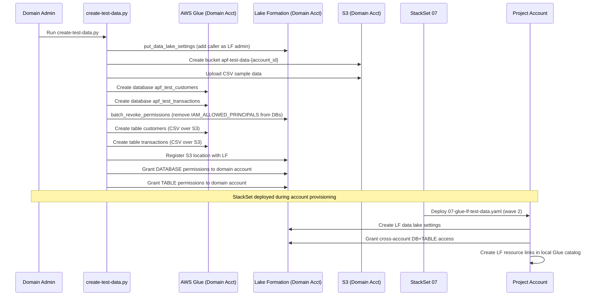

# Design Document: Glue/Lake Formation Test Data Infrastructure

## Overview

Create a testing infrastructure that provisions sample Glue databases and tables with minimal test data (3-5 rows per table) in the domain account (994753223772), registers them in Lake Formation, and shares them to project accounts via a new StackSet template. This StackSet runs in wave 2, alongside VPC/IAM/EventBridge templates — its only real dependency is the wave 1 domain-access role.

## Main Algorithm/Workflow



## Core Interfaces/Types

```python
# === Script: create-test-data.py ===
# Run in domain account (994753223772) to create Glue databases, tables, and sample data

# Configuration
REGION = "us-east-2"
DOMAIN_ACCOUNT_ID = "994753223772"
BUCKET_PREFIX = "apf-test-data"

# Test databases to create
DATABASES = {
    "apf_test_customers": "Sample customer data for testing Lake Formation sharing",
    "apf_test_transactions": "Sample transaction data for testing Lake Formation sharing",
}

# Table definitions
TABLES = {
    "apf_test_customers": {
        "customers": {
            "columns": [
                {"Name": "customer_id", "Type": "string"},
                {"Name": "name", "Type": "string"},
                {"Name": "email", "Type": "string"},
                {"Name": "city", "Type": "string"},
                {"Name": "signup_date", "Type": "string"},
            ],
            "input_format": "org.apache.hadoop.mapred.TextInputFormat",
            "output_format": "org.apache.hadoop.hive.ql.io.HiveIgnoreKeyTextOutputFormat",
            "serde": "org.apache.hadoop.hive.serde2.lazy.LazySimpleSerDe",
            "serde_params": {"field.delim": ",", "skip.header.line.count": "1"},
        }
    },
    "apf_test_transactions": {
        "transactions": {
            "columns": [
                {"Name": "transaction_id", "Type": "string"},
                {"Name": "customer_id", "Type": "string"},
                {"Name": "amount", "Type": "double"},
                {"Name": "currency", "Type": "string"},
                {"Name": "transaction_date", "Type": "string"},
            ],
            "input_format": "org.apache.hadoop.mapred.TextInputFormat",
            "output_format": "org.apache.hadoop.hive.ql.io.HiveIgnoreKeyTextOutputFormat",
            "serde": "org.apache.hadoop.hive.serde2.lazy.LazySimpleSerDe",
            "serde_params": {"field.delim": ",", "skip.header.line.count": "1"},
        }
    },
}
```

## Key Functions with Formal Specifications

### Function 1: create_s3_bucket_and_data(s3_client, bucket_name, region)

```python
def create_s3_bucket_and_data(s3_client, bucket_name: str, region: str) -> str:
    """Create S3 bucket and upload sample CSV data files."""
    ...
```

**Preconditions:**
- `s3_client` is a valid boto3 S3 client with write permissions in the domain account
- `region` is a valid AWS region string
- Caller has `s3:CreateBucket`, `s3:PutObject` permissions

**Postconditions:**
- S3 bucket `bucket_name` exists in `region`
- `s3://{bucket_name}/customers/customers.csv` contains 3-5 sample customer rows
- `s3://{bucket_name}/transactions/transactions.csv` contains 3-5 sample transaction rows
- Returns the bucket name

### Function 2: create_glue_databases(glue_client, databases)

```python
def create_glue_databases(glue_client, databases: dict) -> list:
    """Create Glue databases. Idempotent — skips if already exists."""
    ...
```

**Preconditions:**
- `glue_client` is a valid boto3 Glue client in the domain account
- `databases` is a dict of `{db_name: description}`
- Caller has `glue:CreateDatabase` permission

**Postconditions:**
- All databases in `databases` exist in the Glue catalog
- Returns list of created database names
- Existing databases are not modified (idempotent)

### Function 3: create_glue_tables(glue_client, tables, bucket_name)

```python
def create_glue_tables(glue_client, tables: dict, bucket_name: str) -> list:
    """Create Glue tables pointing to S3 CSV data. Idempotent."""
    ...
```

**Preconditions:**
- `glue_client` is a valid boto3 Glue client in the domain account
- `tables` dict maps `{db_name: {table_name: table_def}}`
- S3 bucket `bucket_name` exists with data at expected paths
- Caller has `glue:CreateTable` permission

**Postconditions:**
- All tables exist in their respective databases
- Each table's `StorageDescriptor.Location` points to `s3://{bucket_name}/{table_name}/`
- Returns list of `(db_name, table_name)` tuples
- Existing tables are not modified (idempotent)

### Function 4: register_lakeformation(lf_client, bucket_name, account_id)

```python
def register_lakeformation(lf_client, bucket_name: str, account_id: str) -> None:
    """Register S3 location with Lake Formation and grant permissions."""
    ...
```

**Preconditions:**
- `lf_client` is a valid boto3 Lake Formation client in the domain account
- S3 bucket `bucket_name` exists
- Lake Formation service-linked role exists in the domain account
- Caller has `lakeformation:RegisterResource`, `lakeformation:GrantPermissions`

**Postconditions:**
- S3 location `s3://{bucket_name}` is registered as a Lake Formation resource
- Domain account has `ALL` permissions on all databases and tables
- Lake Formation is the authority for access control on the registered location

### Function 5: setup_lf_admin(lf_client, sts_client)

```python
def setup_lf_admin(lf_client, sts_client) -> str:
    """Add the caller's IAM role as a Lake Formation data lake administrator.
    Must be called BEFORE creating databases so LF-only access control works."""
    ...
```

**Preconditions:**
- `lf_client` is a valid boto3 Lake Formation client in the domain account
- `sts_client` is a valid boto3 STS client
- Caller has `lakeformation:PutDataLakeSettings`, `lakeformation:GetDataLakeSettings`

**Postconditions:**
- The caller's IAM role ARN is listed as a DataLakeAdmin in `get_data_lake_settings()`
- Existing data lake admins are preserved (additive, not replacement)
- Returns the caller's role ARN

### Function 6: revoke_iam_allowed_principals(lf_client, databases)

```python
def revoke_iam_allowed_principals(lf_client, databases: dict) -> None:
    """Remove IAM_ALLOWED_PRINCIPALS from all databases.
    By default, Glue databases have IAM_ALLOWED_PRINCIPALS which bypasses
    Lake Formation permissions entirely. This must be revoked so LF-only
    access control works for cross-account sharing."""
    ...
```

**Preconditions:**
- `lf_client` is a valid boto3 Lake Formation client in the domain account
- All databases in `databases` exist in the Glue catalog
- Caller is a Lake Formation admin (via `setup_lf_admin`)
- Caller has `lakeformation:BatchRevokePermissions`

**Postconditions:**
- `IAM_ALLOWED_PRINCIPALS` no longer has `ALL` permission on any database in `databases`
- Lake Formation is the sole authority for access control on these databases
- Idempotent — safe to re-run if IAM_ALLOWED_PRINCIPALS was already revoked

### Function 7: grant_cross_account_permissions(lf_client, target_account_id, databases)

```python
def grant_cross_account_permissions(lf_client, target_account_id: str, databases: dict) -> None:
    """Grant Lake Formation cross-account permissions to a project account.
    Called by the StackSet Custom Resource in the project account."""
    ...
```

**Preconditions:**
- `lf_client` is a valid Lake Formation client in the domain account
- `target_account_id` is a valid 12-digit AWS account ID
- All databases in `databases` exist in the domain account Glue catalog
- Caller has `lakeformation:GrantPermissions` with grant option

**Postconditions:**
- `target_account_id` has `DESCRIBE` on each database
- `target_account_id` has `SELECT`, `DESCRIBE` on all tables in each database
- Permissions are grantable (WITH GRANT OPTION) so the project account can further delegate

### Function 8: verify_athena_shared_data(dz_client, athena_client, domain_id, connection_id)

```python
def verify_athena_shared_data(
    dz_client, athena_client, domain_id: str, connection_id: str
) -> bool:
    """Verify shared Glue/LF databases are visible and queryable via Athena.
    Used in e2e test after deployment completes and before project deletion."""
    ...
```

**Preconditions:**
- `dz_client` is a valid boto3 DataZone client in the domain account
- `athena_client` is a valid boto3 Athena client
- `connection_id` is a valid DataZone Athena connection in the project
- Deployment has completed (StackSet 07 deployed to project account)

**Postconditions:**
- Returns `True` if all verifications pass
- `SHOW DATABASES` result includes `apf_test_customers` and `apf_test_transactions`
- `SELECT * FROM apf_test_customers.customers LIMIT 5` returns at least 1 row
- Raises or returns `False` if any verification fails

## Algorithmic Pseudocode

### create-test-data.py Main Flow

```python
def main():
    """Main entry point — run in domain account."""
    region = "us-east-2"
    sts = boto3.client("sts", region_name=region)
    account_id = sts.get_caller_identity()["Account"]
    bucket_name = f"apf-test-data-{account_id}"

    s3 = boto3.client("s3", region_name=region)
    glue = boto3.client("glue", region_name=region)
    lf = boto3.client("lakeformation", region_name=region)

    # Step 1: Add caller as Lake Formation admin
    # Must happen BEFORE creating databases so we can control their permissions
    print("Step 1: Setting up Lake Formation admin role...")
    setup_lf_admin(lf, sts)

    # Step 2: Create S3 bucket and upload sample data
    print("Step 2: Creating S3 bucket and uploading sample data...")
    create_s3_bucket_and_data(s3, bucket_name, region)

    # Step 3: Create Glue databases
    print("Step 3: Creating Glue databases...")
    create_glue_databases(glue, DATABASES)

    # Step 4: Revoke IAM_ALLOWED_PRINCIPALS from databases
    # By default Glue databases grant IAM_ALLOWED_PRINCIPALS ALL access,
    # which bypasses Lake Formation permissions. Must revoke so LF-only
    # access control works for cross-account sharing.
    print("Step 4: Revoking IAM_ALLOWED_PRINCIPALS from databases...")
    revoke_iam_allowed_principals(lf, DATABASES)

    # Step 5: Create Glue tables
    print("Step 5: Creating Glue tables...")
    create_glue_tables(glue, TABLES, bucket_name)

    # Step 6: Register with Lake Formation and grant permissions
    print("Step 6: Registering with Lake Formation...")
    register_lakeformation(lf, bucket_name, account_id)

    print("Done! Test data infrastructure is ready.")
    print(f"  Bucket: s3://{bucket_name}")
    print(f"  Databases: {list(DATABASES.keys())}")
```

### StackSet Template 07-glue-lf-test-data.yaml Logic

```python
# CloudFormation StackSet template deployed to each project account (wave 2)
# Runs in parallel with VPC/IAM/EventBridge templates — only depends on wave 1 (domain-access role).
# This template:
#   1. Creates a Lake Formation data lake admin setting for the project account
#   2. Accepts the RAM share from the domain account (handled by existing RAM share flow)
#   3. Creates resource links in the project account's Glue catalog pointing to shared databases
#   4. Grants all IAM principals in the project account read access to the resource links

# Parameters:
#   DomainAccountId: str  — the domain account (994753223772)
#   DomainId: str         — DataZone domain ID

# Resources created in project account:
#   - Glue::Database resource links for each shared database
#   - LakeFormation permissions granting SELECT to all account principals
```

### Deploy Script 07-deploy-test-data.sh Logic

```python
# Bash deploy script — run in domain account after create-test-data.py
# Follows the same pattern as existing deploy scripts:
#   1. Source resolve-config.sh domain
#   2. Call create-test-data.py to set up Glue/LF resources
#   3. The StackSet template is uploaded to S3 by the org admin deploy (01-deploy.sh)
#   4. StackSet instances are created by ProvisionAccount Lambda during account provisioning

# The script only needs to run create-test-data.py since:
#   - StackSet template upload is handled by org admin deploy
#   - StackSet instance creation is handled by ProvisionAccount Lambda
#   - The template is added to 01-org-account/config.yaml stacksets list
```

### E2E Test: Athena Connection Verification (new Step 5b)

Inserted after Step 5 (account reaches ASSIGNED) and after deployment completes,
but before Step 6 (delete project).

```python
def verify_athena_connection(dz, domain_id, project_id):
    """Step 5b: Verify shared Glue/LF data is accessible via Athena connection.
    
    This step validates the end-to-end data sharing pipeline:
    StackSet 07 → LF cross-account grants → resource links → Athena queryable.
    """
    print(f"Step 5b: Verifying Athena connection to shared test data...")

    # 1. Get Athena connection from DataZone
    #    The connection is created by the blueprint enablement (wave 3)
    #    and provides JDBC details + credentials for querying.
    connections = dz.list_connections(
        domainIdentifier=domain_id,
        projectIdentifier=project_id,
        type='ATHENA'
    )
    if not connections.get('items'):
        print(f"  {FAIL} No Athena connections found in project")
        return False

    connection_id = connections['items'][0]['connectionId']
    conn = dz.get_connection(
        domainIdentifier=domain_id,
        identifier=connection_id,
        withSecret=True
    )
    # conn contains: athenaProperties (workgroup, region), authenticationConfiguration

    # 2. Set up Athena client using connection details
    athena = boto3.client('athena', region_name=REGION)
    workgroup = conn.get('props', {}).get('athenaProperties', {}).get('workgroupName', 'primary')

    # 3. Verify shared databases are visible
    print(f"  Running: SHOW DATABASES...")
    query_id = run_athena_query(athena, "SHOW DATABASES", workgroup)
    databases = get_athena_results(athena, query_id)
    db_names = [row[0] for row in databases]

    expected_dbs = ['apf_test_customers', 'apf_test_transactions']
    for db in expected_dbs:
        if db not in db_names:
            print(f"  {FAIL} Expected database '{db}' not found in SHOW DATABASES")
            return False
    print(f"  {PASS} Shared databases visible: {expected_dbs}")

    # 4. Query a table to verify data access
    print(f"  Running: SELECT * FROM apf_test_customers.customers LIMIT 5...")
    query_id = run_athena_query(
        athena,
        "SELECT * FROM apf_test_customers.customers LIMIT 5",
        workgroup
    )
    rows = get_athena_results(athena, query_id)
    if not rows:
        print(f"  {FAIL} No rows returned from customers table")
        return False
    print(f"  {PASS} Query returned {len(rows)} rows")

    print(f"  {PASS} Athena connection verification PASSED")
    return True


def run_athena_query(athena, sql, workgroup, timeout=60):
    """Submit an Athena query and wait for completion."""
    resp = athena.start_query_execution(
        QueryString=sql,
        WorkGroup=workgroup
    )
    query_id = resp['QueryExecutionId']

    start = time.time()
    while time.time() - start < timeout:
        status = athena.get_query_execution(QueryExecutionId=query_id)
        state = status['QueryExecution']['Status']['State']
        if state == 'SUCCEEDED':
            return query_id
        if state in ('FAILED', 'CANCELLED'):
            reason = status['QueryExecution']['Status'].get('StateChangeReason', '')
            raise RuntimeError(f"Athena query {state}: {reason}")
        time.sleep(2)
    raise RuntimeError(f"Athena query timed out after {timeout}s")


def get_athena_results(athena, query_id):
    """Fetch result rows (excluding header) from a completed Athena query."""
    resp = athena.get_query_results(QueryExecutionId=query_id)
    rows = resp['ResultSet']['Rows']
    # First row is the header
    return [
        [col.get('VarCharValue', '') for col in row['Data']]
        for row in rows[1:]
    ]
```

## Deployment Strategy — Phased Rollout

### Phase 1: Domain Account Setup

Script: `02-domain-account/scripts/deploy/06-create-test-data.py`

```bash
# Switch to domain account
eval $(isengardcli credentials amirbo+3@amazon.com)

# Run the test data creation script
./02-domain-account/scripts/deploy/06-create-test-data.py
```

What Phase 1 does (in order):
1. `put_data_lake_settings` — adds the caller's admin role as a Lake Formation administrator
2. Creates S3 bucket and uploads sample CSV data
3. Creates Glue databases (`apf_test_customers`, `apf_test_transactions`)
4. `batch_revoke_permissions` — removes `IAM_ALLOWED_PRINCIPALS` from each database (critical: default Glue behavior grants `IAM_ALLOWED_PRINCIPALS` `ALL` access, which bypasses LF permissions entirely)
5. Creates Glue tables pointing to S3 data
6. Registers S3 location with Lake Formation and grants domain account permissions

### Phase 2: Single Account Test

Script: `tests/integration/test-lf-single-account.py`

A complete, self-contained Python script following the `test-e2e-pool-lifecycle.py` pattern. Run in the domain account.

```bash
eval $(isengardcli credentials amirbo+3@amazon.com)
python3 tests/integration/test-lf-single-account.py
```

#### Script Design: test-lf-single-account.py

```python
#!/usr/bin/env python3
"""
Phase 2: Single-account Lake Formation test.
  1. Pick one AVAILABLE pool account
  2. Deploy StackSet 07 instance to just that account (assumes org admin already uploaded template)
  3. Create a project forced to use that specific account
  4. Wait for deployment, verify Athena connection to shared test data
  5. Clean up (delete project, wait for account to return to AVAILABLE)

Prerequisites:
  - Phase 1 complete (create-test-data.py has run in domain account)
  - Org admin has deployed (01-deploy.sh) so StackSet 07 template is uploaded
  - Run with domain account credentials

Usage:
    eval $(isengardcli credentials amirbo+3@amazon.com)
    python3 tests/integration/test-lf-single-account.py

Exit codes: 0 = all steps passed, 1 = failure
"""
import sys, os, time, json, boto3, yaml

SCRIPT_DIR   = os.path.dirname(os.path.abspath(__file__))
PROJECT_ROOT = os.path.join(SCRIPT_DIR, '..', '..')

# --- Config loading (same pattern as test-e2e-pool-lifecycle.py) ---
_cfg_file = os.path.join(PROJECT_ROOT, '02-domain-account/config.yaml')
if not os.path.exists(_cfg_file):
    _cfg_file = os.path.join(PROJECT_ROOT, 'config.yaml')
with open(_cfg_file) as f:
    _cfg = yaml.safe_load(f)

def _get(key, legacy_path=None, default=''):
    # ... same helper as test-e2e-pool-lifecycle.py ...

DOMAIN_ID       = _get('domain_id', ['datazone', 'domain_id'], '')
REGION          = _get('region', ['aws', 'region'], 'us-east-2')
ACCOUNT_POOL_ID = 'c5r1rtjwi2qhbd'
PROFILE_ID      = '5riu03k7l71zc9'
PROVIDER_FN     = 'AccountProvider'
TABLE           = 'AccountPoolFactory-AccountState'
ORG_ACCOUNT_ID  = '495869084367'
STACKSET_NAME   = 'AccountPoolFactory-07-glue-lf-test-data'

PASS = "✅"; FAIL = "❌"; INFO = "ℹ️ "

# --- Reusable helpers (same as test-e2e-pool-lifecycle.py) ---
def step(n, title): ...
def get_account_state(account_id): ...
def poll_state(account_id, expected_state, timeout, interval=15): ...

# --- Athena verification (from design Function 8) ---
def run_athena_query(athena, sql, workgroup, timeout=60): ...
def get_athena_results(athena, query_id): ...
def verify_athena_connection(dz, domain_id, project_id): ...

def main():
    dz  = boto3.client('datazone', region_name=REGION)
    ddb = boto3.client('dynamodb', region_name=REGION)
    lam = boto3.client('lambda', region_name=REGION)
    sts = boto3.client('sts', region_name=REGION)

    # Step 0: Verify credentials (domain account)
    step(0, "Verify credentials")
    identity = sts.get_caller_identity()
    domain_account = _get('domain_account_id', ['aws', 'domain_account_id'], '')
    if identity['Account'] != domain_account:
        print(f"{FAIL} Must run in domain account ({domain_account})")
        sys.exit(1)
    print(f"{PASS} Running in domain account {identity['Account']}")

    # Step 1: Pick one AVAILABLE pool account
    step(1, "Pick one AVAILABLE pool account")
    resp = lam.invoke(
        FunctionName=PROVIDER_FN,
        InvocationType='RequestResponse',
        Payload=json.dumps({'operationRequest': {'listAuthorizedAccountsRequest': {}}}).encode()
    )
    result = json.loads(resp['Payload'].read())
    accounts = result.get('operationResponse', {}) \
                     .get('listAuthorizedAccountsResponse', {}) \
                     .get('items', [])
    if not accounts:
        print(f"{FAIL} No available accounts in pool")
        sys.exit(1)
    test_account_id = accounts[0]['awsAccountId']
    print(f"{PASS} Using account: {test_account_id}")

    # Step 2: Deploy StackSet instance to this single account
    # NOTE: This step requires org admin credentials.
    # The script will prompt the user to switch credentials, or
    # use a cross-account role if available.
    step(2, f"Deploy StackSet 07 instance to account {test_account_id}")
    print(f"  Checking if StackSet instance already exists...")

    # Use org admin credentials for StackSet operations
    # The script assumes the user has set up org admin credentials
    # in a separate terminal or via environment variable
    org_cf = boto3.client('cloudformation', region_name=REGION)
    try:
        # Check if instance already exists
        instances = org_cf.list_stack_instances(
            StackSetName=STACKSET_NAME,
            StackInstanceAccount=test_account_id,
            StackInstanceRegion=REGION
        )
        if instances.get('Summaries'):
            existing_status = instances['Summaries'][0].get('Status', '')
            print(f"  {INFO} StackSet instance already exists (status={existing_status})")
        else:
            raise Exception("No instance found")
    except Exception:
        print(f"  Creating StackSet instance for {test_account_id}...")
        op = org_cf.create_stack_instances(
            StackSetName=STACKSET_NAME,
            Accounts=[test_account_id],
            Regions=[REGION],
            OperationPreferences={'MaxConcurrentCount': 1}
        )
        op_id = op['OperationId']
        # Poll until complete
        start = time.time()
        while time.time() - start < 300:
            op_status = org_cf.describe_stack_set_operation(
                StackSetName=STACKSET_NAME, OperationId=op_id
            )
            state = op_status['StackSetOperation']['Status']
            elapsed = int(time.time() - start)
            print(f"  [{elapsed}s] StackSet operation: {state}")
            if state == 'SUCCEEDED':
                break
            if state in ('FAILED', 'STOPPED'):
                print(f"{FAIL} StackSet deployment failed: {state}")
                sys.exit(1)
            time.sleep(15)
    print(f"{PASS} StackSet 07 deployed to {test_account_id}")

    # Step 3: Create project forced to use this specific account
    step(3, "Create project forced to this account")
    profile = dz.get_project_profile(domainIdentifier=DOMAIN_ID, identifier=PROFILE_ID)
    env_config_names = [e['name'] for e in profile.get('environmentConfigurations', [])]

    ts = str(int(time.time()))
    project_name = f'e2e-lf-test-{ts}'
    user_params = [
        {
            'environmentConfigurationName': name,
            'environmentResolvedAccount': {
                'awsAccountId': test_account_id,
                'regionName': REGION,
                'sourceAccountPoolId': ACCOUNT_POOL_ID
            }
        }
        for name in env_config_names
    ]
    create_resp = dz.create_project(
        domainIdentifier=DOMAIN_ID,
        name=project_name,
        description='Phase 2: single account LF test',
        projectProfileId=PROFILE_ID,
        userParameters=user_params,
    )
    project_id = create_resp['id']
    print(f"{PASS} Project created: {project_id} ({project_name})")

    # Step 4: Wait for ASSIGNED state
    step(4, f"Wait for account {test_account_id} to reach ASSIGNED")
    assigned = poll_state(test_account_id, 'ASSIGNED', timeout=180, interval=10)
    if not assigned:
        print(f"{FAIL} Account did not reach ASSIGNED within 180s")
        # Attempt cleanup
        try: dz.delete_project(domainIdentifier=DOMAIN_ID, identifier=project_id)
        except: pass
        sys.exit(1)
    print(f"{PASS} Account {test_account_id} is ASSIGNED")

    # Step 4b: Wait for deployment to complete
    step("4b", "Wait for deployment to complete")
    start = time.time()
    while time.time() - start < 600:
        proj = dz.get_project(domainIdentifier=DOMAIN_ID, identifier=project_id)
        deploy_status = proj.get('environmentDeploymentDetails', {}).get('overallDeploymentStatus', '')
        elapsed = int(time.time() - start)
        print(f"  [{elapsed}s] deploymentStatus={deploy_status}")
        if deploy_status not in ('PENDING_DEPLOYMENT', 'IN_PROGRESS_DEPLOYMENT', 'IN_PROGRESS'):
            break
        time.sleep(20)

    # Step 5: Verify Athena connection to shared test data
    step(5, "Verify Athena connection to shared test data")
    athena_ok = verify_athena_connection(dz, DOMAIN_ID, project_id)
    if not athena_ok:
        print(f"{FAIL} Athena verification failed")
        # Still clean up
    else:
        print(f"{PASS} Athena verification passed")

    # Step 6: Cleanup — delete project, wait for account to return
    step(6, f"Cleanup: delete project {project_id}")
    # (follows same delete flow as test-e2e-pool-lifecycle.py:
    #  delete data sources → delete environments → delete project → poll for deletion)
    # ... delete data sources ...
    # ... delete environments ...
    # ... delete project ...
    # ... wait for project deletion ...

    # Step 7: Wait for account to return to AVAILABLE
    step(7, f"Wait for account {test_account_id} to return to AVAILABLE")
    returned = poll_state(test_account_id, 'AVAILABLE', timeout=1200, interval=20)
    if returned:
        print(f"{PASS} Account {test_account_id} returned to AVAILABLE")
    else:
        print(f"{FAIL} Account did not return to AVAILABLE within 1200s")

    # Final result
    overall = "pass" if athena_ok and returned else "fail"

    print(f"\n{'='*60}")
    if overall == "pass":
        print(f"{PASS} Phase 2: Single account LF test PASSED")
    else:
        print(f"{FAIL} Phase 2: Single account LF test FAILED")
    print('='*60)
    sys.exit(0 if overall == "pass" else 1)

if __name__ == '__main__':
    main()
```

**Credential note:** Step 2 (StackSet deployment) requires org admin credentials. Two approaches:
1. Run the script with `--skip-deploy` flag if the StackSet instance was already created manually from the org admin account
2. The script attempts to use the current credentials — if running from domain account, the user must have already deployed the StackSet instance from the org admin account beforehand

### Phase 3: Fleet-Wide Rollout

Script: `tests/integration/test-lf-fleet-rollout.py`

A complete Python script that rolls out StackSet 07 to all pool accounts after Phase 2 passes. Run in the org admin account.

```bash
# Switch to org admin for StackSet operations
eval $(isengardcli credentials amirbo+1@amazon.com)
python3 tests/integration/test-lf-fleet-rollout.py
```

#### Script Design: test-lf-fleet-rollout.py

```python
#!/usr/bin/env python3
"""
Phase 3: Fleet-wide Lake Formation rollout.
  1. Trigger cleanupStacks for AVAILABLE accounts (reconciler re-provisions with new StackSet)
  2. Push StackSet 07 instances to ASSIGNED accounts

Prerequisites:
  - Phase 2 passed (test-lf-single-account.py exited 0)
  - Org admin has deployed (01-deploy.sh) so StackSet 07 template exists
  - Run with org admin credentials for StackSet operations
  - Then switch to domain account credentials for cleanupStacks

Usage:
    # Step 1: Trigger cleanupStacks for AVAILABLE accounts (domain account)
    eval $(isengardcli credentials amirbo+3@amazon.com)
    python3 tests/integration/test-lf-fleet-rollout.py --phase available

    # Step 2: Push StackSet to ASSIGNED accounts (org admin)
    eval $(isengardcli credentials amirbo+1@amazon.com)
    python3 tests/integration/test-lf-fleet-rollout.py --phase assigned

    # Or run both phases (requires credential switch between steps):
    python3 tests/integration/test-lf-fleet-rollout.py --phase all

Exit codes: 0 = all steps passed, 1 = failure
"""
import sys, os, time, json, argparse, boto3, yaml

SCRIPT_DIR   = os.path.dirname(os.path.abspath(__file__))
PROJECT_ROOT = os.path.join(SCRIPT_DIR, '..', '..')

# --- Config loading ---
_cfg_file = os.path.join(PROJECT_ROOT, '02-domain-account/config.yaml')
if not os.path.exists(_cfg_file):
    _cfg_file = os.path.join(PROJECT_ROOT, 'config.yaml')
with open(_cfg_file) as f:
    _cfg = yaml.safe_load(f)

REGION         = _cfg.get('region', 'us-east-2')
TABLE          = 'AccountPoolFactory-AccountState'
STACKSET_NAME  = 'AccountPoolFactory-07-glue-lf-test-data'

PASS = "✅"; FAIL = "❌"; INFO = "ℹ️ "

def get_accounts_by_state(ddb, state):
    """Scan DynamoDB for accounts in a given state."""
    accounts = []
    resp = ddb.scan(
        TableName=TABLE,
        FilterExpression='#s = :state',
        ExpressionAttributeNames={'#s': 'state'},
        ExpressionAttributeValues={':state': {'S': state}}
    )
    for item in resp.get('Items', []):
        accounts.append(item['accountId']['S'])
    # Handle pagination
    while 'LastEvaluatedKey' in resp:
        resp = ddb.scan(
            TableName=TABLE,
            FilterExpression='#s = :state',
            ExpressionAttributeNames={'#s': 'state'},
            ExpressionAttributeValues={':state': {'S': state}},
            ExclusiveStartKey=resp['LastEvaluatedKey']
        )
        for item in resp.get('Items', []):
            accounts.append(item['accountId']['S'])
    return accounts

def rollout_available_accounts():
    """Trigger cleanupStacks for AVAILABLE accounts.
    Requires domain account credentials.
    cleanupStacks deletes direct CF stacks and resets DynamoDB setup fields.
    State stays AVAILABLE — the reconciler detects missing stacks and
    re-provisions them with the new StackSet (including 07-glue-lf-test-data).
    """
    print(f"\n{'='*60}")
    print(f"Phase 3a: AVAILABLE accounts — trigger cleanupStacks")
    print('='*60)

    lam = boto3.client('lambda', region_name=REGION)
    ddb = boto3.client('dynamodb', region_name=REGION)

    available = get_accounts_by_state(ddb, 'AVAILABLE')
    print(f"  Found {len(available)} AVAILABLE accounts")

    if not available:
        print(f"  {INFO} No AVAILABLE accounts to process")
        return True

    # Trigger cleanupStacks — the recycler processes in batches
    print(f"  Triggering cleanupStacks for all AVAILABLE accounts...")
    lam.invoke(
        FunctionName='AccountRecycler',
        InvocationType='Event',
        Payload=json.dumps({'action': 'cleanupStacks', 'all': True}).encode()
    )
    print(f"  {PASS} cleanupStacks triggered (async)")

    # Monitor: wait for reconciler to re-provision (accounts stay AVAILABLE,
    # but their setup fields get reset then re-populated)
    print(f"  {INFO} Reconciler will re-provision on next scheduled run")
    for acct in available:
        print(f"  {PASS} {acct}: cleanup triggered")
    return True

def rollout_assigned_accounts():
    """Push StackSet 07 instances to ASSIGNED accounts.
    Requires org admin credentials.
    These accounts already have the domain-access role (wave 1),
    so the wave 2 template can deploy directly.
    """
    print(f"\n{'='*60}")
    print(f"Phase 3b: ASSIGNED accounts — push StackSet instances")
    print('='*60)

    cf  = boto3.client('cloudformation', region_name=REGION)
    ddb = boto3.client('dynamodb', region_name=REGION)

    assigned = get_accounts_by_state(ddb, 'ASSIGNED')
    print(f"  Found {len(assigned)} ASSIGNED accounts")

    if not assigned:
        print(f"  {INFO} No ASSIGNED accounts to process")
        return True

    # Filter out accounts that already have the StackSet instance
    accounts_to_deploy = []
    for acct in assigned:
        try:
            instances = cf.list_stack_instances(
                StackSetName=STACKSET_NAME,
                StackInstanceAccount=acct,
                StackInstanceRegion=REGION
            )
            if instances.get('Summaries'):
                print(f"  {INFO} {acct} already has StackSet instance, skipping")
                continue
        except Exception:
            pass
        accounts_to_deploy.append(acct)

    if not accounts_to_deploy:
        print(f"  {PASS} All ASSIGNED accounts already have StackSet instances")
        return True

    print(f"  Deploying to {len(accounts_to_deploy)} accounts...")
    op = cf.create_stack_instances(
        StackSetName=STACKSET_NAME,
        Accounts=accounts_to_deploy,
        Regions=[REGION],
        OperationPreferences={
            'MaxConcurrentCount': 5,
            'FailureToleranceCount': 2
        }
    )
    op_id = op['OperationId']

    # Poll StackSet operation
    failed_accounts = []
    start = time.time()
    while time.time() - start < 900:
        op_status = cf.describe_stack_set_operation(
            StackSetName=STACKSET_NAME, OperationId=op_id
        )
        state = op_status['StackSetOperation']['Status']
        elapsed = int(time.time() - start)
        print(f"  [{elapsed}s] StackSet operation: {state}")
        if state == 'SUCCEEDED':
            break
        if state in ('FAILED', 'STOPPED'):
            print(f"  {FAIL} StackSet operation {state}")
            # Check which accounts failed
            results = cf.list_stack_set_operation_results(
                StackSetName=STACKSET_NAME, OperationId=op_id
            )
            for r in results.get('Summaries', []):
                acct = r.get('Account', '')
                r_status = r.get('Status', '')
                reason = r.get('StatusReason', '')
                if r_status != 'SUCCEEDED':
                    print(f"    {FAIL} {acct}: {r_status} — {reason}")
                    failed_accounts.append(acct)
            return False
        time.sleep(15)

    print(f"  {PASS} StackSet deployed to {len(accounts_to_deploy)} ASSIGNED accounts")
    return True

def main():
    parser = argparse.ArgumentParser(description='Phase 3: Fleet-wide LF rollout')
    parser.add_argument('--phase', choices=['available', 'assigned', 'all'],
                        default='all', help='Which phase to run')
    args = parser.parse_args()

    success = True
    if args.phase in ('available', 'all'):
        success = rollout_available_accounts() and success
    if args.phase in ('assigned', 'all'):
        success = rollout_assigned_accounts() and success

    print(f"\n{'='*60}")
    if success:
        print(f"{PASS} Phase 3: Fleet rollout complete")
    else:
        print(f"{FAIL} Phase 3: Fleet rollout had failures")
    print('='*60)
    sys.exit(0 if success else 1)

if __name__ == '__main__':
    main()
```

**Credential note:** This script requires different credentials for different phases:
- `--phase available` → domain account credentials (to invoke AccountRecycler Lambda)
- `--phase assigned` → org admin credentials (to create StackSet instances)
- `--phase all` → starts with current credentials; if both phases are needed, run them separately with the appropriate credentials

## Example Usage

```python
# === Verifying in a project account ===
# After a project account is provisioned:

import boto3
glue = boto3.client("glue", region_name="us-east-2")

# Resource links should be visible
dbs = glue.get_databases()
for db in dbs["DatabaseList"]:
    if db["Name"].startswith("apf_test_"):
        print(f"Found shared DB: {db['Name']}")
        tables = glue.get_tables(DatabaseName=db["Name"])
        for t in tables["TableList"]:
            print(f"  Table: {t['Name']}")
```

## Correctness Properties

*A property is a characteristic or behavior that should hold true across all valid executions of a system — essentially, a formal statement about what the system should do. Properties serve as the bridge between human-readable specifications and machine-verifiable correctness guarantees.*

### Property 1: Script idempotency

*For any* state of the domain account (whether resources already exist or not), running `create-test-data.py` twice in succession should produce the same end state as running it once, with no errors on the second run.

**Validates: Requirements 1.5, 2.4**

### Property 2: LF admin preservation

*For any* set of existing Lake Formation data lake administrators, after `setup_lf_admin()` adds the caller's role, all previously existing administrators should still be present in the admin list.

**Validates: Requirement 2.2**

### Property 3: IAM_ALLOWED_PRINCIPALS revocation

*For any* Glue database created by the script, after `revoke_iam_allowed_principals()` completes, `IAM_ALLOWED_PRINCIPALS` should have zero permissions on that database.

**Validates: Requirement 2.3**

### Property 4: Table schema consistency

*For any* table definition in the TABLES configuration, the corresponding Glue table created by the script should have columns matching the defined schema and a `StorageDescriptor.Location` pointing to `s3://{bucket_name}/{table_name}/`.

**Validates: Requirement 1.3**

### Property 5: Cross-account database visibility

*For any* project account where StackSet 07 has been deployed, the shared databases (`apf_test_customers`, `apf_test_transactions`) should be visible via `SHOW DATABASES` through an Athena connection, and `SELECT` queries on shared tables should return data.

**Validates: Requirements 3.1, 3.2, 5.3, 5.4, 7.2, 7.3**

### Property 6: Fleet rollout deploy-or-skip

*For any* ASSIGNED account in the pool, the fleet rollout script should create a StackSet 07 instance if and only if that account does not already have one. Accounts with existing instances should be skipped without modification.

**Validates: Requirements 6.2, 6.3**

## TestingGuide Update

The following content must be added to `docs/TestingGuide.md` after the "End-to-End Lifecycle Test" section:

### New Section: "Test Data Infrastructure (Glue/Lake Formation)"

Content to add:

#### Prerequisites

- Domain account credentials (`amirbo+3@amazon.com`)
- Org admin credentials (`amirbo+1@amazon.com`) — for StackSet operations
- `07-glue-lf-test-data.yaml` added to `01-org-account/config.yaml` and org admin deploy (`01-deploy.sh`) has been run

#### Phase 1: Create Test Data

```bash
# Switch to domain account
eval $(isengardcli credentials amirbo+3@amazon.com)

# Create Glue databases, tables, S3 sample data, and Lake Formation registration
./02-domain-account/scripts/deploy/06-create-test-data.py
```

What it creates:
- S3 bucket `apf-test-data-994753223772` with sample CSVs (3-5 rows each)
- Two Glue databases: `apf_test_customers`, `apf_test_transactions`
- Lake Formation registration and permissions
- Idempotent — safe to re-run

#### Phase 2: Single Account Test

```bash
# Switch to domain account
eval $(isengardcli credentials amirbo+3@amazon.com)

# Run the single-account test
python3 tests/integration/test-lf-single-account.py
```

What it does:
1. Picks one AVAILABLE pool account
2. Deploys StackSet 07 instance to just that account
3. Creates a project forced to use that specific account
4. Waits for deployment, verifies Athena can query shared test data
5. Cleans up (deletes project, waits for account to return to AVAILABLE)

Exit code 0 = passed, 1 = failed.

**Note:** Step 2 (StackSet deployment) requires the StackSet instance to already exist or org admin credentials. If running from domain account, deploy the StackSet instance first:
```bash
eval $(isengardcli credentials amirbo+1@amazon.com)
# The script will attempt to create the instance, or you can pre-create it
```

#### Phase 3: Fleet-Wide Rollout

```bash
# Step 1: Trigger cleanupStacks for AVAILABLE accounts (domain account)
eval $(isengardcli credentials amirbo+3@amazon.com)
python3 tests/integration/test-lf-fleet-rollout.py --phase available

# Step 2: Push StackSet to ASSIGNED accounts (org admin)
eval $(isengardcli credentials amirbo+1@amazon.com)
python3 tests/integration/test-lf-fleet-rollout.py --phase assigned
```

What it does:
- `--phase available`: Triggers `cleanupStacks` for all AVAILABLE accounts. The reconciler re-provisions them with the new StackSet on its next run.
- `--phase assigned`: Creates StackSet 07 instances for all ASSIGNED accounts (max 5 concurrent, 2 failure tolerance).
- `--phase all`: Runs both phases sequentially (requires same credentials for both — usually run separately).

#### Full End-to-End Sequence

```bash
# 1. Add StackSet template to 01-org-account/config.yaml (manual edit)
#    stacksets:
#      - template: 07-glue-lf-test-data.yaml   # TEST ONLY
#        wave: 2

# 2. Deploy org admin (uploads template, creates StackSet)
eval $(isengardcli credentials amirbo+1@amazon.com)
./01-org-account/scripts/deploy/01-deploy.sh

# 3. Phase 1: Create test data in domain account
eval $(isengardcli credentials amirbo+3@amazon.com)
./02-domain-account/scripts/deploy/06-create-test-data.py

# 4. Phase 2: Single account test (exit code 0 = passed)
eval $(isengardcli credentials amirbo+3@amazon.com)
python3 tests/integration/test-lf-single-account.py

# 5. Phase 3: Fleet rollout (only if Phase 2 passed)
eval $(isengardcli credentials amirbo+3@amazon.com)
python3 tests/integration/test-lf-fleet-rollout.py --phase available

eval $(isengardcli credentials amirbo+1@amazon.com)
python3 tests/integration/test-lf-fleet-rollout.py --phase assigned
```

#### How the StackSet sharing works

- Template `07-glue-lf-test-data.yaml` is added to `01-org-account/config.yaml` as a wave 2 StackSet
- During account provisioning, ProvisionAccount Lambda deploys it alongside VPC/IAM/EventBridge templates
- The StackSet creates resource links in the project account's Glue catalog pointing to the shared databases in the domain account
- Lake Formation cross-account grants give the project account `SELECT`/`DESCRIBE` on shared tables

#### Athena verification (Phase 2 Step 5)

- After deployment completes, the test verifies data access via Athena
- Gets an Athena connection from DataZone (`get_connection` with `withSecret=True`)
- Runs `SHOW DATABASES` to confirm `apf_test_customers` and `apf_test_transactions` are visible
- Queries `SELECT * FROM apf_test_customers.customers LIMIT 5` to verify rows are returned
- This validates the full chain: Glue catalog → LF permissions → Athena queryable

## File Layout

```
experimental/AccountPoolFactory/
├── 02-domain-account/scripts/deploy/
│   └── 06-create-test-data.py          # Phase 1: Create Glue DBs, tables, S3 data, LF registration
├── approved-stacksets/cloudformation/idc/
│   └── 07-glue-lf-test-data.yaml       # StackSet template for cross-account LF sharing
├── tests/integration/
│   ├── test-e2e-pool-lifecycle.py       # Existing: updated with Step 5b Athena verification
│   ├── test-lf-single-account.py       # Phase 2: Single account LF test (new)
│   └── test-lf-fleet-rollout.py        # Phase 3: Fleet-wide rollout (new)
├── docs/
│   └── TestingGuide.md                  # Updated: full Phase 1/2/3 runbook
└── 01-org-account/config.yaml                      # Add wave 2 stackset entry (with TEST ONLY comment)
```
