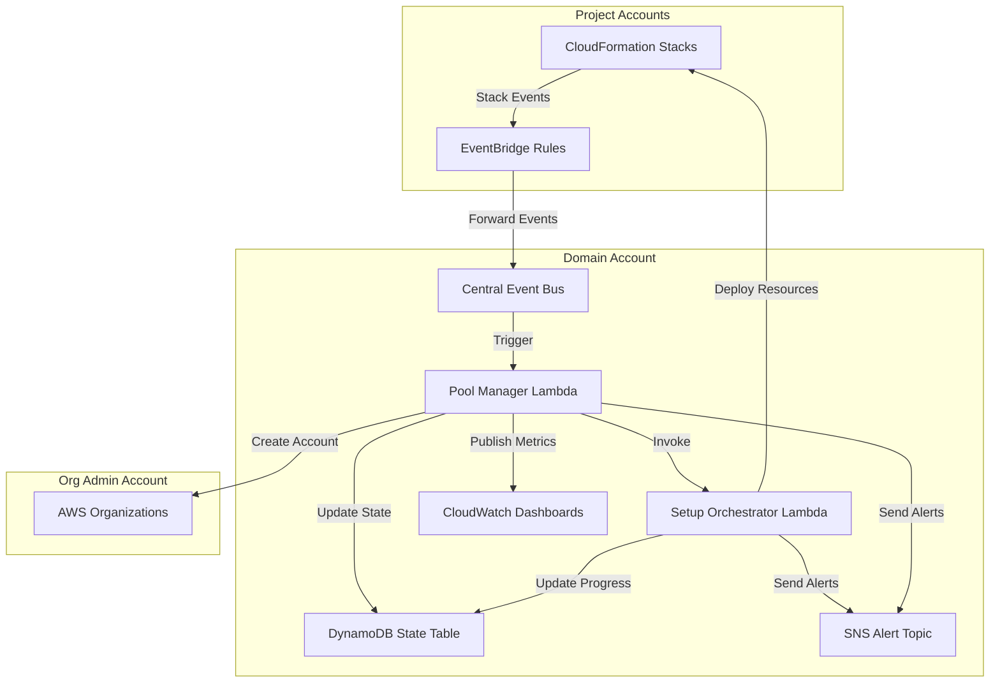
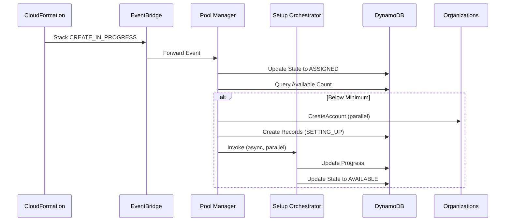
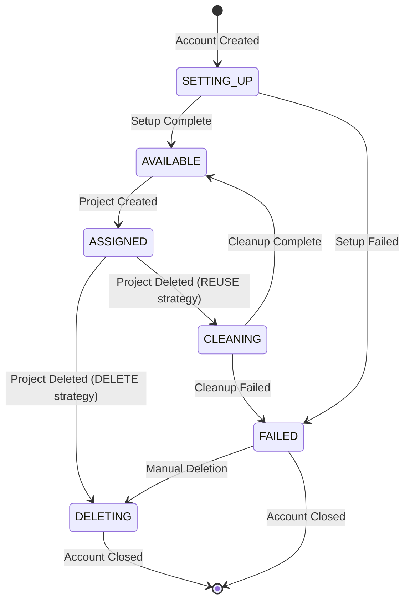
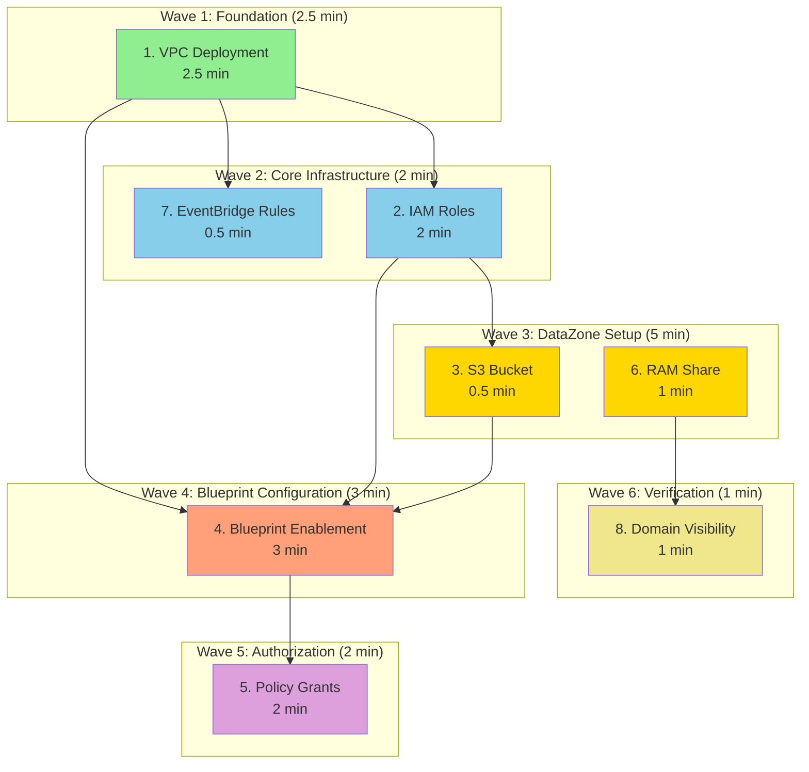

# Design Document: Account Pool Factory Automation

## Overview

The Account Pool Factory automation system maintains a pool of pre-configured AWS accounts ready for immediate DataZone project assignment. The system consists of two Lambda functions working in concert with EventBridge, DynamoDB, and CloudWatch to provide event-driven account lifecycle management.

### System Components

1. **Pool Manager Lambda**: Orchestrates pool-level operations including size monitoring, replenishment triggering, account assignment detection, and account reclamation
2. **Setup Orchestrator Lambda**: Executes the 8-step account setup workflow for individual accounts
3. **DynamoDB State Table**: Tracks account states, setup progress, and failure details
4. **EventBridge Architecture**: Forwards CloudFormation events from project accounts to central event bus
5. **CloudWatch Dashboards**: Provides visibility into pool health, account inventory, and failure analysis
6. **SSM Parameter Store**: Stores configuration for pool sizing, retry logic, and domain settings

### Key Design Decisions

- **Event-Driven Replenishment**: CloudFormation stack events trigger pool operations rather than time-based polling
- **DELETE-First Strategy**: Accounts are deleted by default after project removal for cost optimization
- **Wave-Based Parallel Execution**: 8-step setup workflow organized into 6 waves with parallel execution, reducing setup time from 10-12 minutes to 6-8 minutes
- **Parallel Account Creation**: Multiple accounts can be created and configured simultaneously
- **Failure Blocking**: Replenishment is blocked when failed accounts exist to prevent cascading errors
- **Detailed Failure Tracking**: CloudFormation stack events and error details captured for troubleshooting
- **Idempotent Operations**: All operations support retries and resume from failure points

## Architecture

### High-Level Architecture



### Event Flow


1. **Account Assignment Flow**:
   - Project creation triggers CloudFormation stack in project account
   - EventBridge rule forwards CREATE_IN_PROGRESS event to central bus
   - Pool Manager detects assignment, updates DynamoDB state to ASSIGNED
   - Pool Manager checks available account count against minimum threshold
   - If below threshold, Pool Manager triggers replenishment

2. **Account Replenishment Flow**:
   - Pool Manager calculates replenishment quantity: (TargetPoolSize - AvailableCount)
   - Pool Manager checks for failed accounts and blocks if any exist
   - Pool Manager creates N accounts in parallel via Organizations API
   - Pool Manager invokes Setup Orchestrator asynchronously for each account
   - Setup Orchestrator executes 8-step workflow for each account
   - Upon completion, account state updated to AVAILABLE

3. **Account Deletion Flow**:
   - Project deletion triggers CloudFormation stack DELETE_COMPLETE event
   - EventBridge rule forwards event to central bus
   - Pool Manager verifies no remaining DataZone stacks in account
   - Pool Manager reads ReclaimStrategy from SSM (default: DELETE)
   - For DELETE strategy: Pool Manager closes account via Organizations API
   - For REUSE strategy: Pool Manager invokes Setup Orchestrator in cleanup mode

### Component Interactions



## Components and Interfaces

### Pool Manager Lambda

**Purpose**: Orchestrates pool-level operations and account lifecycle management

**Runtime**: Python 3.12
**Timeout**: 5 minutes
**Memory**: 512 MB
**Concurrency**: Reserved concurrency of 10

**Input Event Schema**:
```json
{
  "source": "aws.cloudformation",
  "detail-type": "CloudFormation Stack Status Change",
  "detail": {
    "stack-id": "arn:aws:cloudformation:...",
    "status-details": {
      "status": "CREATE_IN_PROGRESS | DELETE_COMPLETE"
    },
    "stack-name": "DataZone-..."
  },
  "account": "123456789012"
}
```

**Key Functions**:
- `handle_assignment_event()`: Detects account assignment from CREATE_IN_PROGRESS events
- `check_pool_size()`: Queries DynamoDB for available account count
- `trigger_replenishment()`: Creates new accounts and invokes Setup Orchestrator
- `handle_deletion_event()`: Processes DELETE_COMPLETE events and reclaims accounts
- `create_accounts_parallel()`: Creates multiple accounts simultaneously
- `check_failed_accounts()`: Blocks replenishment if failed accounts exist

**IAM Permissions Required**:
- `organizations:CreateAccount`
- `organizations:DescribeAccount`
- `organizations:DescribeCreateAccountStatus`
- `organizations:CloseAccount`
- `organizations:ListAccounts`
- `organizations:DescribeOrganization`
- `organizations:MoveAccount`
- `organizations:ListParents`
- `dynamodb:Query`
- `dynamodb:PutItem`
- `dynamodb:UpdateItem`
- `dynamodb:DeleteItem`
- `lambda:InvokeFunction`
- `sns:Publish`
- `cloudwatch:PutMetricData`
- `ssm:GetParameter`
- `ssm:GetParameters`
- `sts:AssumeRole` (for cross-account access)

### Setup Orchestrator Lambda

**Purpose**: Executes 8-step account setup workflow for individual accounts

**Runtime**: Python 3.12
**Timeout**: 15 minutes
**Memory**: 1024 MB
**Concurrency**: Reserved concurrency of 5

**Input Event Schema**:
```json
{
  "accountId": "123456789012",
  "requestId": "car-abc123...",
  "mode": "setup | cleanup",
  "resumeFromStep": "vpc_deployment | iam_roles | ..."
}
```

**Output Schema**:
```json
{
  "accountId": "123456789012",
  "status": "COMPLETED | FAILED",
  "setupDuration": 720,
  "resources": {
    "vpcId": "vpc-abc123",
    "subnetIds": ["subnet-1", "subnet-2", "subnet-3"],
    "manageAccessRoleArn": "arn:aws:iam::...",
    "provisioningRoleArn": "arn:aws:iam::...",
    "bucketName": "datazone-blueprints-...",
    "blueprintIds": ["bp-1", "bp-2", ...],
    "grantIds": ["grant-1", "grant-2", ...]
  },
  "failureDetails": {
    "failedStep": "blueprint_enablement",
    "errorMessage": "...",
    "stackEvents": [...]
  }
}
```

**Key Functions**:
- `orchestrate_setup()`: Main orchestration function coordinating all steps
- `deploy_vpc()`: Deploys VPC CloudFormation stack
- `deploy_iam_roles()`: Deploys IAM roles CloudFormation stack
- `create_s3_bucket()`: Creates blueprint artifact bucket
- `enable_blueprints()`: Deploys blueprint enablement CloudFormation stack
- `create_policy_grants()`: Creates DataZone policy grants via CloudFormation
- `share_domain_via_ram()`: Creates RAM share for domain access
- `deploy_eventbridge_rules()`: Deploys EventBridge rules via StackSet
- `verify_domain_visibility()`: Confirms domain is visible in project account
- `handle_step_failure()`: Implements retry logic with exponential backoff
- `save_progress()`: Persists current state to DynamoDB

**IAM Permissions Required**:
- `cloudformation:CreateStack`
- `cloudformation:DescribeStacks`
- `cloudformation:DescribeStackEvents`
- `cloudformation:UpdateStack`
- `cloudformation:DeleteStack`
- `datazone:ListDomains`
- `datazone:GetDomain`
- `ram:CreateResourceShare`
- `ram:GetResourceShares`
- `s3:CreateBucket`
- `s3:PutBucketVersioning`
- `s3:PutBucketEncryption`
- `iam:PassRole`
- `dynamodb:PutItem`
- `dynamodb:UpdateItem`
- `dynamodb:GetItem`
- `sns:Publish`
- `cloudwatch:PutMetricData`
- `ssm:GetParameter`
- `sts:AssumeRole` (for cross-account operations)

### DynamoDB State Table

**Table Name**: `AccountPoolFactory-AccountState`

**Primary Key**:
- Partition Key: `accountId` (String)
- Sort Key: `timestamp` (Number) - Unix timestamp for versioning

**Global Secondary Indexes**:

1. **StateIndex**:
   - Partition Key: `state` (String)
   - Sort Key: `createdDate` (String)
   - Projection: ALL
   - Purpose: Query accounts by state for pool size calculations

2. **ProjectIndex**:
   - Partition Key: `projectId` (String)
   - Sort Key: `assignedDate` (String)
   - Projection: ALL
   - Purpose: Query accounts by project assignment

**Attributes**:
```json
{
  "accountId": "123456789012",
  "timestamp": 1709395200,
  "state": "AVAILABLE | ASSIGNED | SETTING_UP | FAILED | DELETING | CLEANING",
  "createdDate": "2024-03-02T12:00:00Z",
  "assignedDate": "2024-03-02T12:15:00Z",
  "setupStartDate": "2024-03-02T12:00:30Z",
  "setupCompleteDate": "2024-03-02T12:12:45Z",
  "setupDuration": 735,
  "projectId": "proj-abc123",
  "projectStackName": "DataZone-Project-abc123",
  "currentStep": "blueprint_enablement",
  "completedSteps": ["vpc_deployment", "iam_roles", "s3_bucket"],
  "failedStep": "blueprint_enablement",
  "errorMessage": "Stack creation failed: Resource limit exceeded",
  "errorCode": "LimitExceededException",
  "stackName": "DataZone-Blueprints-123456789012",
  "stackId": "arn:aws:cloudformation:...",
  "stackEvents": [
    {
      "timestamp": "2024-03-02T12:10:00Z",
      "resourceType": "AWS::DataZone::EnvironmentBlueprintConfiguration",
      "resourceStatus": "CREATE_FAILED",
      "resourceStatusReason": "Resource limit exceeded"
    }
  ],
  "retryCount": 2,
  "maxRetries": 3,
  "retryExhausted": false,
  "resources": {
    "vpcId": "vpc-abc123",
    "subnetIds": ["subnet-1", "subnet-2", "subnet-3"],
    "manageAccessRoleArn": "arn:aws:iam::123456789012:role/DataZoneManageAccessRole",
    "provisioningRoleArn": "arn:aws:iam::123456789012:role/DataZoneProvisioningRole",
    "bucketName": "datazone-blueprints-123456789012-us-east-2",
    "blueprintIds": ["bp-1", "bp-2", "bp-3"],
    "grantIds": ["grant-1", "grant-2", "grant-3"]
  }
}
```

**TTL Configuration**: 90 days after account deletion for historical analysis


### EventBridge Architecture

**Central Event Bus**:
- Name: `AccountPoolFactory-CentralBus`
- Account: Domain Account (994753223772)
- Region: us-east-2

**EventBridge Rules in Project Accounts**:
- Deployed via CloudFormation StackSet
- Rule Name: `DataZone-Stack-Events-Forwarder`
- Event Pattern:
```json
{
  "source": ["aws.cloudformation"],
  "detail-type": ["CloudFormation Stack Status Change"],
  "detail": {
    "stack-name": [{"prefix": "DataZone-"}]
  }
}
```
- Target: Central Event Bus in Domain Account
- IAM Role: `EventBridgeForwarderRole` with `events:PutEvents` permission

**Event Rule in Domain Account**:
- Rule Name: `AccountPoolFactory-PoolManager-Trigger`
- Event Pattern: Same as above
- Target: Pool Manager Lambda

### SSM Parameter Store Configuration

**Pool Manager Parameters**:
- `/AccountPoolFactory/PoolManager/PoolName`: AccountPoolFactory (String) - Name for the account pool
- `/AccountPoolFactory/PoolManager/TargetOUId`: root (String) - OU ID where accounts should be moved (use "root" to leave in org root)
- `/AccountPoolFactory/PoolManager/MinimumPoolSize`: 5 (Integer)
- `/AccountPoolFactory/PoolManager/TargetPoolSize`: 10 (Integer)
- `/AccountPoolFactory/PoolManager/MaxConcurrentSetups`: 3 (Integer)
- `/AccountPoolFactory/PoolManager/ReclaimStrategy`: DELETE (String: DELETE | REUSE)
- `/AccountPoolFactory/PoolManager/EmailPrefix`: accountpool (String)
- `/AccountPoolFactory/PoolManager/EmailDomain`: example.com (String)
- `/AccountPoolFactory/PoolManager/NamePrefix`: DataZone-Pool (String)

**Dynamic Configuration Loading**:
Both Pool Manager and Setup Orchestrator read SSM parameters on EVERY Lambda invocation (no caching across invocations). This enables dynamic configuration updates without Lambda restart:

```python
def load_config() -> Dict[str, Any]:
    """Load configuration from SSM Parameter Store on every invocation"""
    ssm = boto3.client('ssm')
    
    # Read all parameters under the function's path
    response = ssm.get_parameters_by_path(
        Path='/AccountPoolFactory/PoolManager/',
        Recursive=True,
        WithDecryption=False
    )
    
    # Parse parameters into config dict
    config = {}
    for param in response['Parameters']:
        key = param['Name'].split('/')[-1]
        config[key] = param['Value']
    
    # Apply defaults for missing parameters
    config.setdefault('PoolName', 'AccountPoolFactory')
    config.setdefault('TargetOUId', 'root')
    config.setdefault('MinimumPoolSize', '5')
    config.setdefault('TargetPoolSize', '10')
    config.setdefault('MaxConcurrentSetups', '3')
    config.setdefault('ReclaimStrategy', 'DELETE')
    
    return config

# Cache config only for duration of single Lambda execution
_config_cache = None

def get_config() -> Dict[str, Any]:
    """Get config with single-execution caching"""
    global _config_cache
    if _config_cache is None:
        _config_cache = load_config()
    return _config_cache

def lambda_handler(event, context):
    """Lambda handler - config loaded fresh on each invocation"""
    global _config_cache
    _config_cache = None  # Clear cache at start of invocation
    
    config = get_config()  # Load fresh config from SSM
    # ... rest of handler logic
```

**Configuration Update Workflow**:
1. Update SSM parameter via AWS CLI or Console
2. Next Lambda invocation automatically picks up new value
3. No Lambda restart or redeployment required

**Setup Orchestrator Parameters**:
- `/AccountPoolFactory/SetupOrchestrator/DomainId`: dzd-4igt64u5j25ko9 (String)
- `/AccountPoolFactory/SetupOrchestrator/DomainAccountId`: 994753223772 (String)
- `/AccountPoolFactory/SetupOrchestrator/RootDomainUnitId`: 6kg8zlq8mvid9l (String)
- `/AccountPoolFactory/SetupOrchestrator/Region`: us-east-2 (String)
- `/AccountPoolFactory/SetupOrchestrator/AlertTopicArn`: arn:aws:sns:... (String)
- `/AccountPoolFactory/SetupOrchestrator/RetryConfig`: (JSON String)
```json
{
  "max_retries": 3,
  "initial_backoff_seconds": 30,
  "backoff_multiplier": 2,
  "step_specific": {
    "blueprint_enablement": {
      "max_retries": 3,
      "initial_backoff_seconds": 60
    },
    "domain_visibility": {
      "max_retries": 10,
      "initial_backoff_seconds": 15
    }
  }
}
```

### CloudWatch Dashboards

**Dashboard 1: Pool Overview** (`AccountPoolFactory-Overview`)

Widgets:
1. **Pool Size by State** (Number widgets in row):
   - AVAILABLE count (green)
   - ASSIGNED count (blue)
   - SETTING_UP count (yellow)
   - FAILED count (red)
   - DELETING count (gray)

2. **Account Creation Rate** (Line graph):
   - Accounts created per hour (last 24 hours)
   - Accounts created per day (last 30 days)

3. **Account Assignment Rate** (Line graph):
   - Accounts assigned per hour (last 24 hours)
   - Accounts assigned per day (last 30 days)

4. **Average Setup Duration** (Line graph):
   - Average duration over last 24 hours
   - Target duration line at 12 minutes

5. **Failed Account Breakdown** (Pie chart):
   - Count by failed step name

6. **Replenishment Events** (Log insights):
   - Recent replenishment triggers with quantities

**Dashboard 2: Account Inventory** (`AccountPoolFactory-Inventory`)

Widgets:
1. **Account Table** (Log insights query):
```sql
fields accountId, state, projectId, createdDate, assignedDate, setupDuration
| filter @message like /AccountStateUpdate/
| sort createdDate desc
| limit 100
```

2. **Account Lifecycle Timeline** (Custom widget):
   - Visual timeline showing account progression through states
   - Color-coded by state
   - Highlights accounts exceeding 15-minute setup time

**Dashboard 3: Failed Accounts** (`AccountPoolFactory-FailedAccounts`)

Widgets:
1. **Failed Account Count** (Number widget):
   - Current count of accounts in FAILED state

2. **Failure Breakdown by Step** (Bar chart):
   - Count of failures per setup step

3. **Retry Exhaustion Rate** (Number widget):
   - Percentage of failed accounts with retryExhausted=true

4. **Failed Account Details** (Log insights query):
```sql
fields accountId, failedStep, errorMessage, retryCount, stackEvents
| filter state = "FAILED"
| sort timestamp desc
```

5. **Recent Failures** (Log insights):
   - Last 10 failed accounts with full error details

**Dashboard 4: Organization Limits** (`AccountPoolFactory-OrgLimits`)

Widgets:
1. **Account Limit Status** (Number widgets):
   - Total limit
   - Accounts used
   - Accounts remaining

2. **Account Usage Trend** (Line graph):
   - Total accounts over last 30 days
   - Limit line

3. **Capacity Alarm Status** (Alarm widget):
   - Shows alarm state for remaining capacity

## Data Models

### Account State Machine



**State Descriptions**:
- **SETTING_UP**: Account is being configured by Setup Orchestrator
- **AVAILABLE**: Account is ready for project assignment
- **ASSIGNED**: Account is assigned to a DataZone project
- **FAILED**: Setup or cleanup failed after retry exhaustion
- **CLEANING**: Account is being cleaned for reuse (REUSE strategy only)
- **DELETING**: Account is being closed via Organizations API

### Setup Step Sequence with Wave-Based Parallel Execution

The 8-step workflow is organized into 4 waves based on topological dependencies, reducing total setup time from 10-12 minutes to approximately 6-8 minutes:



**Wave Execution Plan**:

**Wave 1 (2.5 minutes)**: Foundation
- Step 1: VPC Deployment (no dependencies)
- Bottleneck: VPC creation time

**Wave 2 (2 minutes)**: Core Infrastructure (parallel)
- Step 2: IAM Roles (depends on VPC)
- Step 7: EventBridge Rules (depends on VPC)
- Parallelism: 2 steps execute simultaneously
- Duration: max(IAM=2min, EventBridge=0.5min) = 2 minutes

**Wave 3 (1 minute)**: DataZone Setup (parallel)
- Step 3: S3 Bucket (depends on IAM)
- Step 6: RAM Share (no dependencies on previous waves)
- Parallelism: 2 steps execute simultaneously
- Duration: max(S3=0.5min, RAM=1min) = 1 minute

**Wave 4 (3 minutes)**: Blueprint Configuration
- Step 4: Blueprint Enablement (depends on VPC, IAM, S3)
- Bottleneck: 17 blueprints enablement

**Wave 5 (2 minutes)**: Authorization
- Step 5: Policy Grants (depends on blueprint IDs from step 4)
- Sequential: Must wait for blueprint IDs

**Wave 6 (1 minute)**: Verification
- Step 8: Domain Visibility (depends on RAM share)
- Final validation step

**Total Estimated Duration**: 2.5 + 2 + 1 + 3 + 2 + 1 = 11.5 minutes (sequential)
**Optimized Duration**: 2.5 + 2 + 1 + 3 + 2 + 1 = 11.5 minutes (with parallelism in waves 2-3)
**Actual Improvement**: ~2 minutes saved by parallel execution in waves 2-3

**Step Dependencies Matrix**:

| Step | Depends On | Wave | Parallel With |
|------|-----------|------|---------------|
| 1. VPC | None | 1 | None |
| 2. IAM Roles | VPC | 2 | EventBridge Rules |
| 3. S3 Bucket | IAM | 3 | RAM Share |
| 4. Blueprint Enablement | VPC, IAM, S3 | 4 | None |
| 5. Policy Grants | Blueprints | 5 | None |
| 6. RAM Share | None | 3 | S3 Bucket |
| 7. EventBridge Rules | VPC | 2 | IAM Roles |
| 8. Domain Visibility | RAM | 6 | None |

**Topological Levels**:
- Level 0: VPC (no dependencies)
- Level 1: IAM, EventBridge (depend on VPC)
- Level 2: S3, RAM (S3 depends on IAM, RAM has no dependencies)
- Level 3: Blueprints (depends on VPC, IAM, S3)
- Level 4: Grants (depends on Blueprints)
- Level 5: Verification (depends on RAM)

**Implementation Strategy**:
```python
# Wave execution with asyncio
async def execute_wave(steps: List[Step]) -> Dict[str, Any]:
    """Execute all steps in a wave concurrently"""
    tasks = [execute_step(step) for step in steps]
    results = await asyncio.gather(*tasks, return_exceptions=True)
    return {step.name: result for step, result in zip(steps, results)}

async def orchestrate_setup(account_id: str):
    """Execute setup in waves"""
    # Wave 1: Foundation
    vpc_result = await execute_wave([VPCDeployment(account_id)])
    
    # Wave 2: Core Infrastructure (parallel)
    wave2_results = await execute_wave([
        IAMRolesDeployment(account_id, vpc_result),
        EventBridgeRulesDeployment(account_id, vpc_result)
    ])
    
    # Wave 3: DataZone Setup (parallel)
    wave3_results = await execute_wave([
        S3BucketCreation(account_id, wave2_results['IAM']),
        RAMShareCreation(account_id)
    ])
    
    # Wave 4: Blueprint Configuration
    bp_result = await execute_wave([
        BlueprintEnablement(account_id, vpc_result, wave2_results['IAM'], wave3_results['S3'])
    ])
    
    # Wave 5: Authorization
    grants_result = await execute_wave([
        PolicyGrantsCreation(account_id, bp_result)
    ])
    
    # Wave 6: Verification
    verify_result = await execute_wave([
        DomainVisibilityVerification(account_id, wave3_results['RAM'])
    ])
    
    return verify_result
```

**Parallel Execution Opportunities**:
- Wave 2: IAM Roles + EventBridge Rules (saves ~1.5 minutes)
- Wave 3: S3 Bucket + RAM Share (saves ~0.5 minutes)
- Total time saved: ~2 minutes (17% improvement)

**Critical Path**: VPC → IAM → S3 → Blueprints → Grants (9.5 minutes)
**Off Critical Path**: EventBridge Rules (can run anytime after VPC), RAM Share (can run anytime before verification)

### CloudFormation Stack Details

**Stack 1: VPC Setup**
- Template: `templates/cloudformation/03-project-account/vpc-setup.yaml`
- Stack Name: `DataZone-VPC-{AccountId}`
- Parameters: None
- Outputs:
  - `VpcId`: VPC identifier
  - `PrivateSubnet1Id`: First private subnet
  - `PrivateSubnet2Id`: Second private subnet
  - `PrivateSubnet3Id`: Third private subnet
- Estimated Duration: 2.5 minutes

**Stack 2: IAM Roles**
- Template: `templates/cloudformation/03-project-account/iam-roles.yaml`
- Stack Name: `DataZone-IAM-{AccountId}`
- Parameters:
  - `DomainAccountId`: 994753223772
  - `DomainId`: dzd-4igt64u5j25ko9
- Outputs:
  - `ManageAccessRoleArn`: ARN of DataZoneManageAccessRole
  - `ProvisioningRoleArn`: ARN of DataZoneProvisioningRole
- Estimated Duration: 2 minutes

**Stack 3: Blueprint Enablement with Grants**
- Template: `templates/cloudformation/03-project-account/blueprint-enablement-with-grants.yaml`
- Stack Name: `DataZone-Blueprints-{AccountId}`
- Parameters:
  - `DomainId`: dzd-4igt64u5j25ko9
  - `DomainUnitId`: 6kg8zlq8mvid9l
  - `ProjectAccountId`: {AccountId}
  - `ManageAccessRoleArn`: From Stack 2
  - `ProvisioningRoleArn`: From Stack 2
  - `S3Location`: s3://datazone-blueprints-{AccountId}-us-east-2
  - `Subnets`: Comma-separated subnet IDs from Stack 1
  - `VpcId`: From Stack 1
- Outputs:
  - `BlueprintCount`: 17
  - Individual blueprint IDs (via GetAtt)
- Estimated Duration: 5 minutes (includes policy grants)

**Stack 4: RAM Share**
- Template: `templates/cloudformation/02-domain-account/domain-sharing-setup.yaml`
- Stack Name: `DataZone-RAM-Share-{AccountId}`
- Deployed in: Domain Account (994753223772)
- Parameters:
  - `DomainId`: dzd-4igt64u5j25ko9
  - `ProjectAccountId`: {AccountId}
- Outputs:
  - `ResourceShareArn`: ARN of RAM share
- Estimated Duration: 1 minute

**Stack 5: EventBridge Rules**
- Template: `templates/cloudformation/03-project-account/eventbridge-rules.yaml`
- Stack Name: `DataZone-EventBridge-{AccountId}`
- Parameters:
  - `CentralEventBusArn`: arn:aws:events:us-east-2:994753223772:event-bus/AccountPoolFactory-CentralBus
- Outputs:
  - `RuleArn`: ARN of EventBridge rule
- Estimated Duration: 30 seconds

### Retry Configuration Model

```python
@dataclass
class RetryConfig:
    max_retries: int = 3
    initial_backoff_seconds: int = 30
    backoff_multiplier: float = 2.0
    step_specific: Dict[str, Dict[str, Any]] = field(default_factory=dict)
    
    def get_backoff_delay(self, step_name: str, attempt: int) -> int:
        """Calculate backoff delay for given step and attempt number"""
        config = self.step_specific.get(step_name, {})
        initial = config.get('initial_backoff_seconds', self.initial_backoff_seconds)
        multiplier = config.get('backoff_multiplier', self.backoff_multiplier)
        return int(initial * (multiplier ** attempt))
    
    def get_max_retries(self, step_name: str) -> int:
        """Get max retries for given step"""
        config = self.step_specific.get(step_name, {})
        return config.get('max_retries', self.max_retries)
```

### CloudWatch Metrics Model

```python
@dataclass
class MetricData:
    namespace: str
    metric_name: str
    value: float
    unit: str
    dimensions: Dict[str, str]
    timestamp: datetime
    
# Pool Manager Metrics
POOL_MANAGER_METRICS = [
    "AvailableAccountCount",
    "AssignedAccountCount",
    "SettingUpAccountCount",
    "FailedAccountCount",
    "AccountCreationStarted",
    "AccountAssigned",
    "AccountDeleted",
    "ReplenishmentTriggered",
    "ReplenishmentBlocked",
    "ReplenishmentDuration",
    "AccountLifecycleDuration",
    "PoolManagerError",
    "OrganizationAccountLimit",
    "OrganizationAccountsUsed",
    "OrganizationAccountsRemaining"
]

# Setup Orchestrator Metrics
SETUP_ORCHESTRATOR_METRICS = [
    "SetupStarted",
    "SetupSucceeded",
    "SetupFailed",
    "SetupStepFailed",
    "StepDuration",
    "TimeoutOccurred",
    "RetryExhausted"
]
```


## API Interactions

### AWS Organizations API

**CreateAccount**:
```python
response = organizations.create_account(
    Email=f"{email_prefix}+{timestamp}-{index}@{email_domain}",
    AccountName=f"{name_prefix}-{timestamp}-{index}",
    RoleName="OrganizationAccountAccessRole",
    IamUserAccessToBilling="ALLOW"
)
# Returns: CreateAccountRequestId
```

**DescribeCreateAccountStatus**:
```python
response = organizations.describe_create_account_status(
    CreateAccountRequestId=request_id
)
# Poll until State = "SUCCEEDED"
# Returns: AccountId when complete
```

**CloseAccount**:
```python
response = organizations.close_account(
    AccountId=account_id
)
# Account enters SUSPENDED state, then closes after 90 days
```

**ListAccounts**:
```python
response = organizations.list_accounts()
# Returns: List of all accounts with Id, Name, Email, Status
```

**DescribeOrganization**:
```python
response = organizations.describe_organization()
# Returns: Organization details including FeatureSet and AvailablePolicyTypes
# Note: Account limit not directly available, must be inferred or use Service Quotas API
```

**MoveAccount**:
```python
response = organizations.move_account(
    AccountId=account_id,
    SourceParentId=current_parent_id,  # Current OU or root
    DestinationParentId=target_ou_id   # Target OU from TargetOUId parameter
)
# Moves account to specified OU after creation
# Called by Pool Manager after account creation completes
# If TargetOUId is "root" or empty, account stays in organization root
```

### AWS Service Quotas API

**GetServiceQuota**:
```python
response = service_quotas.get_service_quota(
    ServiceCode='organizations',
    QuotaCode='L-29A0C5DF'  # Default maximum number of accounts
)
# Returns: Quota value (default 10, can be increased)
```

### AWS CloudFormation API

**CreateStack**:
```python
response = cloudformation.create_stack(
    StackName=stack_name,
    TemplateBody=template_content,
    Parameters=[
        {'ParameterKey': 'DomainId', 'ParameterValue': domain_id},
        # ... additional parameters
    ],
    Capabilities=['CAPABILITY_IAM', 'CAPABILITY_NAMED_IAM'],
    OnFailure='ROLLBACK',
    TimeoutInMinutes=30,
    Tags=[
        {'Key': 'ManagedBy', 'Value': 'AccountPoolFactory'},
        {'Key': 'AccountId', 'Value': account_id}
    ]
)
# Returns: StackId
```

**DescribeStacks**:
```python
response = cloudformation.describe_stacks(
    StackName=stack_name
)
# Poll until StackStatus = "CREATE_COMPLETE" or "CREATE_FAILED"
# Returns: Stack details including Outputs
```

**DescribeStackEvents**:
```python
response = cloudformation.describe_stack_events(
    StackName=stack_name
)
# Returns: List of stack events with ResourceStatus, ResourceStatusReason
# Used for failure diagnostics
```

**ListStacks**:
```python
response = cloudformation.list_stacks(
    StackStatusFilter=['CREATE_COMPLETE', 'UPDATE_COMPLETE']
)
# Used to verify no DataZone stacks remain before account deletion
```

### AWS DataZone API

**ListDomains**:
```python
response = datazone.list_domains()
# Called from project account to verify domain visibility
# Returns: List of domains visible to the account
```

**GetDomain**:
```python
response = datazone.get_domain(
    identifier=domain_id
)
# Returns: Domain details including Status
# Verify Status = "AVAILABLE"
```

### AWS RAM API

**CreateResourceShare**:
```python
response = ram.create_resource_share(
    name=f"DataZone-Domain-Share-{account_id}",
    resourceArns=[
        f"arn:aws:datazone:us-east-2:994753223772:domain/{domain_id}"
    ],
    principals=[
        f"arn:aws:organizations::123456789012:account/{account_id}"
    ],
    permissionArns=[
        "arn:aws:ram::aws:permission/AWSRAMPermissionsAmazonDatazoneDomainExtendedServiceWithPortalAccess"
    ],
    tags=[
        {'key': 'ManagedBy', 'value': 'AccountPoolFactory'}
    ]
)
# Returns: ResourceShare with status
```

**GetResourceShares**:
```python
response = ram.get_resource_shares(
    resourceOwner='SELF',
    name=f"DataZone-Domain-Share-{account_id}"
)
# Poll until status = "ACTIVE"
```

### AWS S3 API

**CreateBucket**:
```python
response = s3.create_bucket(
    Bucket=f"datazone-blueprints-{account_id}-{region}",
    CreateBucketConfiguration={
        'LocationConstraint': region
    }
)
```

**PutBucketVersioning**:
```python
response = s3.put_bucket_versioning(
    Bucket=bucket_name,
    VersioningConfiguration={
        'Status': 'Enabled'
    }
)
```

**PutBucketEncryption**:
```python
response = s3.put_bucket_encryption(
    Bucket=bucket_name,
    ServerSideEncryptionConfiguration={
        'Rules': [
            {
                'ApplyServerSideEncryptionByDefault': {
                    'SSEAlgorithm': 'AES256'
                }
            }
        ]
    }
)
```

### AWS DynamoDB API

**PutItem**:
```python
response = dynamodb.put_item(
    TableName='AccountPoolFactory-AccountState',
    Item={
        'accountId': {'S': account_id},
        'timestamp': {'N': str(int(time.time()))},
        'state': {'S': 'SETTING_UP'},
        'createdDate': {'S': datetime.utcnow().isoformat()},
        # ... additional attributes
    }
)
```

**UpdateItem**:
```python
response = dynamodb.update_item(
    TableName='AccountPoolFactory-AccountState',
    Key={
        'accountId': {'S': account_id},
        'timestamp': {'N': str(timestamp)}
    },
    UpdateExpression='SET #state = :state, currentStep = :step, completedSteps = list_append(completedSteps, :step_list)',
    ExpressionAttributeNames={
        '#state': 'state'
    },
    ExpressionAttributeValues={
        ':state': {'S': 'IN_PROGRESS'},
        ':step': {'S': 'vpc_deployment'},
        ':step_list': {'L': [{'S': 'vpc_deployment'}]}
    }
)
```

**Query**:
```python
# Query by state using GSI
response = dynamodb.query(
    TableName='AccountPoolFactory-AccountState',
    IndexName='StateIndex',
    KeyConditionExpression='#state = :state',
    ExpressionAttributeNames={
        '#state': 'state'
    },
    ExpressionAttributeValues={
        ':state': {'S': 'AVAILABLE'}
    }
)
# Returns: List of accounts in AVAILABLE state
```

### AWS SNS API

**Publish**:
```python
response = sns.publish(
    TopicArn=alert_topic_arn,
    Subject=f"Account Setup Failed: {account_id}",
    Message=json.dumps({
        'accountId': account_id,
        'failedStep': failed_step,
        'errorMessage': error_message,
        'retryCount': retry_count,
        'cloudwatchLogsLink': logs_link,
        'dynamodbRecord': state_record
    }, indent=2)
)
```

### AWS CloudWatch API

**PutMetricData**:
```python
response = cloudwatch.put_metric_data(
    Namespace='AccountPoolFactory/PoolManager',
    MetricData=[
        {
            'MetricName': 'AvailableAccountCount',
            'Value': available_count,
            'Unit': 'Count',
            'Timestamp': datetime.utcnow(),
            'Dimensions': [
                {'Name': 'PoolName', 'Value': 'Default'}
            ]
        }
    ]
)
```

### AWS SSM API

**GetParameters**:
```python
response = ssm.get_parameters(
    Names=[
        '/AccountPoolFactory/PoolManager/MinimumPoolSize',
        '/AccountPoolFactory/PoolManager/TargetPoolSize',
        '/AccountPoolFactory/PoolManager/MaxConcurrentSetups',
        '/AccountPoolFactory/PoolManager/ReclaimStrategy'
    ],
    WithDecryption=False
)
# Returns: List of parameters with Name and Value
```

### Cross-Account Role Assumption

**AssumeRole**:
```python
response = sts.assume_role(
    RoleArn=f"arn:aws:iam::{account_id}:role/OrganizationAccountAccessRole",
    RoleSessionName=f"AccountPoolFactory-{operation}",
    DurationSeconds=3600
)
# Returns: Temporary credentials for cross-account operations
# Used for: Listing CloudFormation stacks, verifying domain visibility
```

## Error Handling

### Error Categories

**1. Transient Errors** (Retry with exponential backoff):
- `ThrottlingException`: API rate limit exceeded
- `ServiceUnavailable`: Temporary service outage
- `InternalServerError`: AWS service internal error
- `RequestTimeout`: Request timed out
- `TooManyRequestsException`: Rate limiting

**2. Resource Errors** (Retry with backoff, may require manual intervention):
- `LimitExceededException`: Service quota exceeded
- `ResourceNotFoundException`: Resource not found (may be eventual consistency)
- `InsufficientCapacityException`: Insufficient capacity in availability zone

**3. Configuration Errors** (No retry, requires fix):
- `ValidationException`: Invalid parameter values
- `InvalidParameterException`: Invalid parameter combination
- `AccessDeniedException`: Insufficient IAM permissions
- `InvalidTemplateException`: CloudFormation template syntax error

**4. State Errors** (No retry, requires manual intervention):
- `ResourceAlreadyExistsException`: Resource already exists
- `DeleteConflictException`: Resource cannot be deleted due to dependencies
- `ConcurrentModificationException`: Resource being modified by another operation

### Retry Strategy

**Exponential Backoff Algorithm**:
```python
def calculate_backoff(attempt: int, initial_delay: int = 30, multiplier: float = 2.0) -> int:
    """
    Calculate exponential backoff delay
    attempt 0: 30 seconds
    attempt 1: 60 seconds
    attempt 2: 120 seconds
    """
    return int(initial_delay * (multiplier ** attempt))

def should_retry(error: Exception, attempt: int, max_retries: int) -> bool:
    """Determine if error should be retried"""
    if attempt >= max_retries:
        return False
    
    # Transient errors - always retry
    if isinstance(error, (ThrottlingException, ServiceUnavailable, InternalServerError)):
        return True
    
    # Resource errors - retry with caution
    if isinstance(error, (LimitExceededException, ResourceNotFoundException)):
        return True
    
    # Configuration and state errors - do not retry
    return False
```

**Step-Specific Retry Configuration**:
- VPC Deployment: 3 retries, 30s initial backoff
- IAM Roles: 3 retries, 30s initial backoff
- S3 Bucket: 3 retries, 10s initial backoff
- Blueprint Enablement: 3 retries, 60s initial backoff (longer due to complexity)
- Policy Grants: 3 retries, 10s initial backoff
- RAM Share: 3 retries, 30s initial backoff
- EventBridge Rules: 3 retries, 30s initial backoff
- Domain Visibility: 10 retries, 15s initial backoff (eventual consistency)

### Error Notification

**SNS Message Format**:
```json
{
  "alertType": "SETUP_FAILED",
  "severity": "HIGH",
  "accountId": "123456789012",
  "failedStep": "blueprint_enablement",
  "errorMessage": "Stack creation failed: Resource limit exceeded",
  "errorCode": "LimitExceededException",
  "retryCount": 3,
  "retryExhausted": true,
  "timestamp": "2024-03-02T12:15:30Z",
  "cloudwatchLogsLink": "https://console.aws.amazon.com/cloudwatch/home?region=us-east-2#logsV2:log-groups/log-group/$252Faws$252Flambda$252FSetupOrchestrator",
  "dynamodbRecord": {
    "accountId": "123456789012",
    "state": "FAILED",
    "stackEvents": [...]
  },
  "recommendedAction": "Check service quotas for DataZone blueprint configurations. Increase limit or delete failed account to unblock replenishment."
}
```

### Failure Recovery Procedures

**1. Failed Account Cleanup**:
```bash
# List failed accounts
aws dynamodb query \
  --table-name AccountPoolFactory-AccountState \
  --index-name StateIndex \
  --key-condition-expression "state = :state" \
  --expression-attribute-values '{":state":{"S":"FAILED"}}'

# Delete failed account (triggers account closure)
aws lambda invoke \
  --function-name PoolManager \
  --payload '{"action":"delete_failed_account","accountId":"123456789012"}' \
  response.json
```

**2. Manual Account Setup Resume**:
```bash
# Resume setup from last completed step
aws lambda invoke \
  --function-name SetupOrchestrator \
  --payload '{"accountId":"123456789012","mode":"resume"}' \
  response.json
```

**3. Pool Replenishment Unblock**:
```bash
# After resolving all failed accounts, trigger replenishment
aws lambda invoke \
  --function-name PoolManager \
  --payload '{"action":"force_replenishment"}' \
  response.json
```

### CloudFormation Stack Failure Diagnostics

**Capture Stack Events**:
```python
def capture_stack_events(stack_name: str, max_events: int = 10) -> List[Dict]:
    """Capture recent stack events for failure analysis"""
    response = cloudformation.describe_stack_events(StackName=stack_name)
    events = response['StackEvents'][:max_events]
    
    return [
        {
            'timestamp': event['Timestamp'].isoformat(),
            'resourceType': event.get('ResourceType'),
            'logicalResourceId': event.get('LogicalResourceId'),
            'resourceStatus': event.get('ResourceStatus'),
            'resourceStatusReason': event.get('ResourceStatusReason', 'N/A')
        }
        for event in events
        if 'FAILED' in event.get('ResourceStatus', '')
    ]
```

**Common CloudFormation Failures**:
- Blueprint enablement: Service quota exceeded (17 blueprints × N accounts)
- IAM roles: Permission boundary conflicts
- VPC: Insufficient IP addresses in region
- RAM share: Domain not found or access denied


## Testing Strategy

### Dual Testing Approach

The testing strategy employs both unit tests and property-based tests to ensure comprehensive coverage:

**Unit Tests**: Focus on specific examples, edge cases, and error conditions
- Specific CloudFormation event formats
- Error handling for specific AWS API errors
- Integration points between Pool Manager and Setup Orchestrator
- Edge cases like empty pool, maximum concurrent setups reached
- Specific failure scenarios (e.g., blueprint enablement timeout)

**Property-Based Tests**: Verify universal properties across all inputs
- Account state transitions for any valid state sequence
- Replenishment calculations for any pool size configuration
- Retry logic for any failure type and attempt count
- Email and account name generation for any timestamp and index
- DynamoDB state consistency for any operation sequence

**Property-Based Testing Configuration**:
- Library: Hypothesis (Python)
- Minimum iterations: 100 per property test
- Each property test references its design document property via comment tag
- Tag format: `# Feature: setup-orchestrator, Property {number}: {property_text}`

### Test Organization

```
tests/
├── unit/
│   ├── test_pool_manager.py
│   ├── test_setup_orchestrator.py
│   ├── test_event_parsing.py
│   ├── test_state_transitions.py
│   └── test_error_handling.py
├── property/
│   ├── test_pool_manager_properties.py
│   ├── test_setup_orchestrator_properties.py
│   ├── test_state_machine_properties.py
│   └── test_retry_properties.py
├── integration/
│   ├── test_end_to_end_setup.py
│   ├── test_account_lifecycle.py
│   └── test_failure_recovery.py
└── fixtures/
    ├── cloudformation_events.json
    ├── dynamodb_records.json
    └── ssm_parameters.json
```

### Integration Testing

**End-to-End Setup Test**:
1. Create test account via Organizations API
2. Invoke Setup Orchestrator with test account ID
3. Verify all 8 steps complete successfully
4. Verify account state transitions to AVAILABLE
5. Verify all resources exist in project account
6. Clean up test account

**Account Lifecycle Test**:
1. Create account and complete setup
2. Simulate project assignment (CREATE_IN_PROGRESS event)
3. Verify pool replenishment triggered
4. Simulate project deletion (DELETE_COMPLETE event)
5. Verify account reclamation (DELETE or REUSE strategy)
6. Verify pool size returns to target

**Failure Recovery Test**:
1. Create account and inject failure at specific step
2. Verify retry logic executes correctly
3. Verify failure details captured in DynamoDB
4. Verify SNS notification sent
5. Verify replenishment blocked
6. Delete failed account and verify replenishment unblocked

## Correctness Properties

*A property is a characteristic or behavior that should hold true across all valid executions of a system—essentially, a formal statement about what the system should do. Properties serve as the bridge between human-readable specifications and machine-verifiable correctness guarantees.*

### Property Reflection

After analyzing all acceptance criteria, I identified several opportunities to consolidate redundant properties:

**Consolidations Made**:
1. Configuration reading properties (PM-3.2, PM-3.3, PM-3.5, PM-6.1, PM-11.1, PM-22.1-22.6, Req 15.1-15.6) → Combined into single property about SSM parameter reading
2. Metrics publishing properties (PM-2.5, PM-3.8, PM-4.8, PM-5.6, PM-6.6, PM-8.1-8.7, PM-10.7, PM-11.7, PM-12.3, Req 11.1-11.6) → Combined into single property about metric publishing correctness
3. SNS notification properties (PM-6.7, PM-7.7, PM-9.1-9.7, PM-12.4-12.6, Req 12.1-12.6) → Combined into single property about notification content
4. Dashboard widget properties (PM-14.1-14.7, PM-15.1-15.7, PM-16.1-16.7, PM-21.1-21.7) → Combined into single property about dashboard structure
5. Setup step deployment properties (Req 2.1-2.7, 3.1-3.7, 4.1-4.6, 5.1-5.6, 6.1-6.7, 7.1-7.7, 8.1-8.7) → Combined into single property about step completion
6. DynamoDB state update properties (PM-2.3, PM-2.4, PM-5.7, PM-6.2, PM-7.1, PM-10.6, PM-11.6, Req 10.1-10.6) → Combined into single property about state consistency

**Properties Retained as Separate**:
- Account assignment detection (PM-2.1) - unique event parsing logic
- Replenishment calculation (PM-3.4) - specific mathematical formula
- Replenishment blocking (PM-12.2) - critical safety mechanism
- Retry backoff calculation (PM-11.4) - specific exponential backoff formula
- Account name/email generation (PM-4.3, PM-4.4) - unique format requirements
- Domain visibility verification (Req 9.1-9.7) - eventual consistency handling
- Idempotency (Req 10.1-10.6 second set) - critical for duplicate event handling

### Property 1: EventBridge Rule Configuration Correctness

*For any* project account with deployed EventBridge rules, the rule SHALL have event pattern matching CloudFormation stack events with source "aws.cloudformation", detail-type "CloudFormation Stack Status Change", stack name prefix "DataZone-", and target configured to forward events to the central event bus in the domain account with appropriate IAM permissions.

**Validates: Requirements PM-1.1, PM-1.2, PM-1.3, PM-1.4, PM-1.5**

### Property 2: Account Assignment Event Parsing

*For any* CloudFormation stack event with status CREATE_IN_PROGRESS and stack name prefix "DataZone-", the Pool Manager SHALL correctly extract the account ID from the event and query DynamoDB to verify the account exists with state AVAILABLE.

**Validates: Requirements PM-2.1, PM-2.2**

### Property 3: Account State Transition on Assignment

*For any* account in state AVAILABLE, when a project assignment event is processed, the account state SHALL transition to ASSIGNED with the project stack name, creation timestamp, and AccountAssigned metric published.

**Validates: Requirements PM-2.3, PM-2.4, PM-2.5, PM-2.7**

### Property 4: Missing Account Graceful Handling

*For any* assignment event referencing an account ID not found in DynamoDB, the Pool Manager SHALL log a warning and continue execution without throwing an error.

**Validates: Requirements PM-2.6**

### Property 5: Available Account Count Accuracy

*For any* DynamoDB table state, querying accounts with state AVAILABLE SHALL return a count that matches the actual number of accounts in AVAILABLE state.

**Validates: Requirements PM-3.1, PM-3.6**

### Property 6: SSM Parameter Reading Correctness

*For any* SSM parameter path used by Pool Manager or Setup Orchestrator, the parameter SHALL be read correctly with appropriate default values used if the parameter is missing or retrieval fails.

**Validates: Requirements PM-3.2, PM-3.3, PM-3.5, PM-6.1, PM-11.1, PM-22.1-22.6, Req 15.1-15.6**

### Property 7: Replenishment Quantity Calculation

*For any* available account count below MinimumPoolSize, the replenishment quantity SHALL be calculated as (TargetPoolSize - available_count), limited by (MaxConcurrentSetups - current_setting_up_count).

**Validates: Requirements PM-3.4, PM-3.7**

### Property 8: Parallel Account Creation Correctness

*For any* replenishment quantity N, the Pool Manager SHALL create exactly N accounts in parallel using Organizations CreateAccount API, generate unique email addresses in format ${EmailPrefix}+${Timestamp}-${Index}@${EmailDomain}, generate unique account names in format ${NamePrefix}-${Timestamp}-${Index}, create DynamoDB records with state SETTING_UP, and invoke Setup Orchestrator asynchronously for each account.

**Validates: Requirements PM-4.1, PM-4.2, PM-4.3, PM-4.4, PM-4.5, PM-4.6, PM-4.7**

### Property 9: Account Deletion Event Processing

*For any* CloudFormation stack event with status DELETE_COMPLETE and stack name prefix "DataZone-", the Pool Manager SHALL extract the account ID, query DynamoDB for the ASSIGNED account record, assume role in the project account to list remaining DataZone stacks, and only proceed with reclamation if no DataZone stacks remain.

**Validates: Requirements PM-5.1, PM-5.2, PM-5.3, PM-5.4, PM-5.5**

### Property 10: DELETE Strategy Account Reclamation

*For any* account with all DataZone stacks deleted and ReclaimStrategy set to DELETE or not set, the Pool Manager SHALL update account state to DELETING, call Organizations CloseAccount API, wait for closure confirmation with 5-minute timeout, delete the DynamoDB record upon success, or mark state as FAILED and send SNS notification upon failure.

**Validates: Requirements PM-6.1, PM-6.2, PM-6.3, PM-6.4, PM-6.5, PM-6.6, PM-6.7**

### Property 11: REUSE Strategy Account Reclamation

*For any* account with all DataZone stacks deleted and ReclaimStrategy set to REUSE, the Pool Manager SHALL update account state to CLEANING, invoke Setup Orchestrator with cleanup mode enabled to delete all CloudFormation stacks, S3 buckets, and IAM roles, update state to AVAILABLE upon success, or mark state as FAILED and send SNS notification upon failure.

**Validates: Requirements PM-7.1, PM-7.2, PM-7.3, PM-7.4, PM-7.5, PM-7.6, PM-7.7**

### Property 12: CloudWatch Metrics Publishing Correctness

*For any* Pool Manager or Setup Orchestrator operation, the appropriate CloudWatch metric SHALL be published to the correct namespace with accurate dimensions, values, units, and timestamps.

**Validates: Requirements PM-2.5, PM-3.8, PM-4.8, PM-5.6, PM-6.6, PM-8.1-8.7, PM-10.7, PM-11.7, PM-12.3, Req 11.1-11.6**

### Property 13: SNS Notification Content Completeness

*For any* failure condition requiring notification, the SNS message SHALL include account ID, failed step name (if applicable), error message, retry count (if applicable), CloudWatch Logs link, DynamoDB record snapshot, and recommended action.

**Validates: Requirements PM-6.7, PM-7.7, PM-9.1-9.7, PM-12.4-12.6, Req 12.1-12.6**

### Property 14: Detailed Failure Information Capture

*For any* setup step failure, the Setup Orchestrator SHALL update DynamoDB with failed step name, error message, error code, stack trace, CloudFormation stack name/ID/status, last 10 stack events, failed resource identifier (if available), retry attempt number, total retry count, and failure timestamp.

**Validates: Requirements PM-10.1, PM-10.2, PM-10.3, PM-10.4, PM-10.5, PM-10.6**

### Property 15: Exponential Backoff Calculation

*For any* retry attempt number and step-specific configuration, the backoff delay SHALL be calculated as initial_backoff_seconds * (backoff_multiplier ^ retry_attempt), with step-specific overrides applied when configured.

**Validates: Requirements PM-11.4**

### Property 16: Retry Exhaustion Handling

*For any* setup step that fails after max_retries attempts, the Setup Orchestrator SHALL mark the account state as FAILED with retry_exhausted flag set to true, record all retry attempts with timestamps and error messages in DynamoDB, and publish RetryExhausted metric.

**Validates: Requirements PM-11.3, PM-11.5, PM-11.6, PM-11.7**

### Property 17: Replenishment Blocking on Failed Accounts

*For any* replenishment trigger, if the count of accounts with state FAILED is greater than zero, the Pool Manager SHALL NOT create new accounts, SHALL publish ReplenishmentBlocked metric with FailedAccountCount dimension, SHALL send SNS notification with subject "Pool Replenishment Blocked - Failed Accounts Require Attention" including list of failed account IDs, failed step names, error messages, and deletion instructions, and SHALL log warning message.

**Validates: Requirements PM-12.1, PM-12.2, PM-12.3, PM-12.4, PM-12.5, PM-12.6, PM-12.7**

### Property 18: Failed Account Deletion Workflow

*For any* failed account deletion request, the Pool Manager SHALL use Organizations CloseAccount API, remove the DynamoDB record upon successful closure, publish FailedAccountDeleted metric, and automatically resume normal replenishment on next trigger when all failed accounts are deleted.

**Validates: Requirements PM-13.1, PM-13.2, PM-13.3, PM-13.4, PM-13.5, PM-13.6, PM-13.7**

### Property 19: CloudWatch Dashboard Structure Completeness

*For any* deployed CloudWatch dashboard (Overview, Inventory, FailedAccounts, OrgLimits), the dashboard SHALL contain all required widgets with correct metric queries, dimensions, time ranges, and refresh intervals as specified in the requirements.

**Validates: Requirements PM-14.1-14.7, PM-15.1-15.7, PM-16.1-16.7, PM-21.1-21.7**

### Property 20: DynamoDB Query API Correctness

*For any* query by state or project ID using the appropriate GSI, the query SHALL return all matching accounts with correct attributes, support pagination, and return results in JSON format.

**Validates: Requirements PM-17.1, PM-17.2, PM-17.3, PM-17.4, PM-17.5, PM-17.6, PM-17.7**

### Property 21: Daily and Weekly Statistics Accuracy

*For any* 24-hour period, the daily statistics SHALL accurately count accounts created, deleted, and assigned during that period, and weekly statistics SHALL accurately aggregate daily metrics over 7-day periods.

**Validates: Requirements PM-18.1, PM-18.2, PM-18.3, PM-18.4, PM-18.5, PM-18.6, PM-18.7**

### Property 22: Organization Account Limit Monitoring

*For any* organization, the Pool Manager SHALL query Organizations and Service Quotas APIs to retrieve account limit and active account count, calculate remaining capacity as (limit - active_count), publish metrics for limit/used/remaining, create CloudWatch alarm when remaining capacity drops below 50, and send SNS notification when remaining capacity drops below 20.

**Validates: Requirements PM-19.1, PM-19.2, PM-19.3, PM-19.4, PM-19.5, PM-19.6, PM-19.7, PM-19.8, PM-19.9, PM-19.10**

### Property 23: Setup Orchestrator Input Validation

*For any* Setup Orchestrator invocation, the function SHALL validate that account ID and request ID are present in input, validate that account exists in Organizations, create DynamoDB record with state PENDING, and terminate with error logging if validation fails.

**Validates: Requirements 1.1, 1.2, 1.3, 1.4, 1.5, 1.6, 1.7**

### Property 24: Setup Step Completion Correctness

*For any* setup step (VPC, IAM, S3, Blueprints, Grants, RAM, EventBridge, Verification), the Setup Orchestrator SHALL deploy the required resources using the correct CloudFormation template or API calls, extract outputs and store in DynamoDB, update state to reflect step completion, retry up to max_retries times with exponential backoff on failure, and mark account as FAILED if all retries exhausted.

**Validates: Requirements 2.1-2.7, 3.1-3.7, 4.1-4.6, 5.1-5.6, 6.1-6.7, 7.1-7.7, 8.1-8.7**

### Property 25: Blueprint Enablement Completeness

*For any* account setup, the blueprint enablement step SHALL enable all 17 blueprints (LakehouseCatalog, AmazonBedrockGuardrail, MLExperiments, Tooling, RedshiftServerless, EmrServerless, Workflows, AmazonBedrockPrompt, DataLake, AmazonBedrockEvaluation, AmazonBedrockKnowledgeBase, PartnerApps, AmazonBedrockChatAgent, AmazonBedrockFunction, AmazonBedrockFlow, EmrOnEc2, QuickSight) and extract all blueprint IDs from CloudFormation outputs.

**Validates: Requirements 5.1, 5.2, 5.3, 5.4, 5.5**

### Property 26: Policy Grant Creation Completeness

*For any* account setup with N enabled blueprints, the policy grant creation step SHALL create exactly N policy grants with entity identifier format ${AccountId}:${BlueprintId}, policy type CREATE_ENVIRONMENT_FROM_BLUEPRINT, principal configured as Project with CONTRIBUTOR designation, and domain unit filter with root domain unit ID and includeChildDomainUnits set to true.

**Validates: Requirements 6.1, 6.2, 6.3, 6.4, 6.5, 6.6, 6.7**

### Property 27: Domain Visibility Verification with Eventual Consistency

*For any* account setup, the domain visibility verification step SHALL assume role in project account, call DataZone ListDomains API, verify domain ID appears in response with status AVAILABLE, retry up to 10 times with 15-second exponential backoff if domain not visible, mark setup as FAILED if domain not visible after all retries, and update account state to AVAILABLE when domain is verified.

**Validates: Requirements 9.1, 9.2, 9.3, 9.4, 9.5, 9.6, 9.7**

### Property 28: DynamoDB State Consistency

*For any* setup operation or state transition, the DynamoDB record SHALL be updated with current step name and timestamp when step starts, completion timestamp and outputs when step completes, state set to COMPLETED when all steps complete, and all resource identifiers (VPC ID, subnet IDs, role ARNs, bucket name, blueprint IDs, grant IDs) stored when setup completes.

**Validates: Requirements PM-2.3, PM-2.4, PM-5.7, PM-6.2, PM-7.1, PM-10.6, PM-11.6, Req 10.1, 10.2, 10.3, 10.4, 10.5, 10.6**

### Property 29: Idempotency and Duplicate Event Handling

*For any* Setup Orchestrator invocation for an account with state COMPLETED, the function SHALL log a message and terminate without making changes; for an account with state IN_PROGRESS and last updated timestamp older than 30 minutes, the function SHALL resume from the last completed step; for an account with state IN_PROGRESS and last updated timestamp newer than 30 minutes, the function SHALL terminate to avoid concurrent execution.

**Validates: Requirements 10.1, 10.2, 10.3, 10.4, 10.5, 10.6 (second set)**

### Property 30: Lambda Timeout Graceful Handling

*For any* Setup Orchestrator execution, when total execution time exceeds 13 minutes, the function SHALL save current progress to DynamoDB, publish TimeoutOccurred metric, invoke itself asynchronously to resume from last completed step, and mark setup as FAILED if total execution time across all invocations exceeds 30 minutes.

**Validates: Requirements 13.1, 13.2, 13.3, 13.4, 13.5, 13.6**

### Property 31: Wave-Based Parallel Step Execution Optimization

*For any* account setup, the Setup Orchestrator SHALL organize steps into 6 waves based on topological dependencies (Wave 1: VPC; Wave 2: IAM+EventBridge; Wave 3: S3+RAM; Wave 4: Blueprints; Wave 5: Grants; Wave 6: Verification), SHALL execute all steps within a wave concurrently, SHALL wait for all steps in a wave to complete before proceeding to the next wave, SHALL cancel remaining steps in a wave if any step fails, and SHALL achieve total setup duration of 6-8 minutes through wave-based parallelism.

**Validates: Requirements 14.1, 14.2, 14.3, 14.4, 14.5, 14.6, 14.7, 14.8, 14.9, 14.10, 14.11, 14.12**


## Deployment Architecture

### Infrastructure Components

**Lambda Functions**:
```yaml
PoolManagerLambda:
  Runtime: python3.12
  Timeout: 300  # 5 minutes
  Memory: 512
  ReservedConcurrency: 10
  Environment:
    DYNAMODB_TABLE_NAME: AccountPoolFactory-AccountState
    SNS_TOPIC_ARN: !Ref AlertTopic
    SETUP_ORCHESTRATOR_FUNCTION_NAME: SetupOrchestrator
    DOMAIN_ACCOUNT_ID: "994753223772"
  EventSource:
    Type: EventBridge
    EventBusName: AccountPoolFactory-CentralBus
    EventPattern:
      source: ["aws.cloudformation"]
      detail-type: ["CloudFormation Stack Status Change"]
      detail:
        stack-name: [{"prefix": "DataZone-"}]

SetupOrchestratorLambda:
  Runtime: python3.12
  Timeout: 900  # 15 minutes
  Memory: 1024
  ReservedConcurrency: 5
  Environment:
    DYNAMODB_TABLE_NAME: AccountPoolFactory-AccountState
    SNS_TOPIC_ARN: !Ref AlertTopic
    DOMAIN_ID: dzd-4igt64u5j25ko9
    DOMAIN_ACCOUNT_ID: "994753223772"
    ROOT_DOMAIN_UNIT_ID: 6kg8zlq8mvid9l
    REGION: us-east-2
```

**DynamoDB Table**:
```yaml
AccountStateTable:
  TableName: AccountPoolFactory-AccountState
  BillingMode: PAY_PER_REQUEST
  PointInTimeRecoveryEnabled: true
  StreamEnabled: true
  StreamViewType: NEW_AND_OLD_IMAGES
  AttributeDefinitions:
    - AttributeName: accountId
      AttributeType: S
    - AttributeName: timestamp
      AttributeType: N
    - AttributeName: state
      AttributeType: S
    - AttributeName: createdDate
      AttributeType: S
    - AttributeName: projectId
      AttributeType: S
    - AttributeName: assignedDate
      AttributeType: S
  KeySchema:
    - AttributeName: accountId
      KeyType: HASH
    - AttributeName: timestamp
      KeyType: RANGE
  GlobalSecondaryIndexes:
    - IndexName: StateIndex
      KeySchema:
        - AttributeName: state
          KeyType: HASH
        - AttributeName: createdDate
          KeyType: RANGE
      Projection:
        ProjectionType: ALL
    - IndexName: ProjectIndex
      KeySchema:
        - AttributeName: projectId
          KeyType: HASH
        - AttributeName: assignedDate
          KeyType: RANGE
      Projection:
        ProjectionType: ALL
  TimeToLiveSpecification:
    Enabled: true
    AttributeName: ttl
```

**EventBridge Central Bus**:
```yaml
CentralEventBus:
  Name: AccountPoolFactory-CentralBus
  EventBusPolicy:
    Statement:
      - Effect: Allow
        Principal:
          AWS: "*"
        Action: events:PutEvents
        Resource: !GetAtt CentralEventBus.Arn
        Condition:
          StringEquals:
            aws:PrincipalOrgID: !Ref OrganizationId
```

**SNS Alert Topic**:
```yaml
AlertTopic:
  TopicName: AccountPoolFactory-Alerts
  DisplayName: Account Pool Factory Alerts
  Subscriptions:
    - Protocol: email
      Endpoint: admin@example.com
    - Protocol: sqs
      Endpoint: !GetAtt AlertQueue.Arn
```

**SSM Parameters**:
```yaml
Parameters:
  /AccountPoolFactory/PoolManager/MinimumPoolSize:
    Type: String
    Value: "5"
  /AccountPoolFactory/PoolManager/TargetPoolSize:
    Type: String
    Value: "10"
  /AccountPoolFactory/PoolManager/MaxConcurrentSetups:
    Type: String
    Value: "3"
  /AccountPoolFactory/PoolManager/ReclaimStrategy:
    Type: String
    Value: "DELETE"
  /AccountPoolFactory/PoolManager/EmailPrefix:
    Type: String
    Value: "accountpool"
  /AccountPoolFactory/PoolManager/EmailDomain:
    Type: String
    Value: "example.com"
  /AccountPoolFactory/PoolManager/NamePrefix:
    Type: String
    Value: "DataZone-Pool"
  /AccountPoolFactory/SetupOrchestrator/DomainId:
    Type: String
    Value: "dzd-4igt64u5j25ko9"
  /AccountPoolFactory/SetupOrchestrator/DomainAccountId:
    Type: String
    Value: "994753223772"
  /AccountPoolFactory/SetupOrchestrator/RootDomainUnitId:
    Type: String
    Value: "6kg8zlq8mvid9l"
  /AccountPoolFactory/SetupOrchestrator/Region:
    Type: String
    Value: "us-east-2"
  /AccountPoolFactory/SetupOrchestrator/AlertTopicArn:
    Type: String
    Value: !Ref AlertTopic
  /AccountPoolFactory/SetupOrchestrator/RetryConfig:
    Type: String
    Value: |
      {
        "max_retries": 3,
        "initial_backoff_seconds": 30,
        "backoff_multiplier": 2,
        "step_specific": {
          "blueprint_enablement": {
            "max_retries": 3,
            "initial_backoff_seconds": 60
          },
          "domain_visibility": {
            "max_retries": 10,
            "initial_backoff_seconds": 15
          }
        }
      }
```

### IAM Roles and Policies

**Pool Manager Execution Role**:
```yaml
PoolManagerRole:
  AssumeRolePolicyDocument:
    Statement:
      - Effect: Allow
        Principal:
          Service: lambda.amazonaws.com
        Action: sts:AssumeRole
  ManagedPolicyArns:
    - arn:aws:iam::aws:policy/service-role/AWSLambdaBasicExecutionRole
  Policies:
    - PolicyName: PoolManagerPolicy
      PolicyDocument:
        Statement:
          - Effect: Allow
            Action:
              - organizations:CreateAccount
              - organizations:DescribeAccount
              - organizations:DescribeCreateAccountStatus
              - organizations:CloseAccount
              - organizations:ListAccounts
              - organizations:DescribeOrganization
              - organizations:MoveAccount
              - organizations:ListParents
            Resource: "*"
          - Effect: Allow
            Action:
              - servicequotas:GetServiceQuota
            Resource: "*"
          - Effect: Allow
            Action:
              - dynamodb:Query
              - dynamodb:PutItem
              - dynamodb:UpdateItem
              - dynamodb:DeleteItem
              - dynamodb:GetItem
            Resource:
              - !GetAtt AccountStateTable.Arn
              - !Sub "${AccountStateTable.Arn}/index/*"
          - Effect: Allow
            Action:
              - lambda:InvokeFunction
            Resource:
              - !GetAtt SetupOrchestratorLambda.Arn
          - Effect: Allow
            Action:
              - sns:Publish
            Resource:
              - !Ref AlertTopic
          - Effect: Allow
            Action:
              - cloudwatch:PutMetricData
            Resource: "*"
          - Effect: Allow
            Action:
              - ssm:GetParameter
              - ssm:GetParameters
            Resource:
              - !Sub "arn:aws:ssm:${AWS::Region}:${AWS::AccountId}:parameter/AccountPoolFactory/PoolManager/*"
          - Effect: Allow
            Action:
              - sts:AssumeRole
            Resource:
              - "arn:aws:iam::*:role/OrganizationAccountAccessRole"
```

**Setup Orchestrator Execution Role**:
```yaml
SetupOrchestratorRole:
  AssumeRolePolicyDocument:
    Statement:
      - Effect: Allow
        Principal:
          Service: lambda.amazonaws.com
        Action: sts:AssumeRole
  ManagedPolicyArns:
    - arn:aws:iam::aws:policy/service-role/AWSLambdaBasicExecutionRole
  Policies:
    - PolicyName: SetupOrchestratorPolicy
      PolicyDocument:
        Statement:
          - Effect: Allow
            Action:
              - cloudformation:CreateStack
              - cloudformation:DescribeStacks
              - cloudformation:DescribeStackEvents
              - cloudformation:UpdateStack
              - cloudformation:DeleteStack
              - cloudformation:ListStacks
            Resource: "*"
          - Effect: Allow
            Action:
              - datazone:ListDomains
              - datazone:GetDomain
            Resource: "*"
          - Effect: Allow
            Action:
              - ram:CreateResourceShare
              - ram:GetResourceShares
              - ram:DeleteResourceShare
            Resource: "*"
          - Effect: Allow
            Action:
              - s3:CreateBucket
              - s3:PutBucketVersioning
              - s3:PutBucketEncryption
              - s3:DeleteBucket
            Resource: "*"
          - Effect: Allow
            Action:
              - iam:PassRole
            Resource:
              - "arn:aws:iam::*:role/DataZoneManageAccessRole"
              - "arn:aws:iam::*:role/DataZoneProvisioningRole"
          - Effect: Allow
            Action:
              - dynamodb:PutItem
              - dynamodb:UpdateItem
              - dynamodb:GetItem
            Resource:
              - !GetAtt AccountStateTable.Arn
          - Effect: Allow
            Action:
              - sns:Publish
            Resource:
              - !Ref AlertTopic
          - Effect: Allow
            Action:
              - cloudwatch:PutMetricData
            Resource: "*"
          - Effect: Allow
            Action:
              - ssm:GetParameter
              - ssm:GetParameters
            Resource:
              - !Sub "arn:aws:ssm:${AWS::Region}:${AWS::AccountId}:parameter/AccountPoolFactory/SetupOrchestrator/*"
          - Effect: Allow
            Action:
              - sts:AssumeRole
            Resource:
              - "arn:aws:iam::*:role/OrganizationAccountAccessRole"
          - Effect: Allow
            Action:
              - lambda:InvokeFunction
            Resource:
              - !GetAtt SetupOrchestratorLambda.Arn
```

**EventBridge Forwarder Role** (deployed to project accounts):
```yaml
EventBridgeForwarderRole:
  AssumeRolePolicyDocument:
    Statement:
      - Effect: Allow
        Principal:
          Service: events.amazonaws.com
        Action: sts:AssumeRole
  Policies:
    - PolicyName: ForwardEventsToCentralBus
      PolicyDocument:
        Statement:
          - Effect: Allow
            Action:
              - events:PutEvents
            Resource:
              - !Sub "arn:aws:events:us-east-2:994753223772:event-bus/AccountPoolFactory-CentralBus"
```

### Deployment Sequence

1. **Domain Account Setup** (one-time):
   - Deploy DynamoDB table
   - Deploy SNS topic and subscriptions
   - Deploy EventBridge central bus
   - Create SSM parameters
   - Deploy Pool Manager Lambda
   - Deploy Setup Orchestrator Lambda
   - Deploy CloudWatch dashboards
   - Create EventBridge rule to trigger Pool Manager

2. **Initial Pool Seeding**:
   - Manually invoke Pool Manager with force_replenishment action
   - Pool Manager creates initial accounts (up to TargetPoolSize)
   - Setup Orchestrator configures each account
   - Accounts transition to AVAILABLE state

3. **Project Account Setup** (per account, automated):
   - Setup Orchestrator deploys VPC
   - Setup Orchestrator deploys IAM roles
   - Setup Orchestrator creates S3 bucket
   - Setup Orchestrator enables blueprints and creates grants
   - Setup Orchestrator creates RAM share (in domain account)
   - Setup Orchestrator deploys EventBridge rules
   - Setup Orchestrator verifies domain visibility
   - Account transitions to AVAILABLE state

4. **Ongoing Operations**:
   - EventBridge rules forward CloudFormation events to central bus
   - Pool Manager detects assignments and deletions
   - Pool Manager triggers replenishment as needed
   - Setup Orchestrator configures new accounts
   - Failed accounts block replenishment until manually deleted

### Monitoring and Observability

**CloudWatch Logs**:
- `/aws/lambda/PoolManager`: Pool Manager execution logs
- `/aws/lambda/SetupOrchestrator`: Setup Orchestrator execution logs
- Log retention: 30 days
- Log insights queries for troubleshooting

**CloudWatch Alarms**:
- `PoolDepleted`: Triggers when AvailableAccountCount = 0
- `HighFailureRate`: Triggers when FailedAccountCount > 2
- `ReplenishmentBlocked`: Triggers when ReplenishmentBlocked metric published
- `OrgAccountLimitWarning`: Triggers when remaining capacity < 50
- `OrgAccountLimitCritical`: Triggers when remaining capacity < 20
- `SetupDurationHigh`: Triggers when average setup duration > 15 minutes

**X-Ray Tracing**:
- Enabled for both Lambda functions
- Trace account setup workflow end-to-end
- Identify performance bottlenecks
- Analyze failure patterns

**CloudWatch Insights Queries**:

Failed Accounts Summary:
```sql
fields accountId, failedStep, errorMessage, retryCount
| filter state = "FAILED"
| sort timestamp desc
| limit 20
```

Setup Duration Analysis:
```sql
fields accountId, setupDuration
| filter state = "COMPLETED"
| stats avg(setupDuration), max(setupDuration), min(setupDuration) by bin(5m)
```

Replenishment Events:
```sql
fields @timestamp, availableCount, requestedCount, createdCount
| filter @message like /ReplenishmentTriggered/
| sort @timestamp desc
```

### Security Considerations

**Least Privilege Access**:
- Lambda execution roles have minimum required permissions
- Cross-account access limited to OrganizationAccountAccessRole
- EventBridge bus policy restricted to organization accounts

**Data Protection**:
- DynamoDB encryption at rest enabled
- SNS messages encrypted in transit
- CloudWatch Logs encrypted
- S3 buckets created with encryption enabled

**Audit Trail**:
- All API calls logged to CloudTrail
- DynamoDB streams capture state changes
- CloudWatch Logs capture all operations
- SNS notifications for critical events

**Secrets Management**:
- No hardcoded credentials
- IAM roles for authentication
- SSM Parameter Store for configuration
- Temporary credentials via STS AssumeRole

### Cost Optimization

**Lambda Costs**:
- Pool Manager: ~$0.20/month (assuming 100 invocations/day)
- Setup Orchestrator: ~$2.00/month (assuming 10 account setups/day)

**DynamoDB Costs**:
- On-demand pricing: ~$1.25/month (assuming 1000 reads/writes per day)
- Storage: ~$0.25/GB/month

**EventBridge Costs**:
- Custom event bus: $1.00/million events
- Estimated: ~$0.10/month (assuming 3000 events/day)

**CloudWatch Costs**:
- Metrics: $0.30/metric/month
- Dashboards: $3.00/dashboard/month
- Logs: $0.50/GB ingested
- Estimated: ~$10.00/month

**Total Estimated Monthly Cost**: ~$15-20/month

**Cost Reduction Strategies**:
- Use DELETE strategy to minimize account count
- Set appropriate pool sizes (avoid over-provisioning)
- Configure log retention to 7-14 days for non-production
- Use CloudWatch Logs Insights instead of exporting to S3

### Disaster Recovery

**Backup Strategy**:
- DynamoDB point-in-time recovery enabled (35-day retention)
- CloudFormation templates stored in version control
- SSM parameters documented and backed up
- Lambda code stored in version control

**Recovery Procedures**:

1. **DynamoDB Table Loss**:
   - Restore from point-in-time recovery
   - Reconcile with actual account states in Organizations
   - Trigger pool size check to replenish if needed

2. **Lambda Function Loss**:
   - Redeploy from CloudFormation template
   - Verify IAM roles and permissions
   - Test with manual invocation

3. **EventBridge Bus Loss**:
   - Recreate central event bus
   - Update EventBridge rules in project accounts
   - Verify event forwarding

4. **Complete Region Failure**:
   - Deploy to alternate region
   - Update SSM parameters with new region
   - Redeploy EventBridge rules to project accounts
   - Trigger initial pool seeding

**Recovery Time Objective (RTO)**: 1 hour
**Recovery Point Objective (RPO)**: 5 minutes (DynamoDB point-in-time recovery)

