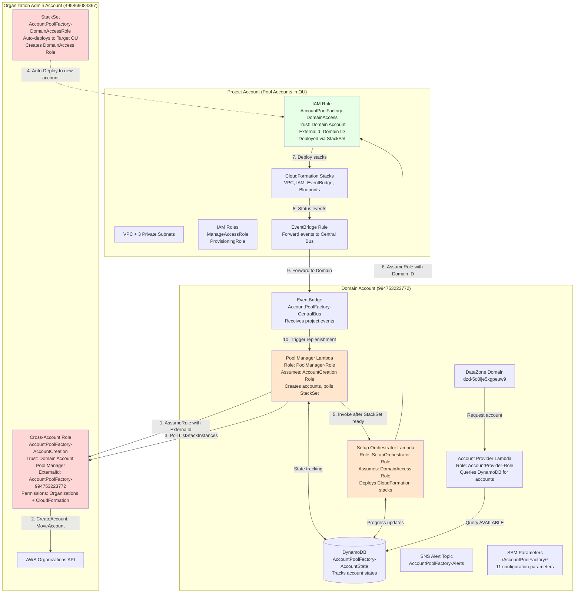
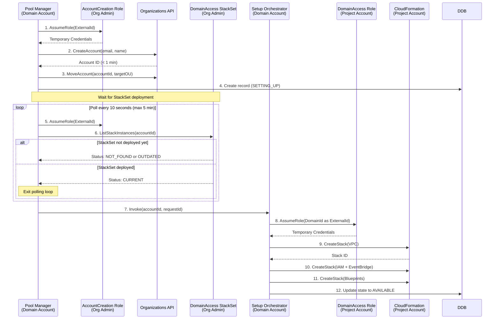

# Account Pool Factory - Current Architecture

## Overview

The Account Pool Factory is an event-driven automation system that maintains a pool of pre-configured AWS accounts for Amazon DataZone projects. This document reflects the **current implementation** as of March 4, 2026.

## System Architecture Diagram

### Component Deployment Across Three Accounts



## Cross-Account Access Pattern

### Account Creation Flow with StackSet Polling



## IAM Roles and Trust Relationships

### Organization Admin Account

**Role**: `AccountPoolFactory-AccountCreation`

**Purpose**: Allows Pool Manager in Domain account to create and manage accounts

**Trust Policy**:
```json
{
  "Version": "2012-10-17",
  "Statement": [{
    "Effect": "Allow",
    "Principal": {
      "AWS": "arn:aws:iam::994753223772:role/AccountPoolFactory-PoolManager-Role"
    },
    "Action": "sts:AssumeRole",
    "Condition": {
      "StringEquals": {
        "sts:ExternalId": "AccountPoolFactory-994753223772"
      }
    }
  }]
}
```

**Permissions**:
- `organizations:CreateAccount`
- `organizations:DescribeCreateAccountStatus`
- `organizations:DescribeAccount`
- `organizations:MoveAccount`
- `organizations:CloseAccount`
- `cloudformation:DescribeStackSet`
- `cloudformation:ListStackInstances`
- `cloudformation:DescribeStackInstance`

**Key Features**:
- External ID prevents confused deputy attacks
- CloudFormation permissions added for StackSet polling
- Least-privilege access (only account lifecycle operations)

### Domain Account

**Role**: `AccountPoolFactory-PoolManager-Role`

**Purpose**: Pool Manager Lambda execution role

**Trust Policy**: Lambda service

**Permissions**:
- `sts:AssumeRole` (to assume AccountCreation role)
- `lambda:InvokeFunction` (to invoke Setup Orchestrator)
- `dynamodb:Query`, `PutItem`, `UpdateItem`, `DeleteItem`
- `sns:Publish`
- `cloudwatch:PutMetricData`
- `ssm:GetParameter`, `GetParametersByPath`

**Role**: `AccountPoolFactory-SetupOrchestrator-Role`

**Purpose**: Setup Orchestrator Lambda execution role

**Trust Policy**: Lambda service

**Permissions**:
- `sts:AssumeRole` (to assume DomainAccess role in project accounts)
- `cloudformation:CreateStack`, `DescribeStacks`, `DeleteStack`
- `datazone:ListDomains`, `GetDomain`
- `dynamodb:PutItem`, `UpdateItem`, `GetItem`
- `sns:Publish`
- `cloudwatch:PutMetricData`
- `ssm:GetParameter`

### Project Account (Deployed via StackSet)

**Role**: `AccountPoolFactory-DomainAccess`

**Purpose**: Allows Setup Orchestrator to deploy CloudFormation stacks

**Trust Policy**:
```json
{
  "Version": "2012-10-17",
  "Statement": [{
    "Effect": "Allow",
    "Principal": {
      "AWS": "arn:aws:iam::994753223772:role/AccountPoolFactory-SetupOrchestrator-Role"
    },
    "Action": "sts:AssumeRole",
    "Condition": {
      "StringEquals": {
        "sts:ExternalId": "dzd-5o0lje5xgpeuw9"
      }
    }
  }]
}
```

**Permissions**:
- `cloudformation:*` (full CloudFormation access)
- `iam:*` (to create DataZone roles)
- `ec2:*` (to create VPC resources)
- `s3:*` (to create S3 buckets)
- `ram:*` (to create resource shares)
- `datazone:*` (to enable blueprints)
- `events:*` (to create EventBridge rules)

**Deployment**: Automatically deployed via StackSet to all accounts in target OU

## Current Implementation Status

### ✅ Completed Features

1. **Cross-Account Role Architecture**
   - AccountCreation role in Org Admin account
   - DomainAccess role deployed via StackSet
   - External ID security for both roles
   - CloudFormation permissions for StackSet polling

2. **StackSet Auto-Deployment**
   - SERVICE_MANAGED StackSet with auto-deployment
   - Deploys DomainAccess role to target OU
   - Pool Manager polls for deployment completion
   - Setup Orchestrator waits for role availability

3. **Pool Manager Lambda**
   - Cross-account role assumption with External ID
   - Account creation via Organizations API
   - StackSet deployment polling (10-second intervals)
   - Parallel account creation (up to 3 concurrent)
   - SSM parameter pagination (loads all 11 parameters)
   - Event-driven replenishment

4. **Setup Orchestrator Lambda**
   - Assumes DomainAccess role with Domain ID as ExternalId
   - Wave-based parallel execution (6 waves)
   - CloudFormation stack deployment
   - Blueprint enablement (17 blueprints)
   - Progress tracking in DynamoDB

5. **Account Provider Lambda**
   - Queries DynamoDB for AVAILABLE accounts
   - Returns account ID and region to DataZone
   - Integrated with DataZone account pool

6. **Infrastructure**
   - DynamoDB state table with GSIs
   - EventBridge central bus
   - SNS alert topic
   - SSM parameters (11 total)
   - CloudWatch dashboards (4 total)

### ⏳ In Progress

1. **Account Setup Completion**
   - 3 accounts currently in SETTING_UP state
   - VPC deployment completed for newest account
   - IAM roles and EventBridge rules deploying
   - Expected completion: 6-8 minutes per account

2. **Testing and Validation**
   - Monitoring CloudWatch Logs
   - Verifying StackSet polling works
   - Confirming cross-account access
   - Waiting for accounts to reach AVAILABLE state

### 🔜 Not Yet Implemented

1. **Project Creation Testing**
   - Create test project via DataZone portal
   - Verify account assignment from pool
   - Test environment creation
   - Validate EventBridge event forwarding

2. **Account Deletion Testing**
   - Delete test project
   - Verify account closure via Organizations API
   - Test DELETE strategy
   - Validate DynamoDB cleanup

3. **Failure Handling Testing**
   - Simulate setup failures
   - Verify replenishment blocking
   - Test SNS alerts
   - Validate manual recovery procedures

4. **Monitoring Validation**
   - Verify CloudWatch dashboards populate
   - Test SNS alert subscriptions
   - Validate metrics publishing
   - Check cross-account dashboard access

## Configuration

### SSM Parameters (11 total)

**Pool Manager Configuration**:
- `/AccountPoolFactory/PoolManager/PoolName`: "AccountPoolFactory"
- `/AccountPoolFactory/PoolManager/TargetOUId`: "ou-n5om-otvkrtx2"
- `/AccountPoolFactory/PoolManager/MinimumPoolSize`: "3"
- `/AccountPoolFactory/PoolManager/TargetPoolSize`: "10"
- `/AccountPoolFactory/PoolManager/MaxConcurrentSetups`: "3"
- `/AccountPoolFactory/PoolManager/ReclaimStrategy`: "DELETE"
- `/AccountPoolFactory/PoolManager/EmailPrefix`: "accountpool"
- `/AccountPoolFactory/PoolManager/EmailDomain`: "example.com"
- `/AccountPoolFactory/PoolManager/NamePrefix`: "DataZone-Pool"
- `/AccountPoolFactory/PoolManager/OrgAdminRoleArn`: "arn:aws:iam::495869084367:role/AccountPoolFactory-AccountCreation"
- `/AccountPoolFactory/PoolManager/ExternalId`: "AccountPoolFactory-994753223772"

**Setup Orchestrator Configuration**:
- `/AccountPoolFactory/SetupOrchestrator/DomainId`: "dzd-5o0lje5xgpeuw9"
- `/AccountPoolFactory/SetupOrchestrator/DomainAccountId`: "994753223772"
- `/AccountPoolFactory/SetupOrchestrator/RootDomainUnitId`: "563ikhcj7fgkrt"
- `/AccountPoolFactory/SetupOrchestrator/Region`: "us-east-2"
- `/AccountPoolFactory/SetupOrchestrator/AlertTopicArn`: "arn:aws:sns:us-east-2:994753223772:AccountPoolFactory-Alerts"

## Key Design Decisions

### 1. StackSet-Based Role Deployment

**Decision**: Use SERVICE_MANAGED StackSet with auto-deployment to deploy DomainAccess role

**Rationale**:
- Automatic deployment to new accounts in target OU
- No manual intervention required
- Consistent role configuration across all accounts
- Supports eventual consistency with polling

**Implementation**:
- StackSet deployed in Org Admin account
- Auto-deployment enabled for target OU
- Pool Manager polls for deployment completion
- Setup Orchestrator invoked only after role is ready

### 2. Polling vs. EventBridge for StackSet Deployment

**Decision**: Use polling (10-second intervals) instead of EventBridge events

**Rationale**:
- StackSet events not reliably delivered to Domain account
- Polling provides deterministic status checking
- 10-second interval balances responsiveness and API costs
- 5-minute timeout prevents infinite loops

**Trade-offs**:
- Additional CloudFormation API calls
- Slight delay (average 30-60 seconds)
- Simpler implementation than event-based approach

### 3. External ID for Security

**Decision**: Use External ID for both cross-account roles

**Rationale**:
- Prevents confused deputy attacks
- Standard AWS security best practice
- Different External IDs for different purposes:
  - AccountCreation role: `AccountPoolFactory-{DomainAccountId}`
  - DomainAccess role: `{DomainId}`

### 4. CloudFormation Permissions on AccountCreation Role

**Decision**: Add CloudFormation permissions to AccountCreation role

**Rationale**:
- Required for StackSet polling
- Least-privilege: Only read operations
- Scoped to AccountPoolFactory StackSets
- Enables automated deployment verification

## Next Steps

1. **Complete Current Account Setup**
   - Monitor Setup Orchestrator logs
   - Verify all 3 accounts reach AVAILABLE state
   - Check DynamoDB for correct state transitions

2. **Test Project Creation**
   - Create test project via DataZone portal
   - Verify account assignment
   - Test environment creation
   - Validate EventBridge forwarding

3. **Test Account Deletion**
   - Delete test project
   - Verify account closure
   - Check replenishment trigger
   - Validate pool size maintenance

4. **Validate Monitoring**
   - Subscribe to SNS alerts
   - Check CloudWatch dashboards
   - Verify metrics publishing
   - Test cross-account access

5. **Documentation Updates**
   - Update User Guide with latest procedures
   - Document troubleshooting steps
   - Create runbook for common operations
   - Add architecture diagrams to README

## Related Documents

- `TESTING_PROGRESS.md`: Current testing status and results
- `docs/UserGuide.md`: Operational procedures
- `docs/Architecture.md`: Detailed technical architecture
- `MANUAL_TESTING_STEPS.md`: Step-by-step testing procedures
