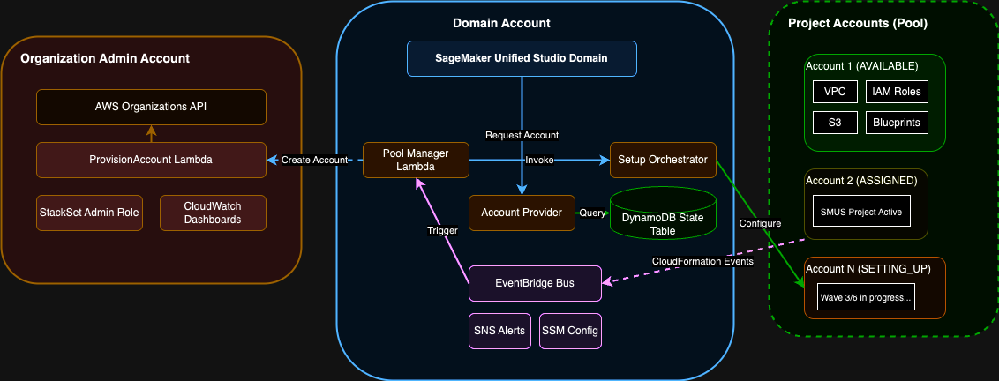

# Account Pool Factory - Architecture

## The Problem We're Solving

When a user creates a new project in **Amazon SageMaker Unified Studio**, that project requires a dedicated AWS account for security isolation. Each project gets its own account to ensure complete separation of resources, data, and permissions between different teams and workloads.

However, creating and configuring a new AWS account takes 6-8 minutes:
- Creating the account via AWS Organizations: ~1 minute
- Deploying VPC, IAM roles, S3 buckets: ~2 minutes
- Enabling 17 DataZone blueprints: ~3 minutes
- Configuring policy grants and permissions: ~2 minutes

This delay frustrates users who expect instant project creation. The Account Pool Factory solves this by maintaining a pool of pre-configured accounts that are ready before users need them.

## The Solution

The Account Pool Factory is an event-driven automation system that:
- Maintains a pool of 5-10 pre-configured AWS accounts (configurable)
- Monitors the pool size and automatically replenishes when accounts are assigned
- Provides instant account assignment (< 5 seconds instead of 6-8 minutes)
- Handles account lifecycle from creation through assignment to cleanup

**Key Benefit**: Users get immediate project creation with zero wait time for account setup.

## Who's Involved

### 1. Project Creator (Works in: Domain Account)

The end user who creates SageMaker Unified Studio projects through the web portal. They:
- Create projects using the SMUS interface
- Create environments within projects
- Delete projects when done

**Experience**: Click "Create Project" → Project ready in seconds (account already configured)

### 2. Domain Administrator (Works in: Domain Account)

Manages the SageMaker Unified Studio domain and the automated account pool. They:
- Deploy and configure the pool management infrastructure
- Monitor pool health via CloudWatch dashboards
- Respond to alerts when accounts fail setup
- Adjust pool sizes based on demand

**Tools**: CloudWatch dashboards, SNS alerts, SSM parameters for configuration

### 3. Organization Administrator (Works in: Organization Admin Account)

Manages the AWS Organization and account creation infrastructure. They:
- Deploy StackSets for account provisioning
- Monitor organization account limits
- Request limit increases when needed
- Review cross-account metrics

**Tools**: AWS Organizations console, CloudWatch dashboards, Service Quotas

## System Architecture

### Multi-Account Architecture



**Editable Diagram**: [mutli-account-architecture-factory.drawio](diagrams/mutli-account-architecture-factory.drawio)

The system spans three account types:
- **Organization Admin Account**: Manages AWS Organizations and account creation
- **Domain Account**: Hosts SageMaker Unified Studio, DataZone, and automation Lambdas
- **Project Accounts (Pool)**: Pre-configured accounts ready for project assignment

## How It Works: Step-by-Step

### Step 1: User Creates a Project

A user opens SageMaker Unified Studio and clicks "Create Project". Behind the scenes:

**API Call Sequence**:

1. **User Action**: Click "Create Project" in SMUS UI

2. **SMUS → DataZone**: `list-accounts-in-account-pool` API call

3. **Account Provider Lambda returns available account** (queries DynamoDB, returns first AVAILABLE account)

4. **SMUS → DataZone**: `CreateProject` API call with the account ID

5. **DataZone deploys project** CloudFormation stacks to the specified account

6. **SMUS UI**: Shows project as ready

**Lambda Activated**: Account Provider Lambda (Domain Account)
- Queries DynamoDB for AVAILABLE accounts
- Returns one account ID to DataZone
- Sends alert if pool is empty

**Result**: User gets instant project creation (< 5 seconds) because account is already configured

### Step 2: Pool Detects Assignment and Replenishes

When DataZone deploys the project to the assigned account, CloudFormation events trigger the Pool Manager Lambda. The Pool Manager marks the account as ASSIGNED in DynamoDB, then checks if the pool size dropped below the minimum threshold (default: 5 accounts).

If replenishment is needed, the Pool Manager invokes the ProvisionAccount Lambda (in Org Admin account) to create new accounts, then invokes the Setup Orchestrator Lambda (in Domain account) to configure them. The entire process takes 6-8 minutes per account, but happens in the background while the pool continues serving other users.

**Result**: Pool automatically maintains the target size (default: 10 accounts) without manual intervention

## Event Flow Summary

```
User Creates Project (SMUS)
  ↓
Account Provider Lambda → Returns available account
  ↓
CloudFormation Events → Pool Manager detects assignment
  ↓
Pool Manager → Triggers replenishment if needed
  ↓
ProvisionAccount Lambda → Creates new account (Org Admin)
  ↓
Setup Orchestrator Lambda → Configures account in 6 waves (Domain)
  ↓
Account Available → Ready for next user
```

## Key Design Decisions

### Why Pre-Configure Accounts?

**Problem**: 6-8 minute wait frustrates users
**Solution**: Accounts ready before users need them
**Trade-off**: Small pool maintenance cost vs. instant user experience

### Why Event-Driven Replenishment?

**Problem**: Time-based polling wastes Lambda invocations
**Solution**: CloudFormation events trigger replenishment only when needed
**Benefit**: Lower costs, immediate response to demand

### Why Cross-Account Lambda for Provisioning?

**Problem**: Setup Orchestrator needs Organizations API access (security risk)
**Solution**: Separate ProvisionAccount Lambda in Org Admin account
**Benefit**: Least-privilege security, ExternalId protection from the start

### Why Wave-Based Parallel Execution?

**Problem**: Sequential deployment takes 10-12 minutes
**Solution**: Deploy independent resources in parallel waves
**Benefit**: 17% faster (6-8 minutes), respects CloudFormation dependencies

## Detailed Component Architecture

This section describes each account type, the resources deployed in it, and how the Lambdas function.

### Organization Admin Account

**Purpose**: Manages AWS Organization and handles secure account provisioning

**Deployed Resources**:
- CloudFormation StackSet Administration Role
- CloudFormation StackSets:
  - `AccountPoolFactory-StackSetExecutionRole` - Deploys execution role to new accounts
  - `AccountPoolFactory-DomainAccess` - Deploys cross-account access role with ExternalId
- ProvisionAccount Lambda function
- CloudWatch Logs for Lambda execution

**Lambda: ProvisionAccount**

**Trigger**: Cross-account invocation from Pool Manager Lambda (Domain Account)

**What it does**:
1. Creates account via Organizations API (~1 minute)
2. Moves account to target OU
3. Deploys StackSet execution role to new account
4. Deploys AccountPoolFactory-DomainAccess role with ExternalId protection
5. Waits for IAM role propagation
6. Returns ready-to-use account ID

**Why it exists**: This is the only Lambda that touches OrganizationAccountAccessRole (no ExternalId). By isolating account creation in the Org Admin account, we prevent the Setup Orchestrator from having Organizations API access, which would be a security risk.

**IAM Permissions**:
- Organizations: CreateAccount, DescribeAccount, MoveAccount, ListParents
- STS: AssumeRole (OrganizationAccountAccessRole in any account)
- CloudFormation: CreateStack, DescribeStacks, CreateStackInstances, DescribeStackSetOperation

**Resource Policy**: Allows Domain account Pool Manager to invoke cross-account

### Domain Account

**Purpose**: Hosts SageMaker Unified Studio, DataZone, and all automation infrastructure

**Deployed Resources**:
- SageMaker Unified Studio domain
- DataZone domain
- DynamoDB table: `AccountPoolFactory-AccountState`
- EventBridge central bus: `AccountPoolFactory-CentralBus`
- SNS topic: `AccountPoolFactory-Alerts`
- SSM parameters: `/AccountPoolFactory/*` (configuration)
- Three Lambda functions:
  - Account Provider Lambda
  - Pool Manager Lambda
  - Setup Orchestrator Lambda
- CloudWatch dashboards (4 dashboards)
- CloudWatch Logs for all Lambdas

**Lambda: Account Provider**

**Trigger**: DataZone API calls (`list-accounts-in-account-pool`, `validate-account-authorization`)

**What it does**:
1. Queries DynamoDB StateIndex GSI for AVAILABLE accounts
2. Returns account ID and region to DataZone
3. Publishes CloudWatch metrics
4. Sends SNS alert if pool is empty

**Why it exists**: DataZone needs a Lambda to query the account pool. This Lambda is the integration point between DataZone and the pool management system.

**IAM Permissions**:
- DynamoDB: Query (StateIndex GSI)
- CloudWatch: PutMetricData
- SNS: Publish

**Lambda: Pool Manager**

**Trigger**: CloudFormation events from EventBridge central bus

**What it does**:
1. Detects account assignment from CREATE_IN_PROGRESS events
2. Updates DynamoDB to mark account as ASSIGNED
3. Checks pool size against minimum threshold
4. Blocks replenishment if failed accounts exist
5. Invokes ProvisionAccount Lambda (cross-account) to create new accounts
6. Creates DynamoDB records for new accounts (state: SETTING_UP)
7. Invokes Setup Orchestrator Lambda (async) to configure accounts
8. Handles account deletion and reclamation (DELETE or REUSE strategy)

**Why it exists**: This is the orchestrator for pool-level operations. It monitors pool health, triggers replenishment, and manages the account lifecycle.

**IAM Permissions**:
- Lambda: InvokeFunction (ProvisionAccount in Org Admin, Setup Orchestrator in Domain)
- DynamoDB: Query, PutItem, UpdateItem, DeleteItem
- SNS: Publish
- CloudWatch: PutMetricData
- SSM: GetParameter, GetParameters
- STS: AssumeRole (for checking remaining stacks in project accounts)

**Configuration** (SSM Parameters):
- PoolName, TargetOUId, MinimumPoolSize (default: 5), TargetPoolSize (default: 10)
- MaxConcurrentSetups (default: 3), ReclaimStrategy (DELETE or REUSE)
- ProvisionAccountLambdaArn (ARN in Org Admin account)

**Lambda: Setup Orchestrator**

**Trigger**: Async invocation from Pool Manager Lambda

**What it does**:
1. Validates account exists in DynamoDB
2. Checks for idempotency (skips if already AVAILABLE)
3. Executes 6-wave configuration workflow:
   - Wave 1: VPC deployment (2.5 min)
   - Wave 2: IAM roles + EventBridge rules in parallel (2 min)
   - Wave 3: S3 bucket + RAM share in parallel (1 min)
   - Wave 4: Enable 17 blueprints (3 min)
   - Wave 5: Policy grants (included in blueprint template)
   - Wave 6: Domain visibility verification (1 min)
4. Updates DynamoDB with progress after each wave
5. Marks account as AVAILABLE when complete

**Why it exists**: This Lambda handles the complex multi-step configuration workflow. By using wave-based parallel execution, it reduces setup time from 10-12 minutes to 6-8 minutes.

**IAM Permissions**:
- CloudFormation: CreateStack, DescribeStacks, DeleteStack
- DataZone: ListDomains, GetDomain, CreatePolicyGrant
- RAM: CreateResourceShare, GetResourceShares, AssociateResourceShare
- S3: CreateBucket, PutBucketVersioning, PutBucketEncryption
- DynamoDB: PutItem, UpdateItem, GetItem
- SNS: Publish
- CloudWatch: PutMetricData
- SSM: GetParameter
- STS: AssumeRole (AccountPoolFactory-DomainAccess role with ExternalId)

**Configuration** (SSM Parameters):
- DomainId, DomainAccountId, RootDomainUnitId, Region
- RetryConfig (exponential backoff for failures)

### Project Account (Pool)

**Purpose**: Pre-configured accounts ready for SageMaker Unified Studio project assignment

**Deployed Resources** (after Setup Orchestrator completes):
- VPC with 3 private subnets across 3 availability zones
- IAM roles:
  - ManageAccessRole (DataZone project management)
  - ProvisioningRole (DataZone environment provisioning)
  - AccountPoolFactory-DomainAccess (cross-account access with ExternalId)
  - AWSCloudFormationStackSetExecutionRole (StackSet deployments)
- EventBridge rules (forward events to Domain account central bus)
- S3 bucket for blueprint artifacts (versioned, encrypted)
- RAM share for DataZone domain access
- 17 enabled DataZone blueprints with policy grants
- CloudFormation stacks for all above resources

**State in DynamoDB**: AVAILABLE (ready for assignment)

**What happens when assigned**:
1. DataZone deploys project CloudFormation stacks
2. CloudFormation events trigger Pool Manager
3. DynamoDB state changes: AVAILABLE → ASSIGNED
4. Account removed from pool inventory

**What happens when deleted**:
1. DataZone deletes project CloudFormation stacks
2. CloudFormation DELETE_COMPLETE events trigger Pool Manager
3. Pool Manager checks for remaining stacks
4. If DELETE strategy: Account removed from pool (still exists in Organizations)
5. If REUSE strategy: Setup Orchestrator cleans account, returns to pool


