# Account Pool Factory - Architecture

## Overview

The Account Pool Factory is an event-driven automation system that maintains a pool of pre-configured AWS accounts for Amazon DataZone projects. It provides instant account assignment by keeping accounts ready before they're needed, eliminating the 6-8 minute setup delay during project creation.

### Design Philosophy

- **Event-Driven**: CloudFormation events trigger pool operations, not time-based polling
- **Parallel Execution**: Multiple accounts created and configured simultaneously
- **Wave-Based Setup**: 8-step workflow organized into 6 waves with parallel execution
- **Failure Isolation**: Failed accounts block replenishment to prevent cascading errors
- **Cost Optimization**: DELETE strategy by default to minimize account costs
- **Observable**: Comprehensive monitoring with 4 CloudWatch dashboards

### Key Metrics

- **Account Creation**: < 1 minute via Organizations API
- **Account Setup**: 6-8 minutes with wave-based parallel execution
- **Pool Replenishment**: Triggered by CloudFormation events, not scheduled
- **Parallel Setups**: Up to 3 accounts configured simultaneously (configurable)
- **Default Pool Size**: 5-10 accounts (configurable)

## System Architecture

### Three-Account Model

```mermaid
graph TB
    subgraph "Organization Admin Account"
        ORGS[AWS Organizations API]
        XACCT_ROLE[Cross-Account Role<br/>AccountPoolFactory-AccountCreation]
        ORGS_DASH[CloudWatch Dashboard<br/>Cross-Account View]
    end
    
    subgraph "Domain Account"
        DZ[DataZone Domain]
        PM[Pool Manager Lambda]
        SO[Setup Orchestrator Lambda]
        AP[Account Provider Lambda]
        DDB[(DynamoDB<br/>State Table)]
        BUS[EventBridge<br/>Central Bus]
        SNS[SNS Alert Topic]
        DASH[CloudWatch Dashboards<br/>4 Dashboards]
        SSM[SSM Parameters<br/>Configuration]
    end
    
    subgraph "Project Account 1..N"
        CF[CloudFormation Stacks]
        VPC[VPC + Subnets]
        IAM[IAM Roles]
        S3[S3 Bucket]
        BP[17 Blueprints]
        EB_RULE[EventBridge Rule]
    end
    
    PM -->|AssumeRole| XACCT_ROLE
    XACCT_ROLE -->|CreateAccount<br/>CloseAccount| ORGS
    PM -->|Invoke| SO
    SO -->|Deploy| CF
    CF -->|Events| EB_RULE
    EB_RULE -->|Forward| BUS
    BUS -->|Trigger| PM
    PM <-->|State| DDB
    SO <-->|Progress| DDB
    PM -->|Alerts| SNS
    SO -->|Alerts| SNS
    PM -->|Metrics| DASH
    SO -->|Metrics| DASH
    PM -->|Read Config| SSM
    SO -->|Read Config| SSM
    DZ -->|Request Account| AP
    AP -->|Query| DDB
    DASH -.->|Cross-Account| ORGS_DASH
    
    style ORGS fill:#FFE6E6
    style XACCT_ROLE fill:#FFD6D6
    style DZ fill:#E6F3FF
    style PM fill:#FFE6CC
    style SO fill:#FFE6CC
    style AP fill:#FFE6CC
    style DDB fill:#E6FFE6
    style BUS fill:#F0E6FF


### Account Hierarchy

```mermaid
graph TD
    ORG[AWS Organization<br/>o-nblj7uawmo]
    ROOT[Root OU<br/>r-n5om]
    TARGET_OU[Target OU<br/>Configurable via TargetOUId]
    DOMAIN_ACCT[Domain Account<br/>994753223772<br/>DataZone Domain]
    PROJ_ACCT1[Project Account 1<br/>Pre-configured]
    PROJ_ACCT2[Project Account 2<br/>Pre-configured]
    PROJ_ACCT3[Project Account N<br/>Pre-configured]
    
    ORG --> ROOT
    ROOT --> TARGET_OU
    ROOT --> DOMAIN_ACCT
    TARGET_OU --> PROJ_ACCT1
    TARGET_OU --> PROJ_ACCT2
    TARGET_OU --> PROJ_ACCT3
    
    style ORG fill:#FFE6E6
    style DOMAIN_ACCT fill:#E6F3FF
    style PROJ_ACCT1 fill:#E6FFE6
    style PROJ_ACCT2 fill:#E6FFE6
    style PROJ_ACCT3 fill:#E6FFE6
```

**Key Points**:
- Organization Admin account manages AWS Organizations
- Domain account hosts DataZone domain and automation Lambdas
- Project accounts are created in configurable target OU (default: root)
- Each project gets one dedicated account for complete isolation

## Personas and Responsibilities

### 1. Organization Administrator

**Account**: Organization Admin Account

**Role**: Manages AWS Organization and account creation infrastructure

**Responsibilities**:
- Deploy approved CloudFormation StackSets
- Monitor organization account limits
- Request account limit increases when needed
- Review cross-account CloudWatch dashboards

**Tools**:
- AWS Organizations console
- CloudWatch dashboards (cross-account view)
- Service Quotas console

**Key Actions**:
- One-time StackSet deployment
- Periodic limit monitoring
- Respond to limit warnings


### 2. Domain Administrator

**Account**: Domain Account

**Role**: Manages DataZone domain and automated account pool

**Responsibilities**:
- Deploy and configure Pool Manager and Setup Orchestrator Lambdas
- Configure pool settings via SSM parameters
- Monitor pool health via CloudWatch dashboards
- Respond to SNS alerts for failures
- Handle failed accounts (investigate and delete)
- Adjust pool sizes based on demand

**Tools**:
- CloudWatch dashboards (4 dashboards)
- SNS email/SMS alerts
- DynamoDB query API
- CloudWatch Logs Insights
- SSM Parameter Store

**Key Actions**:
- Initial infrastructure deployment
- Dynamic configuration updates (no Lambda restart)
- Failure investigation and resolution
- Pool size adjustments
- Alert subscription management

### 3. Project Creator

**Account**: Domain Account (via DataZone portal)

**Role**: Creates DataZone projects and environments

**Responsibilities**:
- Create projects using account pool-enabled profiles
- Create environments manually (ON_DEMAND)
- Monitor project resources

**Tools**:
- DataZone portal
- AWS CLI (optional)

**Key Actions**:
- Project creation (automatic account assignment)
- Manual environment creation
- Project deletion (automatic account cleanup)

**Note**: Account assignment is fully automatic. Each project gets one dedicated account from the pool without manual selection.


## Lambda Functions Architecture

### Pool Manager Lambda

**Purpose**: Orchestrates pool-level operations and account lifecycle management

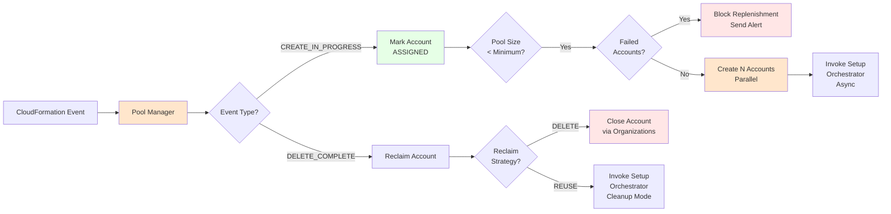

**Key Functions**:
- Event-driven replenishment (not time-based)
- Parallel account creation
- Account assignment detection
- Account reclamation (DELETE or REUSE)
- Failure blocking
- CloudWatch metrics publishing
- SNS alert sending

**Configuration** (SSM Parameters):
- PoolName: Account pool identifier
- TargetOUId: OU for created accounts (default: root)
- MinimumPoolSize: Trigger threshold (default: 5)
- TargetPoolSize: Replenishment target (default: 10)
- MaxConcurrentSetups: Parallel limit (default: 3)
- ReclaimStrategy: DELETE or REUSE (default: DELETE)

**IAM Permissions**:
- Organizations: CreateAccount, CloseAccount, MoveAccount, ListAccounts
- Lambda: InvokeFunction (Setup Orchestrator)
- DynamoDB: Query, PutItem, UpdateItem, DeleteItem
- SNS: Publish
- CloudWatch: PutMetricData
- SSM: GetParameter, GetParameters


### Setup Orchestrator Lambda

**Purpose**: Executes 8-step account setup workflow for individual accounts

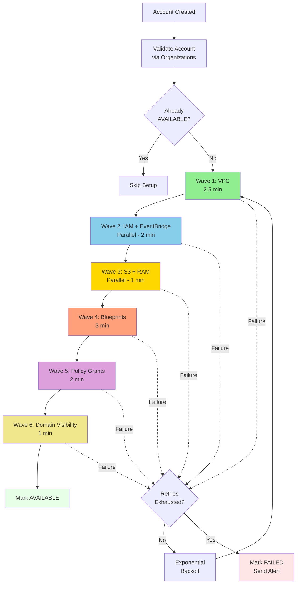

**Wave-Based Parallel Execution**:
- Wave 1: VPC deployment (foundation)
- Wave 2: IAM roles + EventBridge rules (parallel)
- Wave 3: S3 bucket + RAM share (parallel)
- Wave 4: Blueprint enablement (17 blueprints)
- Wave 5: Policy grants creation
- Wave 6: Domain visibility verification

**Total Duration**: 6-8 minutes (vs 10-12 minutes sequential)

**Configuration** (SSM Parameters):
- DomainId: DataZone domain identifier
- DomainAccountId: Domain account ID
- RootDomainUnitId: Root domain unit ID
- Region: AWS region
- RetryConfig: Retry logic with exponential backoff

**IAM Permissions**:
- CloudFormation: CreateStack, DescribeStacks, DeleteStack
- DataZone: ListDomains, GetDomain
- RAM: CreateResourceShare, GetResourceShares
- S3: CreateBucket, PutBucketVersioning, PutBucketEncryption
- DynamoDB: PutItem, UpdateItem, GetItem
- SNS: Publish
- CloudWatch: PutMetricData
- SSM: GetParameter
- STS: AssumeRole (cross-account)


### Account Provider Lambda

**Purpose**: Handles DataZone account pool requests and returns available accounts

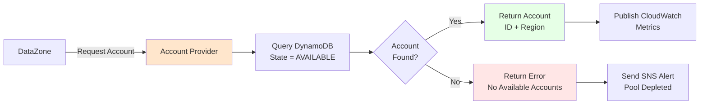

**Key Functions**:
- Query DynamoDB for AVAILABLE accounts
- Return account ID and region to DataZone
- Publish CloudWatch metrics
- Send alerts when pool depleted

**IAM Permissions**:
- DynamoDB: Query (StateIndex GSI)
- CloudWatch: PutMetricData
- SNS: Publish

## Event Flow Architecture

### Account Assignment Flow

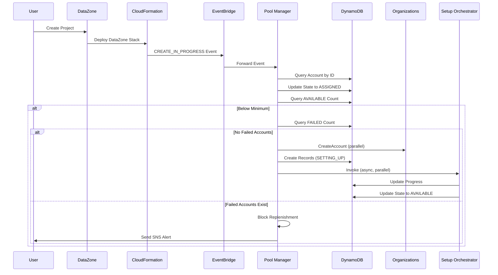

**Key Points**:
- CloudFormation events trigger pool operations
- Account assignment detected from CREATE_IN_PROGRESS
- Replenishment triggered when pool drops below minimum
- Failed accounts block replenishment
- Multiple accounts created in parallel


### Account Deletion Flow

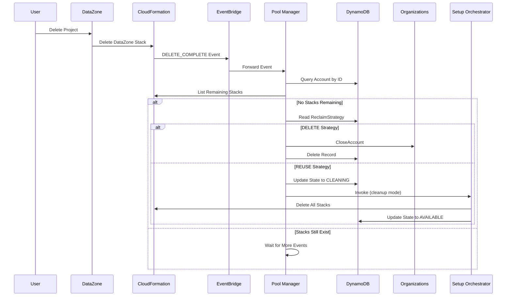

**Key Points**:
- DELETE_COMPLETE events trigger reclamation
- Verifies all DataZone stacks deleted before reclaiming
- DELETE strategy closes accounts (default)
- REUSE strategy cleans and returns to pool
- Multiple stacks handled sequentially

### Replenishment Blocking Flow

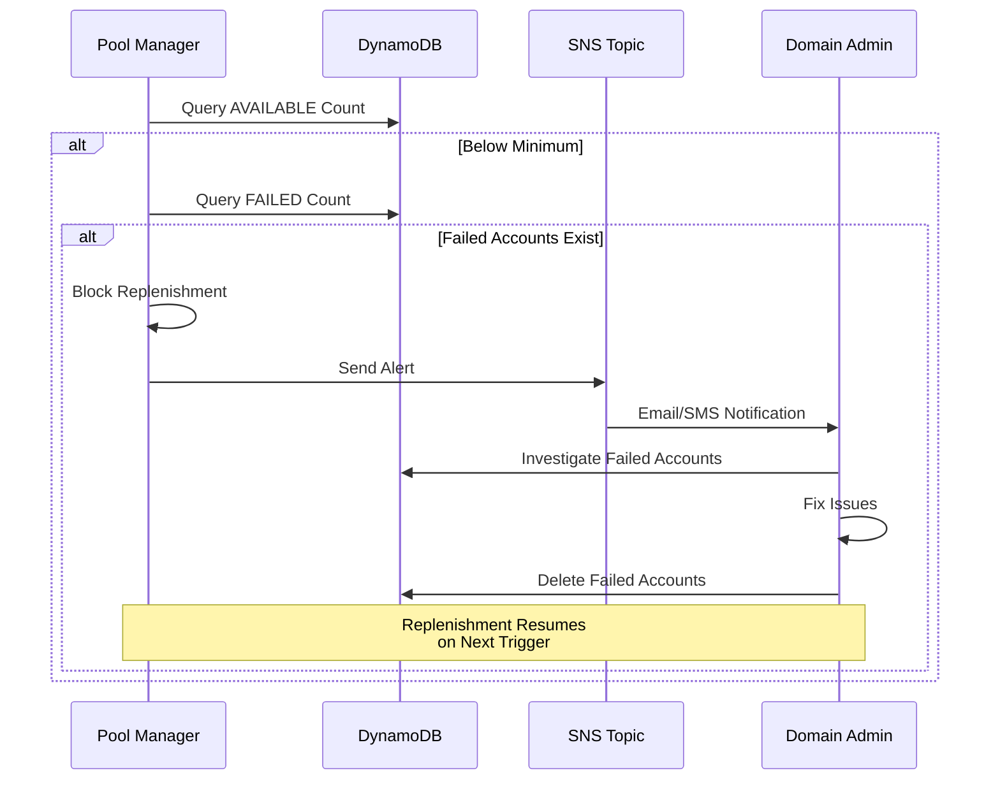

**Key Points**:
- ANY failed account blocks replenishment
- Manual intervention required
- Failed accounts must be deleted to unblock
- Prevents cascading failures


## Account Lifecycle State Machine

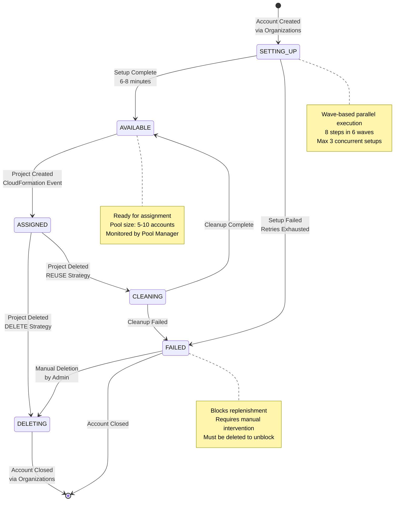

**State Descriptions**:

- **SETTING_UP**: Account being configured by Setup Orchestrator (6-8 minutes)
- **AVAILABLE**: Account ready for project assignment (pool inventory)
- **ASSIGNED**: Account assigned to DataZone project (active project)
- **FAILED**: Setup or cleanup failed after retry exhaustion (blocks replenishment)
- **CLEANING**: Account being cleaned for reuse (REUSE strategy only)
- **DELETING**: Account being closed via Organizations API (DELETE strategy)

**State Transitions**:

- **Creation → Setup**: Organizations API creates account, Setup Orchestrator invoked
- **Setup → Available**: All 8 steps complete successfully
- **Setup → Failed**: Retry exhaustion after 3 attempts with exponential backoff
- **Available → Assigned**: CloudFormation CREATE_IN_PROGRESS event detected
- **Assigned → Deleting**: CloudFormation DELETE_COMPLETE event + DELETE strategy
- **Assigned → Cleaning**: CloudFormation DELETE_COMPLETE event + REUSE strategy
- **Cleaning → Available**: Cleanup complete, account returned to pool
- **Cleaning → Failed**: Cleanup failed after retry exhaustion
- **Failed → Deleting**: Manual deletion by Domain Administrator
- **Deleting → Closed**: Organizations CloseAccount API completes


## Wave-Based Parallel Execution

### Setup Workflow Topology

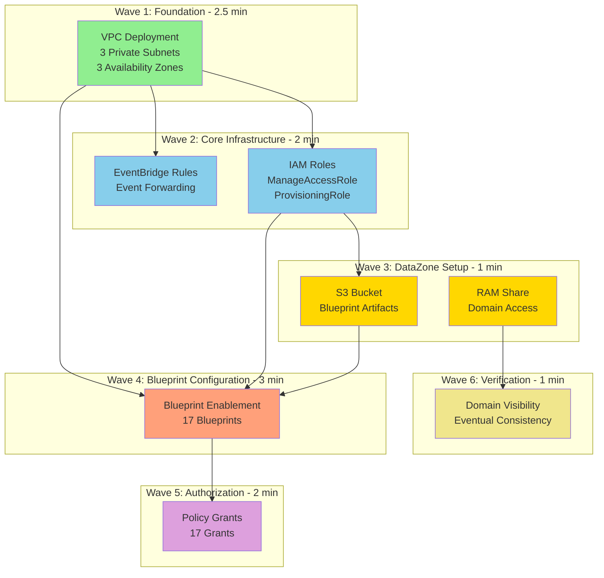

**Execution Strategy**:

- **Wave 1** (2.5 min): VPC deployment - foundation for all other resources
- **Wave 2** (2 min): IAM + EventBridge in parallel - both depend on VPC
- **Wave 3** (1 min): S3 + RAM in parallel - S3 depends on IAM, RAM independent
- **Wave 4** (3 min): Blueprint enablement - depends on VPC, IAM, S3
- **Wave 5** (2 min): Policy grants - depends on blueprint IDs
- **Wave 6** (1 min): Domain visibility - depends on RAM share

**Total Duration**: 11.5 minutes sequential → 6-8 minutes with parallelism

**Parallelism Savings**:
- Wave 2: 1.5 minutes saved (IAM + EventBridge)
- Wave 3: 0.5 minutes saved (S3 + RAM)
- Total: ~2 minutes saved (17% improvement)

**Critical Path**: VPC → IAM → S3 → Blueprints → Grants (9.5 minutes)


## IAM Roles and Permissions

### Cross-Account Access Pattern

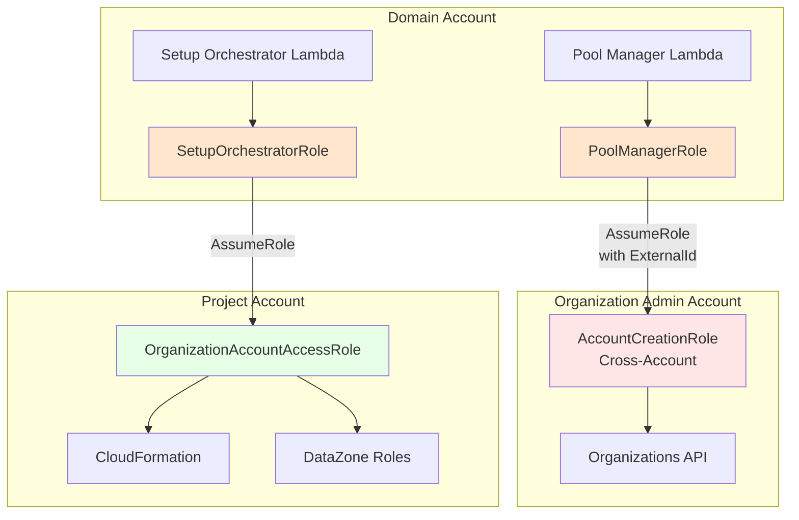

**Security Model**:
- Pool Manager runs in Domain account but needs Organizations API access
- Cross-account role in Org Admin account with least-privilege permissions
- External ID prevents confused deputy attacks
- Setup Orchestrator uses standard OrganizationAccountAccessRole

### Organization Admin Account - Cross-Account Role

**Role Name**: `AccountPoolFactory-AccountCreation`

**Trust Policy**: Domain account Pool Manager Lambda role with External ID
```json
{
  "Version": "2012-10-17",
  "Statement": [{
    "Effect": "Allow",
    "Principal": {
      "AWS": "arn:aws:iam::DOMAIN_ACCOUNT:role/AccountPoolFactory-PoolManager-Role"
    },
    "Action": "sts:AssumeRole",
    "Condition": {
      "StringEquals": {
        "sts:ExternalId": "AccountPoolFactory-DOMAIN_ACCOUNT"
      }
    }
  }]
}
```

**Permissions** (Least Privilege):
```json
{
  "Version": "2012-10-17",
  "Statement": [
    {
      "Effect": "Allow",
      "Action": [
        "organizations:CreateAccount",
        "organizations:DescribeCreateAccountStatus"
      ],
      "Resource": "*",
      "Sid": "AccountCreation"
    },
    {
      "Effect": "Allow",
      "Action": [
        "organizations:DescribeAccount",
        "organizations:ListParents",
        "organizations:MoveAccount",
        "organizations:CloseAccount"
      ],
      "Resource": "*",
      "Sid": "AccountManagement"
    },
    {
      "Effect": "Allow",
      "Action": [
        "organizations:DescribeOrganization",
        "organizations:ListRoots",
        "organizations:ListOrganizationalUnitsForParent",
        "organizations:DescribeOrganizationalUnit"
      ],
      "Resource": "*",
      "Sid": "OrganizationReadOnly"
    }
  ]
}
```

**Configuration**:
- Deployed via CloudFormation in Org Admin account
- Role ARN stored in SSM: `/AccountPoolFactory/PoolManager/OrgAdminRoleArn`
- External ID stored in SSM: `/AccountPoolFactory/PoolManager/ExternalId`
- Pool Manager automatically assumes role when configured

### Pool Manager Role Permissions

**Trust Policy**: Lambda service

**Managed Policies**:
- AWSLambdaBasicExecutionRole (CloudWatch Logs)

**Inline Policies**:
```json
{
  "Lambda": [
    "lambda:InvokeFunction"
  ],
  "DynamoDB": [
    "dynamodb:Query",
    "dynamodb:PutItem",
    "dynamodb:UpdateItem",
    "dynamodb:DeleteItem"
  ],
  "SNS": [
    "sns:Publish"
  ],
  "CloudWatch": [
    "cloudwatch:PutMetricData"
  ],
  "SSM": [
    "ssm:GetParameter",
    "ssm:GetParameters",
    "ssm:GetParametersByPath"
  ],
  "STS": [
    "sts:AssumeRole"
  ]
}
```

**Note**: Organizations API permissions removed - now uses cross-account role


### Setup Orchestrator Role Permissions

**Trust Policy**: Lambda service

**Managed Policies**:
- AWSLambdaBasicExecutionRole (CloudWatch Logs)

**Inline Policies**:
```json
{
  "CloudFormation": [
    "cloudformation:CreateStack",
    "cloudformation:DescribeStacks",
    "cloudformation:DescribeStackEvents",
    "cloudformation:UpdateStack",
    "cloudformation:DeleteStack"
  ],
  "DataZone": [
    "datazone:ListDomains",
    "datazone:GetDomain"
  ],
  "RAM": [
    "ram:CreateResourceShare",
    "ram:GetResourceShares"
  ],
  "S3": [
    "s3:CreateBucket",
    "s3:PutBucketVersioning",
    "s3:PutBucketEncryption"
  ],
  "IAM": [
    "iam:PassRole"
  ],
  "DynamoDB": [
    "dynamodb:PutItem",
    "dynamodb:UpdateItem",
    "dynamodb:GetItem"
  ],
  "SNS": [
    "sns:Publish"
  ],
  "CloudWatch": [
    "cloudwatch:PutMetricData"
  ],
  "SSM": [
    "ssm:GetParameter"
  ],
  "STS": [
    "sts:AssumeRole"
  ]
}
```

### Project Account Roles

**ManageAccessRole**:
- Purpose: DataZone manages Lake Formation and Glue resources
- Trust Policy: DataZone service
- Permissions: Lake Formation, Glue, IAM, S3 (custom inline policies)
- **Critical**: NO permissions boundary attached

**ProvisioningRole**:
- Purpose: DataZone provisions environment resources
- Trust Policy: DataZone service
- Permissions: AdministratorAccess (isolated project accounts)
- **Critical**: NO permissions boundary attached

**EventBridgeForwarderRole**:
- Purpose: Forward CloudFormation events to central bus
- Trust Policy: EventBridge service
- Permissions: events:PutEvents on central bus


## Data Architecture

### DynamoDB State Table Schema

```mermaid
erDiagram
    AccountState {
        string accountId PK
        number timestamp SK
        string state
        string createdDate
        string assignedDate
        string setupStartDate
        string setupCompleteDate
        number setupDuration
        string projectId
        string projectStackName
        string currentStep
        array completedSteps
        string failedStep
        string errorMessage
        string errorCode
        string stackName
        string stackId
        array stackEvents
        number retryCount
        number maxRetries
        boolean retryExhausted
        object resources
    }
    
    StateIndex {
        string state PK
        string createdDate SK
    }
    
    ProjectIndex {
        string projectId PK
        string assignedDate SK
    }
    
    AccountState ||--o{ StateIndex : "GSI"
    AccountState ||--o{ ProjectIndex : "GSI"
```

**Primary Key**:
- Partition Key: `accountId` (String)
- Sort Key: `timestamp` (Number) - Unix timestamp for versioning

**Global Secondary Indexes**:

1. **StateIndex**: Query accounts by state
   - Partition Key: `state`
   - Sort Key: `createdDate`
   - Use Case: Pool size calculations, failure tracking

2. **ProjectIndex**: Query accounts by project
   - Partition Key: `projectId`
   - Sort Key: `assignedDate`
   - Use Case: Project-to-account mapping

**TTL**: 90 days after account deletion for historical analysis

### EventBridge Event Schema

**CloudFormation Stack Event**:
```json
{
  "version": "0",
  "id": "event-id",
  "detail-type": "CloudFormation Stack Status Change",
  "source": "aws.cloudformation",
  "account": "123456789012",
  "time": "2024-03-02T12:00:00Z",
  "region": "us-east-2",
  "resources": [
    "arn:aws:cloudformation:us-east-2:123456789012:stack/DataZone-Project-abc/..."
  ],
  "detail": {
    "stack-id": "arn:aws:cloudformation:...",
    "status-details": {
      "status": "CREATE_IN_PROGRESS"
    },
    "stack-name": "DataZone-Project-abc123"
  }
}
```

**Event Flow**:
1. CloudFormation emits event in project account
2. EventBridge rule matches stack name prefix "DataZone-"
3. Rule forwards event to central bus in domain account
4. Central bus triggers Pool Manager Lambda


## Monitoring and Observability Architecture

### CloudWatch Dashboard Architecture

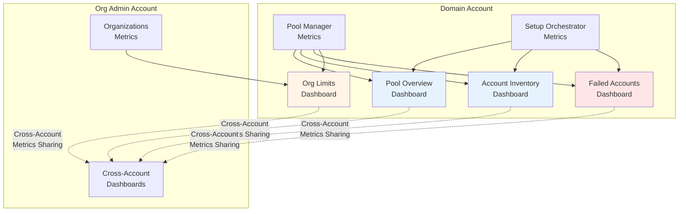

**Dashboard 1: Pool Overview**
- Real-time pool size by state
- Account creation/assignment rates
- Average setup duration
- Failed account breakdown
- Replenishment events

**Dashboard 2: Account Inventory**
- Account table with IDs, states, projects
- Account lifecycle timeline
- Filters by state and date
- Links to CloudWatch Logs

**Dashboard 3: Failed Accounts**
- Failed account count
- Failure breakdown by step
- Retry exhaustion rate
- Detailed error messages

**Dashboard 4: Organization Limits**
- Account limit status
- Account usage trend
- Capacity alarms
- Daily/weekly statistics

**Cross-Account Access**:
- Dashboards deployed to both Domain and Org Admin accounts
- CloudWatch metrics sharing configured automatically
- Consistent visibility regardless of login account


### Alert Architecture

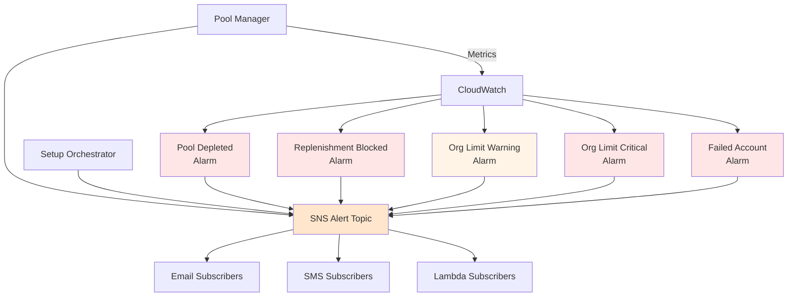

**Alert Types**:

1. **Account Setup Failed**: Setup failed after retry exhaustion
2. **Pool Depleted**: No available accounts in pool
3. **Replenishment Blocked**: Failed accounts exist, blocking new creation
4. **Org Limit Warning**: < 50 accounts remaining
5. **Org Limit Critical**: < 20 accounts remaining

**Notification Channels**:
- Email (primary)
- SMS (optional)
- Lambda (for automation)

## Configuration Management

### SSM Parameter Store Architecture

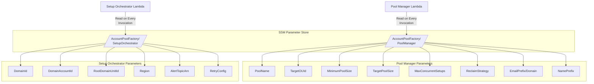

**Dynamic Configuration**:
- Parameters read on EVERY Lambda invocation
- No caching across invocations
- Configuration updates take effect immediately
- No Lambda restart required

**Key Configuration Parameters**:
- **PoolName**: Account pool identifier (default: AccountPoolFactory)
- **TargetOUId**: OU for created accounts (default: root)
- **MinimumPoolSize**: Replenishment trigger (default: 5)
- **TargetPoolSize**: Replenishment target (default: 10)
- **ReclaimStrategy**: DELETE or REUSE (default: DELETE)


## Deployment Architecture

### Infrastructure Components

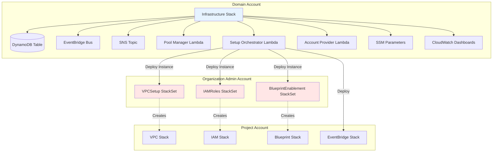

**Deployment Sequence**:

1. **Organization Admin**: Deploy StackSets (one-time)
   - VPCSetup StackSet
   - IAMRoles StackSet
   - BlueprintEnablement StackSet

2. **Domain Admin**: Deploy infrastructure (one-time)
   - DynamoDB state table
   - EventBridge central bus
   - SNS alert topic
   - Pool Manager Lambda
   - Setup Orchestrator Lambda
   - Account Provider Lambda
   - SSM parameters
   - CloudWatch dashboards

3. **Automatic**: Setup Orchestrator deploys to project accounts
   - VPC stack (from StackSet)
   - IAM stack (from StackSet)
   - Blueprint stack (from StackSet)
   - EventBridge rules stack
   - S3 bucket
   - RAM share


## Design Decisions and Rationale

### Event-Driven Replenishment

**Decision**: Use CloudFormation events to trigger pool operations instead of time-based polling

**Rationale**:
- Immediate response to project creation/deletion
- No wasted polling when pool is stable
- Lower Lambda invocation costs
- More accurate pool size tracking
- Scales naturally with project activity

**Implementation**:
- EventBridge rules in each project account
- Central event bus in domain account
- Pool Manager triggered by CREATE_IN_PROGRESS and DELETE_COMPLETE events

### DELETE-First Strategy

**Decision**: Default to closing accounts after project deletion instead of reusing them

**Rationale**:
- Cost optimization: Closed accounts cost $0
- Clean state: No residual resources or configurations
- Simpler cleanup: No complex resource deletion logic
- Account limits: Can request increases if needed
- Security: No risk of data leakage between projects

**Trade-offs**:
- Account creation limits (default 10, can be increased)
- Slightly longer replenishment time (< 1 minute account creation)
- Cannot reuse account IDs

**Alternative**: REUSE strategy available via SSM parameter for organizations with strict account limits

### Wave-Based Parallel Execution

**Decision**: Organize 8-step setup workflow into 6 waves with parallel execution

**Rationale**:
- Reduces setup time from 10-12 minutes to 6-8 minutes (17% improvement)
- Respects CloudFormation dependencies
- Maximizes resource utilization
- Maintains idempotency and retry safety

**Implementation**:
- Wave 1: VPC (foundation)
- Wave 2: IAM + EventBridge (parallel)
- Wave 3: S3 + RAM (parallel)
- Wave 4: Blueprints (sequential, depends on multiple resources)
- Wave 5: Policy grants (sequential, depends on blueprint IDs)
- Wave 6: Domain visibility (sequential, eventual consistency)


### Failure Blocking

**Decision**: Block replenishment when ANY failed accounts exist

**Rationale**:
- Prevents cascading failures
- Forces investigation of root causes
- Avoids wasting account quota on failing setups
- Ensures pool health before scaling
- Clear signal to operators

**Implementation**:
- Pool Manager queries DynamoDB for FAILED state
- Replenishment blocked if count > 0
- SNS alert sent with failed account details
- Manual deletion required to unblock

**Trade-offs**:
- Requires manual intervention
- Pool may deplete during investigation
- Operators must respond to alerts

### No Permissions Boundary

**Decision**: Do NOT attach AmazonDataZoneEnvironmentRolePermissionsBoundary to DataZone roles

**Rationale**:
- Permissions boundary causes explicit deny for required operations
- Project accounts are isolated (one per project)
- AdministratorAccess is safe in isolated accounts
- DataZone needs full permissions for environment provisioning

**Critical Finding**: Permissions boundary blocks Lake Formation, Glue, and IAM operations required by DataZone

**Implementation**:
- ManageAccessRole: Custom inline policies (no boundary)
- ProvisioningRole: AdministratorAccess (no boundary)
- Isolation via dedicated accounts, not permissions boundaries

### Dynamic Configuration

**Decision**: Read SSM parameters on every Lambda invocation instead of caching

**Rationale**:
- Configuration updates take effect immediately
- No Lambda restart required
- Operators can adjust pool sizes dynamically
- Supports A/B testing and gradual rollouts
- Simplifies operational workflows

**Implementation**:
- Load SSM parameters at start of each invocation
- Cache only for duration of single execution
- Clear cache at start of next invocation

**Trade-offs**:
- Additional SSM API calls (minimal cost)
- Slightly longer cold start time (< 100ms)


### Configurable Target OU

**Decision**: Allow configuration of target OU for created accounts via TargetOUId parameter

**Rationale**:
- Organizational flexibility: Different teams may have different OU structures
- Policy inheritance: Accounts inherit SCPs from target OU
- Cost allocation: OU-based cost tracking and budgets
- Compliance: Accounts can be placed in compliance-specific OUs
- Default to root: Simple setup for organizations without complex OU structures

**Implementation**:
- TargetOUId SSM parameter (default: "root")
- Pool Manager moves accounts after creation via MoveAccount API
- If "root" or empty, accounts stay in organization root
- Supports OU IDs like "ou-xxxx-xxxxxxxx"

**Use Cases**:
- Separate OUs for dev/test/prod environments
- Business unit-specific OUs
- Compliance-mandated OU structures
- Cost center-based organization

## Scalability and Performance

### Concurrent Account Setup

**Configuration**: MaxConcurrentSetups (default: 3)

**Scaling Factors**:
- Lambda concurrency limits
- CloudFormation API rate limits
- Organizations API rate limits
- DynamoDB throughput (on-demand)

**Recommendations**:
- Start with 3 concurrent setups
- Increase to 5-10 for high-volume environments
- Monitor Lambda throttling metrics
- Request CloudFormation API limit increases if needed

### Pool Sizing Strategy

**Configuration**:
- MinimumPoolSize: 5 (trigger threshold)
- TargetPoolSize: 10 (replenishment target)

**Sizing Guidelines**:
- Minimum = average daily project creation rate
- Target = minimum + burst capacity buffer
- Example: 3 projects/day average → minimum 5, target 10
- Example: 10 projects/day average → minimum 15, target 25

**Considerations**:
- Setup time: 6-8 minutes per account
- Burst capacity: Target - Minimum
- Cost: Each AVAILABLE account costs $0 (no resources deployed)
- Account limits: Monitor organization limits


### DynamoDB Performance

**Configuration**: On-demand billing mode

**Performance Characteristics**:
- Automatic scaling to handle traffic spikes
- No capacity planning required
- Consistent single-digit millisecond latency
- Global secondary indexes for efficient queries

**Query Patterns**:
- Query by state (StateIndex GSI): Pool size calculations
- Query by project (ProjectIndex GSI): Project-to-account mapping
- Get by account ID: Account details retrieval

**Cost Optimization**:
- On-demand pricing: $1.25/million reads, $6.25/million writes
- Typical usage: ~1000 operations/day = $0.01/day
- TTL: Automatic deletion after 90 days

## Security Architecture

### Least Privilege Access

**Pool Manager**:
- Organizations: Only account lifecycle operations
- Lambda: Only invoke Setup Orchestrator
- DynamoDB: Only account state table
- No access to project account resources

**Setup Orchestrator**:
- CloudFormation: Only stack operations
- DataZone: Only read operations (domain visibility)
- RAM: Only share creation
- Cross-account: Only via AssumeRole with specific execution role

**Project Accounts**:
- Isolated: One account per project
- No cross-project access
- DataZone roles: Scoped to project resources
- EventBridge: Only forward events, no other permissions

### Data Protection

**DynamoDB Encryption**:
- Encryption at rest: AWS managed keys
- Encryption in transit: TLS 1.2+
- Point-in-time recovery: Enabled

**SNS Encryption**:
- Encryption at rest: AWS managed keys
- Encryption in transit: TLS 1.2+

**CloudWatch Logs**:
- Encryption at rest: AWS managed keys
- Retention: 7-14 days (configurable)
- No sensitive data logged (account IDs only)


## Failure Handling and Recovery

### Retry Strategy

**Exponential Backoff Configuration**:
```json
{
  "max_retries": 3,
  "initial_backoff_seconds": 30,
  "backoff_multiplier": 2,
  "step_specific": {
    "blueprint_enablement": {
      "max_retries": 3,
      "initial_backoff_seconds": 60
    },
    "domain_visibility": {
      "max_retries": 10,
      "initial_backoff_seconds": 15
    }
  }
}
```

**Retry Delays**:
- Attempt 1: 30 seconds
- Attempt 2: 60 seconds (30 × 2)
- Attempt 3: 120 seconds (30 × 2²)

**Step-Specific Overrides**:
- Blueprint enablement: Longer initial backoff (60s) for API rate limits
- Domain visibility: More retries (10) for eventual consistency

### Failure Recovery Workflow

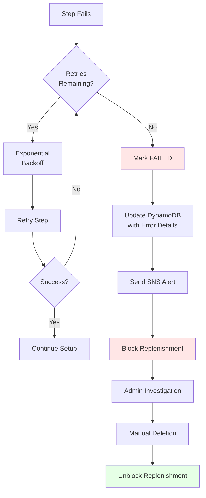

### Idempotency

**Account Creation**:
- Organizations API: CreateAccount is idempotent (returns existing request ID)
- DynamoDB: Conditional writes prevent duplicate records

**Stack Deployment**:
- CloudFormation: Stack names are unique per account
- Update vs Create: Check stack existence before operation
- Rollback: Automatic on failure

**State Transitions**:
- DynamoDB: Conditional updates based on current state
- Prevents race conditions between Pool Manager and Setup Orchestrator


## Cost Architecture

### Monthly Cost Breakdown

**Lambda Functions** (~$2.30/month):
- Pool Manager: $0.20 (100 invocations/day, 512 MB, 30s avg)
- Setup Orchestrator: $2.00 (10 setups/day, 1024 MB, 8 min avg)
- Account Provider: $0.10 (50 invocations/day, 256 MB, 5s avg)

**DynamoDB** (~$1.50/month):
- On-demand reads/writes: $1.25 (1000 operations/day)
- Storage: $0.25 (1 GB, 90-day retention)

**EventBridge** (~$0.10/month):
- Custom events: $1.00/million events
- Estimated: 3000 events/day = 90,000/month

**CloudWatch** (~$19.50/month):
- Metrics: $6.00 (20 custom metrics)
- Dashboards: $12.00 (4 dashboards × $3.00)
- Logs: $1.00 (2 GB ingested/month)
- Alarms: $0.50 (5 alarms × $0.10)

**SNS** (~$0.00/month):
- Email notifications: First 1000 free
- Typical usage: < 100/month

**Total**: ~$25-30/month

**Cost Optimization**:
- DELETE strategy: Closed accounts cost $0
- On-demand DynamoDB: Pay only for actual usage
- Log retention: 7-14 days for non-production
- Reserved concurrency: Not needed for low-volume

### Cost Scaling

**Per 100 Projects/Month**:
- Lambda: +$20 (additional Setup Orchestrator invocations)
- DynamoDB: +$1.25 (additional state updates)
- EventBridge: +$0.01 (additional events)
- CloudWatch Logs: +$0.50 (additional log data)

**Total**: ~$22/100 projects = $0.22/project

**Break-Even Analysis**:
- Manual setup time: 30 minutes/account
- Engineer cost: $100/hour
- Manual cost: $50/account
- Automation cost: $0.22/account
- Savings: $49.78/account (99.6% reduction)


## Operational Considerations

### Monitoring Strategy

**Real-Time Monitoring**:
- CloudWatch dashboards: 1-minute refresh
- SNS alerts: Immediate notification
- CloudWatch alarms: 5-minute evaluation periods

**Proactive Monitoring**:
- Organization account limits: Check every 6 hours
- Failed account count: Continuous tracking
- Pool size: Continuous tracking

**Reactive Monitoring**:
- Setup failures: Immediate alert
- Pool depletion: Immediate alert
- Replenishment blocking: Immediate alert

### Maintenance Windows

**No Maintenance Required**:
- Serverless architecture: No patching
- Managed services: AWS handles updates
- Configuration updates: No downtime

**Planned Changes**:
- Lambda code updates: Blue/green deployment
- CloudFormation template updates: Stack updates
- Configuration changes: SSM parameter updates (immediate effect)

### Disaster Recovery

**RTO (Recovery Time Objective)**: < 1 hour
**RPO (Recovery Point Objective)**: < 5 minutes

**Backup Strategy**:
- DynamoDB: Point-in-time recovery (35 days)
- CloudFormation: Templates in version control
- SSM parameters: Documented defaults
- Lambda code: Stored in S3 (deployment packages)

**Recovery Procedure**:
1. Redeploy CloudFormation infrastructure stack
2. Restore DynamoDB table from point-in-time backup
3. Update SSM parameters from documentation
4. Verify Lambda functions operational
5. Test with manual replenishment trigger


## Integration Points

### DataZone Integration

**Account Pool Registration**:
- Account Provider Lambda registered with DataZone
- MANUAL resolution strategy (only supported option)
- Lambda invoked when user creates environment

**Project Profile Configuration**:
- Account pool enabled in project profile
- Environment configurations reference account pool
- ON_DEMAND deployment mode (ON_CREATE not supported with account pools)

**Environment Creation Flow**:
1. User creates environment via DataZone portal
2. DataZone invokes Account Provider Lambda
3. Lambda queries DynamoDB for AVAILABLE account
4. Lambda returns account ID and region
5. DataZone deploys environment to returned account

### Organizations Integration

**Account Creation**:
- CreateAccount API: Async operation, returns request ID
- DescribeCreateAccountStatus: Poll for completion
- Account creation time: < 1 minute

**Account Closure**:
- CloseAccount API: Marks account for closure
- Account enters SUSPENDED state immediately
- Full closure after 90 days

**Account Movement**:
- MoveAccount API: Moves account to target OU
- Requires source and destination parent IDs
- Inherits SCPs from new OU

### CloudFormation Integration

**Stack Deployment**:
- CreateStack API: Deploy templates to project accounts
- DescribeStacks: Poll for completion
- DescribeStackEvents: Capture failure details

**Event Monitoring**:
- CloudFormation emits events to EventBridge
- Events include stack status changes
- Stack name prefix filtering: "DataZone-"


## Limitations and Constraints

### AWS Service Limits

**Organizations**:
- Default account limit: 10 (can be increased to 1000+)
- Account creation rate: 1 account/minute
- Account closure: 90-day waiting period

**CloudFormation**:
- Stack limit per account: 2000
- Concurrent stack operations: 10 per account
- Template size: 1 MB

**Lambda**:
- Concurrent executions: 1000 (default regional limit)
- Function timeout: 15 minutes maximum
- Deployment package size: 250 MB unzipped

**DynamoDB**:
- Item size: 400 KB maximum
- GSI limit: 20 per table
- On-demand throughput: Unlimited (with burst capacity)

### System Constraints

**Pool Size**:
- Minimum: 1 account (not recommended)
- Maximum: Limited by organization account limit
- Recommended: 5-10 accounts for typical usage

**Concurrent Setups**:
- Minimum: 1 account
- Maximum: Limited by Lambda concurrency and CloudFormation rate limits
- Recommended: 3-5 accounts

**Setup Duration**:
- Minimum: 6 minutes (optimal conditions)
- Maximum: 15 minutes (with retries)
- Average: 6-8 minutes

### Known Limitations

**ON_CREATE Not Supported**:
- Account pools only support MANUAL resolution strategy
- Environments must be created manually (ON_DEMAND)
- ON_CREATE deployment mode is ignored
- This is a DataZone limitation, not a system limitation

**Account Reuse Complexity**:
- REUSE strategy requires complex cleanup logic
- Risk of residual resources
- Longer reclamation time
- DELETE strategy recommended for most use cases

**Cross-Region Limitations**:
- System deployed in single region (us-east-2)
- Project accounts created in same region
- Multi-region support requires separate deployments


## Future Enhancements

### Potential Improvements

**Multi-Region Support**:
- Deploy infrastructure in multiple regions
- Region-specific account pools
- Cross-region failover

**Advanced Pool Strategies**:
- Time-based pool sizing (larger during business hours)
- Predictive scaling based on historical patterns
- Project type-specific pools (dev vs prod)

**Enhanced Monitoring**:
- Cost tracking per project/account
- Setup duration trends and anomaly detection
- Capacity planning recommendations

**Automation Enhancements**:
- Automatic account limit increase requests
- Self-healing for common failure scenarios
- Automated cleanup of orphaned resources

**Integration Improvements**:
- Service Catalog integration
- AWS Control Tower integration (optional)
- Custom tagging strategies

## Related Documentation

- **User Guide**: Operational procedures and common tasks
- **Requirements Document**: Detailed functional requirements
- **Design Document**: Technical implementation details
- **Testing Guide**: Test scenarios and validation procedures
- **Development Progress**: Implementation status and milestones

## Glossary

- **Pool Manager**: Lambda function orchestrating pool-level operations
- **Setup Orchestrator**: Lambda function executing account setup workflow
- **Account Provider**: Lambda function handling DataZone account requests
- **Wave-Based Execution**: Parallel execution strategy for setup steps
- **Event-Driven Replenishment**: CloudFormation events trigger pool operations
- **DELETE Strategy**: Close accounts after project deletion (default)
- **REUSE Strategy**: Clean and return accounts to pool (optional)
- **State Machine**: Account lifecycle progression through states
- **Failure Blocking**: Replenishment blocked when failed accounts exist
- **Dynamic Configuration**: SSM parameters read on every invocation

