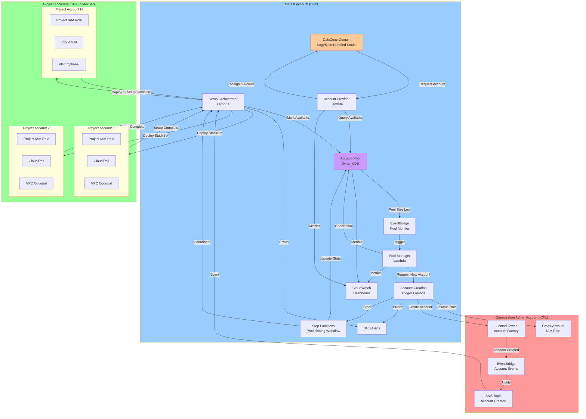
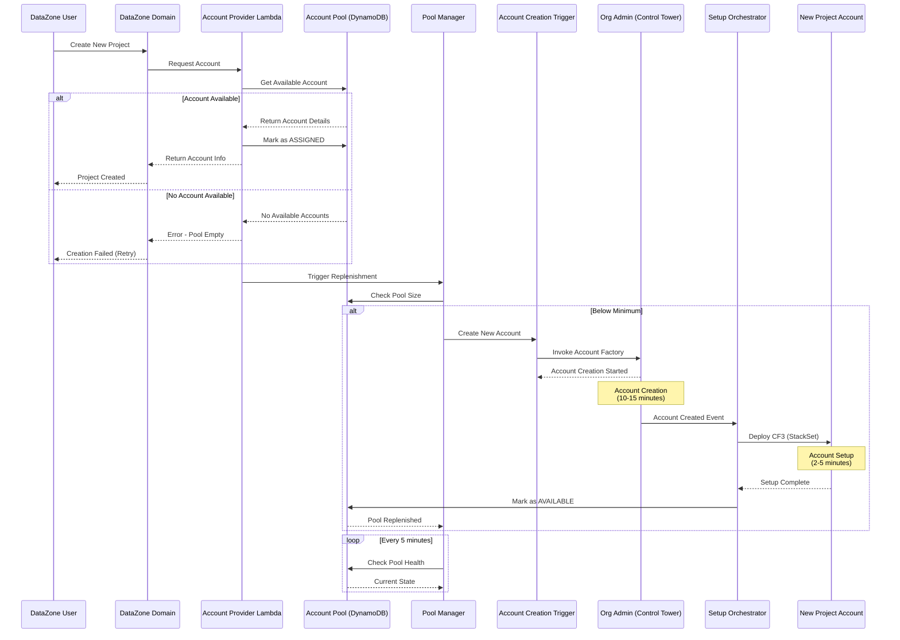
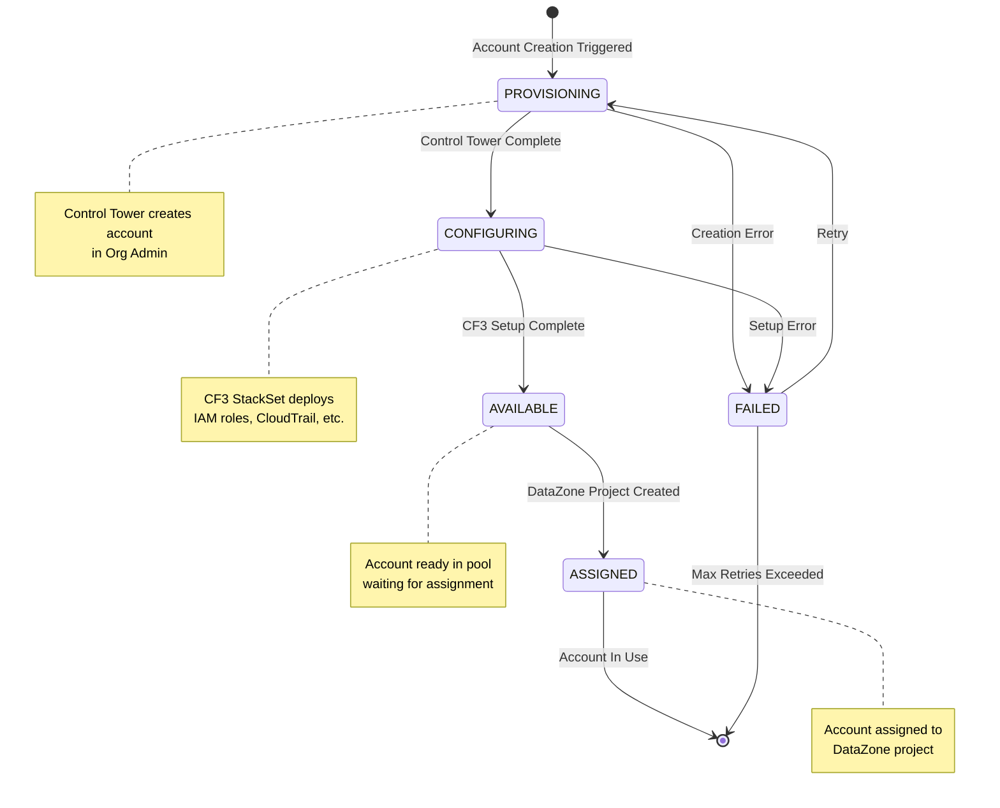

# Account Pool Factory for SageMaker Unified Studio - Requirements

## Overview
An Account Pool Factory system that automatically provisions and manages a pool of AWS accounts for SageMaker Unified Studio projects through DataZone. The system maintains a ready pool of accounts and automatically replenishes them as they are assigned to new projects.

## Architecture Overview

The solution operates across three types of AWS accounts:

1. **Organization Admin Account**: Contains AWS Control Tower Account Factory and manages account creation
2. **Domain Account**: Hosts the SageMaker Unified Studio Domain (DataZone), the Account Pool, and custom Lambda functions
3. **Project Accounts**: Multiple accounts created and managed by the pool, assigned to individual projects

The solution is deployed via three CloudFormation templates:
- **CF1 - Org Admin Setup**: Configures Control Tower Account Factory integration in the Organization Admin account
- **CF2 - Domain Setup**: Deploys the Account Pool, custom Lambda, and DataZone integration in the Domain account
- **CF3 - Project Account Setup**: Configures newly created accounts before they become available in the pool

### Architecture Diagram



### Account Interaction Flow



### State Transition Diagram



## User Stories

### 1. As a Platform Administrator
**I want** an automated account pool management system with configurable parameters  
**So that** new SageMaker Unified Studio projects can be provisioned quickly without manual account creation delays

**Acceptance Criteria:**
- 1.1 The system maintains a configurable minimum pool size of available accounts (admin-defined)
- 1.2 When an account is assigned to a project, a new account is automatically provisioned in the background
- 1.3 Pool status and metrics are visible through monitoring/logging
- 1.4 The system integrates with AWS Control Tower Account Factory for account creation
- 1.5 The system integrates with AWS Organizations for account management
- 1.6 All configuration parameters (pool size, naming conventions, tags, OU, etc.) are externalized and admin-configurable
- 1.7 CloudFormation templates can be deployed independently in the correct sequence

### 2. As a DataZone Project Creator
**I want** to receive a dedicated AWS account automatically when creating a new project  
**So that** I can start working immediately with proper resource isolation

**Acceptance Criteria:**
- 2.1 Account assignment happens automatically during project creation
- 2.2 Each project receives a unique AWS account from the pool
- 2.3 Account assignment completes within acceptable time limits (< 5 minutes)
- 2.4 The assigned account has appropriate IAM roles pre-configured
- 2.5 Account assignment failures are handled gracefully with retry logic

### 3. As a Security Administrator
**I want** each project to have its own AWS account with proper IAM roles  
**So that** resources are isolated and access is properly controlled

**Acceptance Criteria:**
- 3.1 Each account is created with a dedicated project-specific IAM role
- 3.2 Accounts follow organizational security policies and guardrails
- 3.3 Account creation is auditable through CloudTrail
- 3.4 Accounts are created in the appropriate Organizational Unit (OU)
- 3.5 Service Control Policies (SCPs) are applied consistently

### 4. As a System Operator
**I want** the pool to self-heal and maintain availability  
**So that** the system remains reliable without constant manual intervention

**Acceptance Criteria:**
- 4.1 Failed account provisioning attempts are retried automatically
- 4.2 The system alerts when pool size falls below threshold
- 4.3 The system handles AWS API rate limits gracefully
- 4.4 Pool replenishment happens asynchronously without blocking project creation
- 4.5 System state is persisted and recoverable after failures

## Functional Requirements

### FR1: Configuration Management
- FR1.1 All operational parameters are configurable via CloudFormation parameters
- FR1.2 Configuration includes: minimum pool size, maximum pool size, account naming convention, OU path, required tags, retention policies
- FR1.3 Configuration changes can be applied via CloudFormation stack updates
- FR1.4 Configuration is validated at deployment time
- FR1.5 Default values are provided for all configuration parameters

### FR2: Organization Admin Account Setup (CF1)
- FR2.1 Configure IAM roles for Control Tower Account Factory access
- FR2.2 Set up cross-account permissions for Domain account to trigger account creation
- FR2.3 Configure EventBridge rules to notify Domain account of account creation completion
- FR2.4 Establish trust relationships between Org Admin and Domain accounts
- FR2.5 Configure CloudTrail logging for account creation activities

### FR3: Domain Account Setup (CF2)
- FR3.1 Deploy DynamoDB table for account pool state management
- FR3.2 Deploy custom Lambda function for DataZone account provider integration
- FR3.3 Deploy Lambda function for pool management and replenishment
- FR3.4 Deploy Lambda function to trigger Control Tower account creation
- FR3.5 Configure DataZone custom account pool with Lambda integration
- FR3.6 Set up EventBridge rules for pool monitoring and replenishment
- FR3.7 Deploy CloudWatch dashboard for pool metrics
- FR3.8 Configure SNS topics for alerts and notifications
- FR3.9 Set up IAM roles for Lambda functions with least-privilege access

### FR4: Project Account Setup (CF3)
- FR4.1 Deploy as StackSet to newly created accounts
- FR4.2 Create project-specific IAM roles with configurable permissions
- FR4.3 Configure account-level settings (tags, cost allocation, etc.)
- FR4.4 Set up CloudTrail in the project account
- FR4.5 Configure VPC and networking (if required by configuration)
- FR4.6 Apply baseline security configurations
- FR4.7 Notify Domain account when account setup is complete

### FR5: Pool Management
- FR5.1 Maintain configurable minimum and maximum pool sizes
- FR5.2 Track account states: PROVISIONING, CONFIGURING, AVAILABLE, ASSIGNED, FAILED
- FR5.3 Automatically trigger account creation when pool drops below minimum
- FR5.4 Prevent pool from exceeding maximum size
- FR5.5 Handle concurrent account requests safely

### FR6: Account Provisioning Workflow
- FR6.1 Domain account triggers Control Tower account creation in Org Admin account
- FR6.2 Org Admin account creates account via Control Tower Account Factory
- FR6.3 Org Admin account notifies Domain account of account creation
- FR6.4 Domain account deploys CF3 (StackSet) to new account
- FR6.5 New account completes setup and notifies Domain account
- FR6.6 Domain account marks account as AVAILABLE in pool
- FR6.7 All steps include error handling and retry logic

### FR7: Account Assignment
- FR7.1 Assign accounts to DataZone projects via custom Lambda integration
- FR7.2 Update account state from AVAILABLE to ASSIGNED atomically
- FR7.3 Record project-to-account mapping in DynamoDB
- FR7.4 Return account details to DataZone for project configuration
- FR7.5 Trigger pool replenishment after assignment

### FR8: DataZone Integration
- FR8.1 Implement custom account pool handler Lambda for DataZone
- FR8.2 Handle ListAuthorizedAccountsRequest operation
  - FR8.2.1 Query DynamoDB for accounts in AVAILABLE state
  - FR8.2.2 Return list of available accounts with supported regions
  - FR8.2.3 Handle empty pool scenario (return empty items array)
- FR8.3 Handle ValidateAccountAuthorizationRequest operation
  - FR8.3.1 Verify account exists in pool
  - FR8.3.2 Verify account is in AVAILABLE or ASSIGNED state
  - FR8.3.3 Return GRANT or DENY authorization result
- FR8.4 Register Lambda with DataZone account pool
  - FR8.4.1 Create account pool with custom handler source
  - FR8.4.2 Configure Lambda function ARN
  - FR8.4.3 Configure Lambda execution role ARN
  - FR8.4.4 Set resolution strategy to MANUAL
- FR8.5 Handle DataZone API errors gracefully

### FR9: Monitoring and Observability
- FR9.1 Emit CloudWatch metrics for pool size, assignment rate, failures
- FR9.2 Log all account lifecycle events with correlation IDs
- FR9.3 Provide CloudWatch dashboard for pool health
- FR9.4 Alert on pool depletion or high failure rates
- FR9.5 Track account provisioning duration metrics

## Non-Functional Requirements

### NFR1: Performance
- Account assignment from pool: < 30 seconds
- New account provisioning: < 15 minutes (Control Tower SLA)
- System should handle up to 50 concurrent project creations

### NFR2: Reliability
- System availability: 99.5%
- Automatic retry with exponential backoff for transient failures
- Graceful degradation when Control Tower is unavailable

### NFR3: Security
- All credentials stored in AWS Secrets Manager
- Lambda functions use least-privilege IAM roles
- All API calls logged to CloudTrail
- Encryption at rest for all stored data

### NFR4: Scalability
- Support pools of up to 100 accounts
- Handle multiple DataZone domains (multi-tenant)
- Horizontal scaling of Lambda functions

### NFR5: Maintainability
- Infrastructure as Code using CloudFormation/CDK
- Comprehensive error messages and logging
- Configuration externalized (no hardcoded values)
- Automated testing for critical paths

## Configuration Parameters

The following parameters must be configurable by the customer admin:

### Pool Configuration
- **MinimumPoolSize**: Minimum number of accounts to maintain in AVAILABLE state (default: 5)
- **MaximumPoolSize**: Maximum number of accounts in the pool (default: 20)
- **ReplenishmentThreshold**: Pool size that triggers replenishment (default: MinimumPoolSize + 2)

### Account Configuration
- **AccountNamePrefix**: Prefix for account names (e.g., "smus-project-")
- **AccountEmailDomain**: Email domain for account root emails (e.g., "aws-accounts@example.com")
- **OrganizationalUnitPath**: OU path where accounts should be created (e.g., "/Projects/DataZone")
- **AccountTags**: Key-value pairs to tag all accounts (e.g., Purpose=DataZone, ManagedBy=AccountFactory)

### IAM Configuration
- **ProjectRoleName**: Name of the IAM role created in each project account (default: "DataZoneProjectRole")
- **ProjectRolePolicies**: List of managed policy ARNs to attach to project role
- **TrustPrincipal**: Principal that can assume the project role (DataZone service)

### Networking Configuration (Optional)
- **CreateVPC**: Whether to create a VPC in project accounts (default: false)
- **VPCCidr**: CIDR block for VPC if created
- **SubnetConfiguration**: Public/private subnet configuration

### Monitoring Configuration
- **AlertEmail**: Email address for CloudWatch alarms
- **MetricsNamespace**: CloudWatch namespace for custom metrics (default: "AccountPoolFactory")
- **EnableDetailedMonitoring**: Enable detailed CloudWatch metrics (default: true)

### Retention Configuration
- **AccountMappingRetentionDays**: How long to retain account-project mappings (default: 365)
- **LogRetentionDays**: CloudWatch Logs retention period (default: 90)

### Cross-Account Configuration
- **OrgAdminAccountId**: AWS Account ID of the Organization Admin account
- **DomainAccountId**: AWS Account ID of the Domain account
- **DataZoneDomainId**: ID of the DataZone domain

### Technical Constraints
- C1: Must use AWS Control Tower Account Factory for account creation
- C2: Must integrate with DataZone custom account provider API
- C3: Must operate within AWS Organizations structure
- C4: Subject to AWS service quotas (Control Tower, Organizations)

### Business Constraints
- C5: Must comply with organizational security policies
- C6: Account creation costs must be tracked and reported
- C7: Must support existing DataZone domain configurations

## Assumptions

- A1: AWS Control Tower is already configured in the organization
- A2: Appropriate IAM permissions exist for account creation
- A3: DataZone domain is already created and configured
- A4: Service quotas are sufficient for planned pool sizes
- A5: Network connectivity exists between Lambda and required AWS services

## Dependencies

- D1: AWS Control Tower Account Factory
- D2: AWS Organizations
- D3: Amazon DataZone
- D4: AWS Lambda
- D5: Amazon DynamoDB (for state management)
- D6: AWS Secrets Manager
- D7: Amazon CloudWatch
- D8: AWS Step Functions (for orchestration)

## Out of Scope

- Account deletion/cleanup (future phase)
- Cost allocation and chargeback
- Multi-region account pools
- Account recycling/reuse
- Custom account configurations per project type
- Integration with non-DataZone services

## Success Metrics

- M1: Average time to assign account to project < 30 seconds
- M2: Pool availability > 95% (pool never empty)
- M3: Account provisioning success rate > 98%
- M4: Zero manual interventions required per week
- M5: System handles 100+ project creations per day

## Risks and Mitigations

| Risk | Impact | Probability | Mitigation |
|------|--------|-------------|------------|
| Control Tower API rate limits | High | Medium | Implement exponential backoff, queue requests |
| Pool depletion during high demand | High | Low | Increase minimum pool size, implement alerts |
| Account provisioning failures | Medium | Medium | Automatic retry logic, manual intervention alerts |
| DataZone API changes | Medium | Low | Version API integration, monitor AWS announcements |
| Cost overruns from unused accounts | Medium | Medium | Implement pool size monitoring, cost alerts |

## Control Tower Account Factory Integration

### Account Creation Process

The system uses AWS Control Tower Account Factory (via AWS Service Catalog) to create accounts programmatically:

1. **Service Catalog Product**: Control Tower exposes account creation as a Service Catalog product
2. **API Call**: Use `ProvisionProduct` API to create accounts
3. **Required Parameters**:
   - AccountEmail: Unique email for the account root user
   - AccountName: Display name for the account
   - ManagedOrganizationalUnit: OU where account will be placed (e.g., "Custom (ou-xxxx-xxxxxxxx)")
   - SSOUserEmail: Email for IAM Identity Center user
   - SSOUserFirstName: First name for SSO user
   - SSOUserLastName: Last name for SSO user

### Lifecycle Events

Control Tower emits lifecycle events to EventBridge when account operations complete:

**CreateManagedAccount Event**:
```json
{
  "source": "aws.controltower",
  "detail-type": "AWS Service Event via CloudTrail",
  "detail": {
    "eventName": "CreateManagedAccount",
    "serviceEventDetails": {
      "createManagedAccountStatus": {
        "organizationalUnit": {
          "organizationalUnitName": "Custom",
          "organizationalUnitId": "ou-xxxx-xxxxxxxx"
        },
        "account": {
          "accountName": "ProjectAccount-001",
          "accountId": "123456789012"
        },
        "state": "SUCCEEDED",
        "message": "AWS Control Tower successfully created a managed account.",
        "requestedTimestamp": "2024-01-15T10:00:00+0000",
        "completedTimestamp": "2024-01-15T10:15:00+0000"
      }
    }
  }
}
```

**UpdateManagedAccount Event**:
- Emitted when account is updated or when retry after error occurs
- Same structure as CreateManagedAccount
- Lambda functions must handle both event types

### Post-Creation Account Setup

After Control Tower creates an account, additional configuration is required before it can be used as a DataZone project account:

#### Required Setup Steps (CF3 - StackSet Deployment)

The CF3 template must perform the following configuration steps on each newly created account. These steps are based on the existing CloudFormation templates in `cloudformation/domain/`:

1. **DataZone Domain Resource Sharing (RAM)**
   - Create AWS RAM resource share to associate account with DataZone domain
   - Use permission: `arn:aws:ram::aws:permission/AWSRAMPermissionsAmazonDatazoneDomainExtendedServiceAccess`
   - Share the domain ARN with the new account
   - Reference: `create_resource_share.yaml`

2. **Blueprint Enablement**
   - Enable required DataZone environment blueprints for the account
   - Configurable list of blueprints (default: all blueprints)
   - Each blueprint requires:
     - ManageAccessRoleArn (from configuration)
     - ProvisioningRoleArn (from configuration)
     - Regional parameters: S3Location, Subnets, VpcId
   - Blueprints to enable (configurable):
     - LakehouseCatalog (required baseline)
     - Tooling, MLExperiments, DataLake
     - RedshiftServerless, EmrServerless, EmrOnEc2
     - Workflows
     - Amazon Bedrock blueprints (Guardrail, Prompt, Evaluation, KnowledgeBase, ChatAgent, Function, Flow)
     - QuickSight, PartnerApps
   - Reference: `enable_all_blueprints.yaml`

3. **Policy Grants Configuration**
   - Grant permissions for blueprints and project profiles
   - Create policy grants for:
     - CREATE_ENVIRONMENT_FROM_BLUEPRINT for each enabled blueprint
     - CREATE_PROJECT_FROM_PROJECT_PROFILE for project profiles
   - Configure principal access (project contributors, users)
   - Reference: `policy_grant.yaml`

4. **IAM Role Creation**
   - Create project-specific IAM role (e.g., DataZoneProjectRole)
   - Configure trust policy to allow DataZone service to assume role
   - Attach required managed policies for project operations
   - Create cross-account role for Domain account management

5. **Baseline Security Configuration**
   - Enable CloudTrail for audit logging
   - Configure AWS Config for compliance monitoring
   - Set up VPC and networking (if required by blueprints)
   - Apply account-level tags (configurable)

6. **Cross-Account Access**
   - Create IAM role for Domain account to manage the project account
   - Set up EventBridge rules to forward events to Domain account
   - Configure SNS topic for notifications

7. **Account Readiness Validation**
   - Verify all resources are created successfully
   - Test IAM role assumptions
   - Confirm DataZone domain association via RAM
   - Validate blueprint enablement
   - Signal completion to Domain account

**Customization Requirements**:
- All blueprint selections must be configurable
- IAM roles and policies must be customizable
- VPC/networking configuration must be optional and configurable
- Default templates provided but customers can override
- Template versioning for updates

### Account State Workflow

```
REQUESTED → (Service Catalog API Call)
  ↓
PROVISIONING → (Control Tower creates account: 10-15 minutes)
  ↓
CREATED → (CreateManagedAccount event received)
  ↓
CONFIGURING → (CF3 StackSet deployment: 2-5 minutes)
  ↓
AVAILABLE → (Ready for DataZone project assignment)
  ↓
ASSIGNED → (Assigned to DataZone project)
```

### Error Handling

- **Account Creation Failures**: Retry with exponential backoff
- **StackSet Deployment Failures**: Rollback and mark account as FAILED
- **Timeout Handling**: Maximum 20 minutes for complete account provisioning
- **Duplicate Detection**: Handle UpdateManagedAccount events as potential retries

## Open Questions

1. What is the expected peak rate of project creation?
2. What is the acceptable cost for maintaining the account pool?
3. Should accounts be pre-configured with any baseline resources beyond the required setup?
4. What is the account naming convention?
5. Which Organizational Unit should accounts be created in?
6. What tags are required on accounts?
7. What is the retention policy for account-project mappings?
8. Should the system support multiple pool configurations?
9. What are the specific DataZone domain association requirements?
10. What IAM policies should be attached to the project role?
