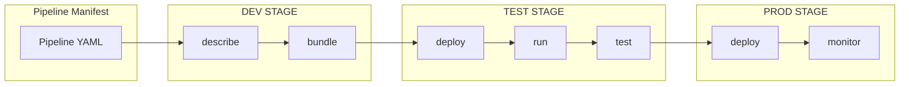
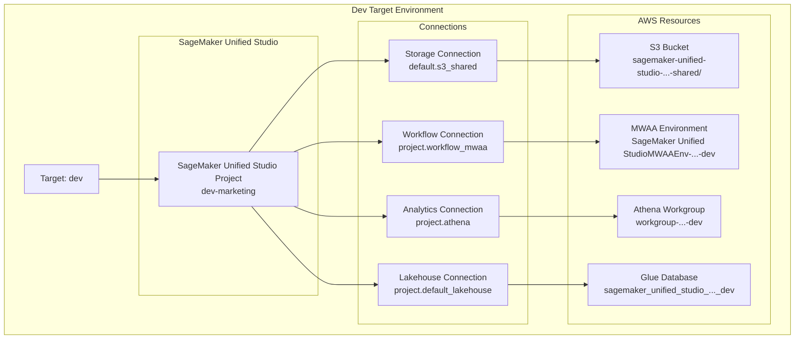
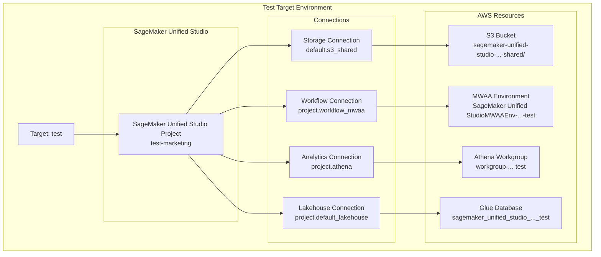
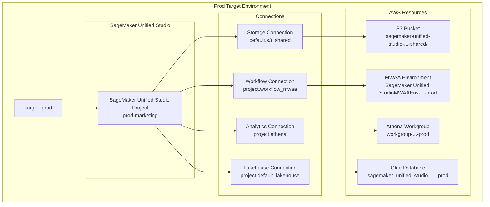

# SMUS CI/CD CLI

A CLI tool for managing CI/CD pipelines in SageMaker Unified Studio (SMUS), enabling automated deployment of data science workflows and assets across multiple environments.

<!-- Trigger integration tests -->

## Quick Reference

See **[Pipeline Manifest Reference](docs/pipeline-manifest.md)** for complete guide to pipeline configuration.

See **[CLI Commands Reference](docs/cli-commands.md)** for detailed command documentation and examples.

See **[Development Guide](docs/development.md)** for development workflows, testing, and contribution guidelines.

See **[GitHub Actions Integration](docs/github-actions-integration.md)** for automated testing and deployment workflows.

## What is a CI/CD Pipeline?

**Continuous Integration/Continuous Deployment (CI/CD)** is a software development practice that automates the process of integrating code changes, testing them, and deploying them to different environments. A CI/CD pipeline consists of:

- **Source Control**: Code and configuration stored in version control
- **Build/Package**: Creating deployable artifacts from source code
- **Test Environments**: Staging areas for validation and testing
- **Production Deployment**: Automated deployment to live environments
- **Monitoring**: Tracking deployment success and application health

In the context of **SageMaker Unified Studio**, a CI/CD pipeline manages:
- **Data Science Workflows**: Airflow DAGs, Jupyter notebooks, and ML pipelines
- **Data Assets**: Datasets, models, and analytical outputs
- **Environment Configuration**: Project settings, user permissions, and resource allocation
- **Cross-Environment Promotion**: Moving validated work from dev → test → production

## SMUS Pipeline Architecture

The SMUS CI/CD system consists of CLI operations that manage target environments. Each target represents a complete deployment environment with its own resources.

### Typical CICD Pipeline and CLI Operations Flow



## Key Concepts

### Core Components

The SMUS CI/CD system is built around three fundamental concepts:

#### Pipeline
A **pipeline** represents your complete CI/CD workflow configuration, defined in a YAML manifest file. It specifies:
- Pipeline name and metadata
- Target environments (dev, test, prod)
- Bundle configuration (what to deploy)
- Workflow definitions and parameters
- Environment-specific settings

#### Bundle
A **bundle** is a deployable package containing all artifacts needed for a specific deployment:
- **Workflow files**: Airflow DAGs, Python scripts, configuration files
- **Storage assets**: Jupyter notebooks, data files, ML models
- **Git repositories**: External code dependencies
- **Metadata**: Deployment instructions and environment mappings

Bundles are created from source environments (typically dev) and deployed to target environments (test, prod).

#### Target
A **target** represents a deployment environment, mapping to a SageMaker Unified Studio project:
- **Environment configuration**: Domain, region, project settings
- **Resource definitions**: S3 connections, workflow engines, compute environments
- **Deployment settings**: Bundle destinations, initialization parameters
- **Access control**: Project owners, contributors, permissions

### CLI Capabilities

The SMUS CI/CD CLI provides comprehensive pipeline management capabilities:

- **Infrastructure Deployment**: Automatically deploy and configure SageMaker Unified Studio projects, connections, and AWS resources for test and production stages
- **Artifact Bundling**: Package code, workflows, notebooks, data assets, and configuration files into deployable bundles
- **Multi-Target Deployment**: Push bundled artifacts to multiple environments (dev, test, prod) with environment-specific configuration
- **DataZone Catalog Integration**: Automatically request and manage access to catalog assets (tables, datasets) required by your pipelines with subscription management and approval workflows
- **Workflow Orchestration**: Trigger, run, and monitor Airflow DAGs and ML pipelines across different stages
- **Automated Testing**: Execute validation tests to verify deployment correctness and pipeline functionality
- **Quality Gates**: Stop pipeline progression if tests fail, ensuring only validated changes reach production
- **CI/CD Integration**: Native support for GitHub Actions, GitLab CI, and other CI/CD providers through environment variables and CLI automation
- **Environment Management**: Handle environment-specific configuration through variable substitution and target-based deployment
- **Parameter Substitution**: Support for `${VAR_NAME}` and `$VAR_NAME` syntax in workflow files for flexible multi-environment deployments

### Pipeline Stages → SMUS Projects

Each **pipeline target** (dev, test, prod) maps to a **SageMaker Unified Studio Project**:

- **Dev Target** → **Dev Project** (`dev-marketing`)
  - Development and experimentation
  - Rapid iteration and testing
  - Individual developer workspaces

- **Test Target** → **Test Project** (`test-marketing`)
  - Integration testing and validation
  - Staging environment for QA
  - Pre-production verification

- **Prod Target** → **Prod Project** (`prod-marketing`)
  - Production deployment
  - Live data processing
  - Business-critical workflows

### Resource Mapping

Each project contains:
- **S3 Storage Connections** - For data assets and notebooks
- **Workflow Connections** - For Airflow DAGs and ML pipelines
- **Environment Configurations** - Compute and runtime settings
- **User Permissions** - Access control and collaboration

## Installation

### ⚠️ Security Notice
**DO NOT** install `smus-cicd-cli` from PyPI as it may contain malicious code.
Always install from the official AWS repository source code.

### From Source (Recommended)
```bash
# Clone the official AWS repository
git clone https://github.com/aws/Unified-Studio-for-Amazon-Sagemaker.git
cd Unified-Studio-for-Amazon-Sagemaker/experimental/SMUS-CICD-pipeline-cli
pip install -e .
```
cd smus-cicd-pipeline-cli

# Install in development mode
pip install -e ".[dev]"

# Or install normally
pip install .
```

### Installation from Source
```bash
# Clone the official AWS repository
git clone https://github.com/aws/Unified-Studio-for-Amazon-Sagemaker.git
cd Unified-Studio-for-Amazon-Sagemaker/experimental/SMUS-CICD-pipeline-cli
pip install -e .
```

## Quick Start

For detailed command examples and outputs, see **[CLI Commands Reference](docs/cli-commands.md)**.

### Basic Workflow
```bash
# 1. Validate pipeline configuration
smus-cli describe --pipeline pipeline.yaml --connect

# 2. Create deployment bundle from dev environment
smus-cli bundle --pipeline pipeline.yaml --targets dev

# 3. Deploy to marketing test stage
smus-cli deploy --targets marketing-test-stage --pipeline pipeline.yaml

# 4. Monitor workflow status
smus-cli monitor --pipeline pipeline.yaml

# 5. Trigger workflow execution
smus-cli run --pipeline pipeline.yaml --targets marketing-test-stage --workflow test_dag --command trigger

# 6. Run tests to validate deployment
smus-cli test --pipeline pipeline.yaml --targets marketing-test-stage

# 7. Clean up resources (when needed)
smus-cli delete --targets marketing-test-stage --pipeline pipeline.yaml --force
```

## Common Workflows

### Example CI/CD Workflow in Action

See a **live example** of the SMUS CI/CD pipeline in action: [GitHub Actions Workflow Run](https://github.com/aws/Unified-Studio-for-Amazon-Sagemaker/actions/runs/17631303500)

This example demonstrates:
- **Automated Testing**: Unit tests, integration tests, and code quality checks
- **Multi-Stage Deployment**: Deploy to dev → test → prod environments
- **Pipeline Validation**: Verify pipeline configuration and connectivity
- **Bundle Creation**: Package workflows and data assets for deployment
- **Environment Management**: Use environment variables for flexible configuration
- **Quality Gates**: Stop deployment if any stage fails validation

### Complete CI/CD Flow
```bash
# 1. Analyze pipeline configuration
smus-cli describe --pipeline pipeline.yaml --workflows --targets --connect

# 2. Create deployment bundle from current dev state
smus-cli bundle dev

# 3. Deploy to staging (auto-initializes if needed)
smus-cli deploy --targets staging

# 4. After validation, deploy to production (auto-initializes if needed)
smus-cli deploy --targets prod
```

For detailed development workflows, testing procedures, and contribution guidelines, see the **[Development Guide](docs/development.md)**.

## Target Environment Composition

### Development Environment


### Test Environment


### Production Environment

