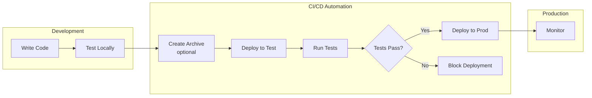

# SMUS CI/CD Pipeline CLI

**Automate deployment of data applications across SageMaker Unified Studio environments**

Deploy Airflow DAGs, Jupyter notebooks, and ML workflows from development to production with confidence. Built for data scientists, data engineers, ML engineers, and GenAI app developers working with DevOps teams.

**Works with your deployment strategy:** Whether you use git branches (branch-based), versioned artifacts (bundle-based), git tags (tag-based), or direct deployment - this CLI supports your workflow. Define your application once, deploy it your way.

---

## Why SMUS CI/CD CLI?

✅ **AWS Abstraction Layer** - CLI encapsulates all AWS analytics, ML, and SMUS complexity - DevOps teams never call AWS APIs directly  
✅ **Separation of Concerns** - Data teams define WHAT to deploy (manifest.yaml), DevOps teams define HOW and WHEN (CI/CD workflows)  
✅ **Generic CI/CD Workflows** - Same workflow works for Glue, SageMaker, Bedrock, QuickSight, or any AWS service combination  
✅ **Deploy with Confidence** - Automated testing and validation before production  
✅ **Multi-Environment Management** - Test → Prod with environment-specific configuration  
✅ **Infrastructure as Code** - Version-controlled application manifests and reproducible deployments  
✅ **Event-Driven Workflows** - Trigger workflows automatically via EventBridge on deployment  

---

## Quick Start

**Install from source:**
```bash
git clone https://github.com/aws/Unified-Studio-for-Amazon-Sagemaker.git
cd Unified-Studio-for-Amazon-Sagemaker/experimental/SMUS-CICD-pipeline-cli
pip install -e .
```

**Deploy your first application:**
```bash
# Validate configuration
smus-cli describe --manifest manifest.yaml --connect

# Create deployment bundle (optional)
smus-cli bundle --manifest manifest.yaml

# Deploy to test environment
smus-cli deploy --targets test --manifest manifest.yaml

# Run validation tests
smus-cli test --manifest manifest.yaml --targets test
```

**See it in action:** [Live GitHub Actions Example](https://github.com/aws/Unified-Studio-for-Amazon-Sagemaker/actions/runs/17631303500)

---

## Who Is This For?

### 👨‍💻 Data Teams (Data Scientists, Data Engineers, GenAI App Developers)
**You focus on:** Your application - what to deploy, where to deploy, and how it runs  
**You define:** Application manifest (`manifest.yaml`) with your code, workflows, and configurations  
**You don't need to know:** CI/CD pipelines, GitHub Actions, deployment automation  

→ **[Quick Start Guide](docs/getting-started/quickstart.md)** - Deploy your first application in 10 minutes  

**Includes examples for:**
- Data Engineering (Glue, Notebooks, Athena)
- ML Workflows (SageMaker, Notebooks)
- GenAI Applications (Bedrock, Notebooks)

### 🔧 DevOps Teams
**You focus on:** CI/CD best practices, security, compliance, and deployment automation  
**You define:** Workflow templates that enforce testing, approvals, and promotion policies  
**You don't need to know:** Application-specific details, AWS services used, DataZone APIs, SMUS project structures, or business logic  

→ **[Admin Guide](docs/getting-started/admin-quickstart.md)** - Configure infrastructure and pipelines in 15 minutes  
→ **[GitHub Workflow Templates](git-templates/)** - Generic, reusable workflow templates for automated deployment

**The CLI is your abstraction layer:** You just call `smus-cli deploy` - the CLI handles all AWS service interactions (DataZone, Glue, Athena, SageMaker, MWAA, S3, IAM, etc.). Your workflows stay simple and generic.

---

## Key Features

### 🚀 Automated Deployment
- **Application Manifest** - Define your application content, workflows, and deployment targets in YAML
- **Flexible Deployment** - Bundle-based (artifact) or direct (git-based) deployment modes
- **Multi-Target Deployment** - Deploy to test and prod with a single command
- **Environment Variables** - Dynamic configuration using `${VAR}` substitution
- **Version Control** - Track deployments in S3 or git for deployment history

### 🔍 Testing & Validation
- **Automated Tests** - Run validation tests before promoting to production
- **Quality Gates** - Block deployments if tests fail
- **Workflow Monitoring** - Track execution status and logs
- **Health Checks** - Verify deployment correctness

### 🔄 CI/CD Pipeline Integration
- **GitHub Actions** - Pre-built CI/CD pipeline workflows for automated deployment
- **GitLab CI** - Native support for GitLab CI/CD pipelines
- **Environment Variables** - Flexible configuration for any CI/CD platform
- **Webhook Support** - Trigger deployments from external events

### 🏗️ Infrastructure Management
- **Project Creation** - Automatically provision SageMaker Unified Studio projects
- **Connection Setup** - Configure S3, Airflow, Athena, and Lakehouse connections
- **Resource Mapping** - Link AWS resources to project connections
- **Permission Management** - Control access and collaboration
- **Event Initialization** - Emit EventBridge events during deployment for downstream automation

### 📊 Catalog Integration
- **Asset Discovery** - Automatically find required catalog assets (Glue, Lake Formation, DataZone)
- **Subscription Management** - Request access to tables and datasets
- **Approval Workflows** - Handle cross-project data access
- **Asset Tracking** - Monitor catalog dependencies

---

## What Can You Deploy?

**📊 Analytics & BI**
- Glue ETL jobs and crawlers
- Athena queries
- QuickSight dashboards
- EMR jobs (future)
- Redshift queries (future)

**🤖 Machine Learning**
- SageMaker training jobs
- ML models and endpoints
- MLflow experiments
- Feature Store (future)
- Batch transforms (future)

**🧠 Generative AI**
- Bedrock agents
- Knowledge bases
- Foundation model configurations (future)

**📓 Code & Workflows**
- Jupyter notebooks
- Python scripts
- Airflow DAGs (MWAA and Serverless)
- Lambda functions (future)

**💾 Data & Storage**
- S3 data files
- Git repositories
- Data catalogs (future)

---

## Supported AWS Services

Deploy workflows using these AWS services through Airflow YAML syntax:

### 🎯 Analytics & Data
**Amazon Athena** • **AWS Glue** • **Amazon EMR** • **Amazon Redshift** • **Amazon QuickSight** • **Lake Formation**

### 🤖 Machine Learning  
**SageMaker Training** • **SageMaker Pipelines** • **Feature Store** • **Model Registry** • **Batch Transform**

### 🧠 Generative AI
**Amazon Bedrock** • **Bedrock Agents** • **Bedrock Knowledge Bases** • **Guardrails**

### 📊 Additional Services
S3 • Lambda • Step Functions • DynamoDB • RDS • SNS/SQS • Batch

**See complete list:** [Airflow AWS Operators Reference](docs/airflow-aws-operators.md)

---

## Core Concepts

### Separation of Concerns: The Key Design Principle

**The Problem:** Traditional deployment approaches force DevOps teams to learn AWS analytics services (Glue, Athena, DataZone, SageMaker, MWAA, etc.) and understand SMUS project structures, or force data teams to become CI/CD experts.

**The Solution:** SMUS CLI is the abstraction layer that encapsulates all AWS and SMUS complexity:

```
Data Teams                    SMUS CLI                         DevOps Teams
    ↓                            ↓                                  ↓
manifest.yaml          smus-cli deploy                    GitHub Actions
(WHAT & WHERE)         (AWS ABSTRACTION)                  (HOW & WHEN)
```

**Data teams focus on:**
- Application code and workflows
- Which AWS services to use (Glue, Athena, SageMaker, etc.)
- Environment configurations
- Business logic

**SMUS CLI handles ALL AWS complexity:**
- DataZone domain and project management
- AWS Glue, Athena, SageMaker, MWAA APIs
- S3 storage and artifact management
- IAM roles and permissions
- Connection configurations
- Catalog asset subscriptions
- Workflow deployment to Airflow
- Infrastructure provisioning
- Testing and validation

**DevOps teams focus on:**
- CI/CD best practices (testing, approvals, notifications)
- Security and compliance gates
- Deployment orchestration
- Monitoring and alerting

**Result:** 
- Data teams never touch CI/CD configs
- **DevOps teams never call AWS APIs directly** - they just call `smus-cli deploy`
- **CI/CD workflows are generic** - same workflow works for Glue apps, SageMaker apps, or Bedrock apps
- Both teams work independently using their expertise

---

### Application Manifest
A declarative YAML file (`manifest.yaml`) that defines your data application:
- **Application details** - Name, version, description
- **Content** - Code from git repositories, data/models from storage, QuickSight dashboards
- **Workflows** - Airflow DAGs for orchestration and automation
- **Stages** - Where to deploy (dev, test, prod environments)
- **Configuration** - Environment-specific settings, connections, and bootstrap actions

**Created and owned by data teams.** Defines **what** to deploy and **where**. No CI/CD knowledge required.

### Application
Your data/analytics workload being deployed:
- Airflow DAGs and Python scripts
- Jupyter notebooks and data files
- ML models and training code
- ETL pipelines and transformations
- GenAI agents and MCP servers
- Foundation model configurations

### Stage
A deployment environment (dev, test, prod) mapped to a SageMaker Unified Studio project:
- Domain and region configuration
- Project name and settings
- Resource connections (S3, Airflow, Athena, Glue)
- Environment-specific parameters
- Optional branch mapping for git-based deployments

### Workflow
Orchestration logic that executes your application. Workflows serve two purposes:

**1. Deployment-time:** Create required AWS resources during deployment
- Provision infrastructure (S3 buckets, databases, IAM roles)
- Configure connections and permissions
- Set up monitoring and logging

**2. Runtime:** Execute ongoing data and ML pipelines
- Scheduled execution (daily, hourly, etc.)
- Event-driven triggers (S3 uploads, API calls)
- Data processing and transformations
- Model training and inference

Workflows are defined as Airflow DAGs (Directed Acyclic Graphs) in YAML format. Supports MWAA (Managed Workflows for Apache Airflow) and Airflow Serverless.

### CI/CD Automation
GitHub Actions workflows (or other CI/CD systems) that automate deployment:
- **Created and owned by DevOps teams**
- Defines **how** and **when** to deploy
- Runs tests and quality gates
- Manages promotion across targets
- Enforces security and compliance policies
- Example: `.github/workflows/deploy.yml`

**Key insight:** DevOps teams create generic, reusable workflows that work for ANY application. They don't need to know if the app uses Glue, SageMaker, or Bedrock - the CLI handles all AWS service interactions. The workflow just calls `smus-cli deploy` and the CLI does the rest.

### Deployment Modes

**Bundle-based (Artifact):** Create versioned archive → deploy archive to stages
- Good for: audit trails, rollback capability, compliance
- Command: `smus-cli bundle` then `smus-cli deploy --manifest app.tar.gz`

**Direct (Git-based):** Deploy directly from sources without intermediate artifacts
- Good for: simpler workflows, rapid iteration, git as source of truth
- Command: `smus-cli deploy --manifest manifest.yaml --stage test`

Both modes work with any combination of storage and git content sources.

---

### How It All Works Together

```
1. Data Team                    2. DevOps Team                 3. SMUS CLI (The Abstraction)
   ↓                               ↓                              ↓
Creates manifest.yaml          Creates generic workflow       Workflow calls:
- Glue jobs                    - Test on merge                smus-cli deploy --manifest manifest.yaml
- SageMaker training           - Approval for prod              ↓
- Athena queries               - Security scans               CLI handles ALL AWS complexity:
- S3 locations                 - Notification rules           - DataZone APIs
                                                              - Glue/Athena/SageMaker APIs
                               Works for ANY app!             - MWAA deployment
                               No AWS knowledge needed!       - S3 management
                                                              - IAM configuration
                                                              - Infrastructure provisioning
                                                                ↓
                                                              Success!
```

**The beauty:** 
- Data teams never learn GitHub Actions
- **DevOps teams never call AWS APIs** - the CLI encapsulates all AWS analytics, ML, and SMUS complexity
- CI/CD workflows are simple: just call `smus-cli deploy`
- Same workflow works for ANY application, regardless of AWS services used

---

## Complete Example

Here's a minimal working example showing all three components:

### 1. Application Manifest (`manifest.yaml`)
```yaml
applicationName: my-data-app

content:
  storage:
    - name: code
      connectionName: default.s3_shared
      include: [scripts/]
  workflows:
    - workflowName: daily_etl
      connectionName: project.workflow_serverless

stages:
  test:
    domain:
      region: us-east-1
    project:
      name: test-analytics
```

### 2. Airflow Workflow (`scripts/daily_etl.yaml`)
```yaml
dag:
  dag_id: daily_etl
  schedule: "0 2 * * *"  # Daily at 2 AM
  
tasks:
  extract_data:
    operator: airflow.providers.amazon.aws.operators.glue.GlueJobOperator
    job_name: extract_s3_data
    script_location: '{proj.connection.default.s3_shared.s3Uri}scripts/extract.py'
    iam_role_name: '{proj.iam_role_name}'
    region_name: '{env.AWS_REGION}'
```

### 3. GitHub Actions (`.github/workflows/deploy.yml`)
```yaml
name: Deploy Data App

on:
  push:
    branches: [main]

jobs:
  deploy:
    runs-on: ubuntu-latest
    steps:
      - uses: actions/checkout@v4
      
      - name: Configure AWS
        uses: aws-actions/configure-aws-credentials@v4
        with:
          role-to-assume: ${{ secrets.AWS_ROLE_ARN }}
          aws-region: us-east-1
      
      - name: Install SMUS CLI
        run: |
          git clone https://github.com/aws/Unified-Studio-for-Amazon-Sagemaker.git
          pip install -e Unified-Studio-for-Amazon-Sagemaker/experimental/SMUS-CICD-pipeline-cli
      
      - name: Deploy to Test
        run: smus-cli deploy --targets test --manifest manifest.yaml
      
      - name: Run Tests
        run: smus-cli test --targets test --manifest manifest.yaml
```



**See more examples:** [GitHub Workflows Guide](.github/workflows/README.md) | [Example Applications](examples/)

---

## Documentation

### Getting Started
- **[Quick Start Guide](docs/getting-started/quickstart.md)** - Deploy your first application (10 min)
- **[Admin Guide](docs/getting-started/admin-quickstart.md)** - Set up infrastructure (15 min)

### Guides
- **[Application Manifest](docs/manifest.md)** - Complete YAML configuration reference
- **[CLI Commands](docs/cli-commands.md)** - All available commands and options
- **[Substitutions & Variables](docs/substitutions-and-variables.md)** - Dynamic configuration
- **[Connections Guide](docs/connections.md)** - Configure AWS service integrations
- **[GitHub Actions Integration](docs/github-actions-integration.md)** - CI/CD automation setup
- **[Deployment Metrics](docs/pipeline-deployment-metrics.md)** - Monitoring with EventBridge

### Reference
- **[Manifest Schema](docs/manifest-schema.md)** - YAML schema validation and structure
- **[Airflow AWS Operators](docs/airflow-aws-operators.md)** - Custom operator reference

### Examples
- **[Examples Guide](docs/examples-guide.md)** - Walkthrough of example applications
- **[Data Notebooks](examples/analytic-workflow/data-notebooks/)** - Jupyter notebooks with Airflow
- **[ML Training](examples/analytic-workflow/ml/training/)** - SageMaker training with MLflow
- **[ML Deployment](examples/analytic-workflow/ml/deployment/)** - SageMaker endpoint deployment
- **[QuickSight Dashboard](examples/analytic-workflow/dashboard-glue-quick/)** - BI dashboards with Glue
- **[GenAI Application](examples/analytic-workflow/genai/)** - Bedrock agents and knowledge bases

### Development
- **[Development Guide](docs/development.md)** - Contributing and testing
- **[Tests Overview](tests/README.md)** - Testing infrastructure

### Support
- **Issues**: [GitHub Issues](https://github.com/aws/Unified-Studio-for-Amazon-Sagemaker/issues)
- **Documentation**: [docs/](docs/)
- **Examples**: [examples/](examples/)

---

## Security Notice

⚠️ **DO NOT** install from PyPI - always install from official AWS source code.

```bash
# ✅ Correct - Install from official AWS repository
git clone https://github.com/aws/Unified-Studio-for-Amazon-Sagemaker.git
cd Unified-Studio-for-Amazon-Sagemaker/experimental/SMUS-CICD-pipeline-cli
pip install -e .

# ❌ Wrong - Do not use PyPI
pip install smus-cicd-cli  # May contain malicious code
```

---

## License

This project is licensed under the MIT-0 License. See [LICENSE](../../LICENSE) for details.
