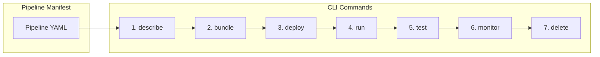
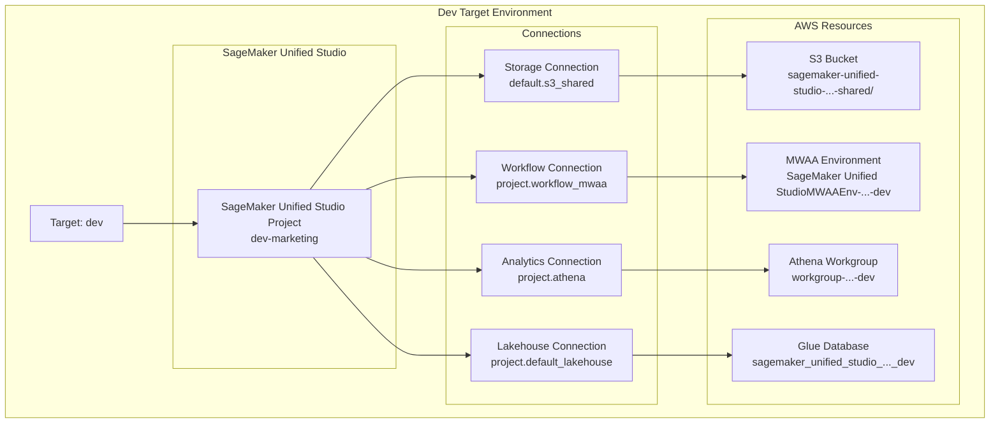
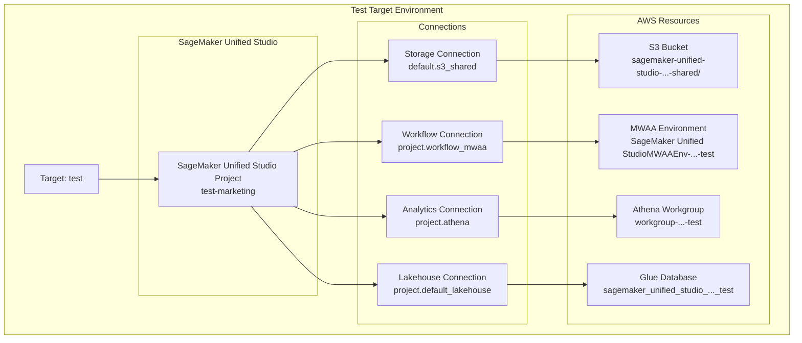
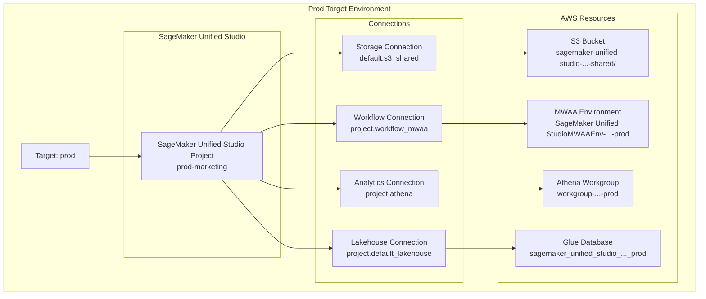

# SMUS CI/CD CLI

A CLI tool for managing CI/CD pipelines in SageMaker Unified Studio (SMUS), enabling automated deployment of data science workflows and assets across multiple environments.

<!-- Trigger integration tests -->

## Quick Reference

See **[Pipeline Manifest Reference](docs/pipeline-manifest.md)** for complete guide to pipeline configuration.

See **[CLI Commands Reference](docs/cli-commands.md)** for detailed command documentation and examples.

See **[Development Guide](docs/development.md)** for development workflows, testing, and contribution guidelines.

## GitHub Actions Integration

The repository includes three GitHub Actions workflows for automated testing and demonstration:

### 1. CI Workflow (`.github/workflows/ci.yml`)
- **Triggers**: Pull requests and pushes to main/master
- **Features**: Code linting, unit tests with coverage, security scans
- **Purpose**: Comprehensive code quality validation

### 2. PR Integration Tests (`.github/workflows/pr-tests.yml`)  
- **Triggers**: Pull requests affecting SMUS CLI code
- **Features**: Integration tests with real AWS resources using OIDC authentication
- **Purpose**: Validate CLI functionality against live AWS services

### 3. Full Pipeline Lifecycle Demo (`.github/workflows/full-pipeline-lifecycle.yml`)
- **Triggers**: Manual workflow dispatch
- **Features**: Complete 8-step pipeline demonstration with customizable inputs
- **Purpose**: End-to-end showcase of SMUS CLI capabilities

See **[GitHub Actions Integration](docs/github-actions-integration.md)** for setup instructions and **[tests/integration/github/README.md](tests/integration/github/README.md)** for AWS OIDC configuration.

## What is a CI/CD Pipeline?

**Continuous Integration/Continuous Deployment (CI/CD)** is a software development practice that automates the process of integrating code changes, testing them, and deploying them to different environments. A CI/CD pipeline consists of:

- **Source Control**: Code and configuration stored in version control
- **Build/Package**: Creating deployable artifacts from source code
- **Test Environments**: Staging areas for validation and testing
- **Production Deployment**: Automated deployment to live environments
- **Monitoring**: Tracking deployment success and application health

In the context of **SageMaker Unified Studio**, a CI/CD pipeline manages:
- **Data Science Workflows**: Airflow DAGs, Jupyter notebooks, and ML pipelines
- **Data Assets**: Datasets, models, and analytical outputs
- **Environment Configuration**: Project settings, user permissions, and resource allocation
- **Cross-Environment Promotion**: Moving validated work from dev → test → production

## SMUS Pipeline Architecture

The SMUS CI/CD system consists of CLI operations that manage target environments. Each target represents a complete deployment environment with its own resources.

### CLI Operations Flow



### Target Environment Composition

#### Development Environment


#### Test Environment


#### Production Environment


## Key Concepts

### Pipeline Stages → SMUS Projects

Each **pipeline stage** (dev, test, prod) maps to a **SageMaker Unified Studio Project**:

- **Dev Stage** → **Dev Project** (`dev-marketing`)
  - Development and experimentation
  - Rapid iteration and testing
  - Individual developer workspaces

- **Test Stage** → **Test Project** (`test-marketing`)
  - Integration testing and validation
  - Staging environment for QA
  - Pre-production verification

- **Prod Stage** → **Prod Project** (`prod-marketing`)
  - Production deployment
  - Live data processing
  - Business-critical workflows

### Resource Mapping

Each project contains:
- **S3 Storage Connections** - For data assets and notebooks
- **Workflow Connections** - For Airflow DAGs and ML pipelines
- **Environment Configurations** - Compute and runtime settings
- **User Permissions** - Access control and collaboration

## Installation

### From PyPI (Recommended)
```bash
pip install smus-cicd-cli
```

### From Source
```bash
# Clone the repository
git clone https://github.com/your-org/smus-cicd-pipeline-cli.git
cd smus-cicd-pipeline-cli

# Install in development mode
pip install -e ".[dev]"

# Or install normally
pip install .
```

### From PyPI (when published)
```bash
pip install smus-cicd-cli
```

## Quick Start

For detailed command examples and outputs, see **[CLI Commands Reference](docs/cli-commands.md)**.

### Basic Workflow
```bash
# 1. Validate pipeline configuration
smus-cli describe --pipeline pipeline.yaml --connect

# 2. Create deployment bundle from dev environment
smus-cli bundle --pipeline pipeline.yaml --targets dev

# 3. Deploy to marketing test stage
smus-cli deploy --targets marketing-test-stage --pipeline pipeline.yaml

# 4. Monitor workflow status
smus-cli monitor --pipeline pipeline.yaml

# 5. Trigger workflow execution
smus-cli run --pipeline pipeline.yaml --targets marketing-test-stage --workflow test_dag --command trigger

# 6. Run tests to validate deployment
smus-cli test --pipeline pipeline.yaml --targets marketing-test-stage

# 7. Clean up resources (when needed)
smus-cli delete --targets marketing-test-stage --pipeline pipeline.yaml --force
```

## Common Workflows

### Complete CI/CD Flow
```bash
# 1. Analyze pipeline configuration
smus-cli describe --pipeline pipeline.yaml --workflows --targets --connect

# 2. Create deployment bundle from current dev state
smus-cli bundle dev

# 3. Deploy to staging (auto-initializes if needed)
smus-cli deploy --targets staging

# 4. After validation, deploy to production (auto-initializes if needed)
smus-cli deploy --targets prod
```

For detailed development workflows, testing procedures, and contribution guidelines, see the **[Development Guide](docs/development.md)**.
