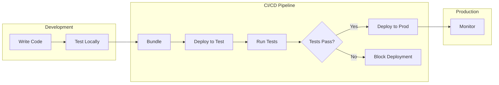

# SMUS CI/CD Pipeline CLI

**Automate deployment of data science workflows across SageMaker Unified Studio environments**

Deploy Airflow DAGs, Jupyter notebooks, and ML pipelines from development to production with confidence. Built for data engineers, ML engineers, and platform teams managing multi-environment data science workflows.

---

## Why SMUS CI/CD CLI?

✅ **Deploy with Confidence** - Automated testing and validation before production  
✅ **Multi-Environment Management** - Dev → Test → Prod with environment-specific configuration  
✅ **DataZone Integration** - Automatic catalog asset subscription and approval workflows  
✅ **Infrastructure as Code** - Version-controlled pipeline definitions and reproducible deployments  
✅ **GitHub Actions Ready** - Native CI/CD integration for automated deployments  

---

## Quick Start

**Install from source:**
```bash
git clone https://github.com/aws/Unified-Studio-for-Amazon-Sagemaker.git
cd Unified-Studio-for-Amazon-Sagemaker/experimental/SMUS-CICD-pipeline-cli
pip install -e .
```

**Deploy your first pipeline:**
```bash
# Validate configuration
smus-cli describe --pipeline pipeline.yaml --connect

# Create deployment bundle
smus-cli bundle --pipeline pipeline.yaml --targets dev

# Deploy to test environment
smus-cli deploy --targets test --pipeline pipeline.yaml

# Run validation tests
smus-cli test --pipeline pipeline.yaml --targets test
```

**See it in action:** [Live GitHub Actions Example](https://github.com/aws/Unified-Studio-for-Amazon-Sagemaker/actions/runs/17631303500)

---

## Who Is This For?

### 👨‍💻 DevOps Teams
Build and deploy CI/CD pipelines for data engineering, ML, and GenAI workflows.  
→ **[Quick Start Guide](docs/getting-started/quickstart.md)** - Deploy your first pipeline in 10 minutes  

**Includes examples for:**
- Data Engineering (Glue, Notebooks, Athena)
- ML Workflows (SageMaker, Notebooks)
- GenAI Applications (Bedrock, Notebooks)

### 🔧 Platform Administrators
Set up and manage multi-environment infrastructure for DevOps teams.  
→ **[Admin Guide](docs/getting-started/admin-quickstart.md)** - Configure infrastructure in 15 minutes

---

## Key Features

### 🚀 Automated Deployment
- **Bundle Creation** - Package workflows, notebooks, and data assets into deployable artifacts
- **Multi-Target Deployment** - Deploy to dev, test, and prod with a single command
- **Environment Variables** - Dynamic configuration using `${VAR}` substitution
- **Rollback Support** - Revert to previous versions when needed

### 🔍 Testing & Validation
- **Automated Tests** - Run validation tests before promoting to production
- **Quality Gates** - Block deployments if tests fail
- **Workflow Monitoring** - Track execution status and logs
- **Health Checks** - Verify deployment correctness

### 📊 DataZone Catalog Integration
- **Asset Discovery** - Automatically find required catalog assets
- **Subscription Management** - Request access to tables and datasets
- **Approval Workflows** - Handle cross-project data access
- **Asset Tracking** - Monitor catalog dependencies

### 🔄 CI/CD Integration
- **GitHub Actions** - Pre-built workflows for automated deployment
- **GitLab CI** - Native support for GitLab pipelines
- **Environment Variables** - Flexible configuration for any CI/CD platform
- **Webhook Support** - Trigger deployments from external events

### 🏗️ Infrastructure Management
- **Project Creation** - Automatically provision SageMaker Unified Studio projects
- **Connection Setup** - Configure S3, Airflow, Athena, and Lakehouse connections
- **Resource Mapping** - Link AWS resources to project connections
- **Permission Management** - Control access and collaboration

---

## Supported AWS Services

Deploy workflows using these AWS services through Airflow YAML syntax:

### 🎯 Analytics & Data
**Amazon Athena** • **AWS Glue** • **Amazon EMR** • **Amazon Redshift** • **Lake Formation**

### 🤖 Machine Learning  
**SageMaker Training** • **SageMaker Pipelines** • **Feature Store** • **Model Registry** • **Batch Transform**

### 🧠 Generative AI
**Amazon Bedrock** • **Bedrock Agents** • **Bedrock Knowledge Bases** • **Guardrails**

### 📊 Additional Services
S3 • Lambda • Step Functions • DynamoDB • RDS • SNS/SQS • Batch

**See complete list:** [Airflow AWS Operators Reference](docs/airflow-aws-operators.md)

---

## Core Concepts

### Pipeline
A YAML manifest defining your complete CI/CD workflow:
- Target environments (dev, test, prod)
- Bundle configuration (what to deploy)
- Workflow definitions and parameters
- Environment-specific settings

### Bundle
A deployable package containing:
- Airflow DAGs and Python scripts
- Jupyter notebooks and data files
- ML models and configuration
- Git repository dependencies

### Target
A deployment environment mapping to a SageMaker Unified Studio project:
- Environment configuration (domain, region, project)
- Resource definitions (S3, Airflow, Athena, Glue)
- Deployment settings and parameters
- Access control and permissions

**How it works:** Bundles code → Deploys to projects → Runs workflows → Monitors execution

---

## Documentation

### Getting Started
- **[Quick Start Guide](docs/getting-started/quickstart.md)** - Deploy your first pipeline (10 min)
- **[Admin Guide](docs/getting-started/admin-quickstart.md)** - Set up infrastructure (15 min)

### Guides
- **[Pipeline Manifest Reference](docs/pipeline-manifest.md)** - Complete YAML configuration guide
- **[CLI Commands](docs/cli-commands.md)** - Detailed command documentation
- **[Substitutions & Variables](docs/substitutions-and-variables.md)** - Dynamic configuration
- **[GitHub Actions Integration](docs/github-actions-integration.md)** - Automated CI/CD workflows

### Reference
- **[Pipeline Manifest Schema](docs/pipeline-manifest-schema.md)** - YAML schema reference
- **[Airflow AWS Operators](docs/airflow-aws-operators.md)** - Custom operators

### Examples
- **[ETL Pipeline](examples/analytic-workflow/etl/)** - Glue jobs with Airflow orchestration
- **[ML Pipeline](examples/analytic-workflow/ml/)** - SageMaker training with MLflow tracking
- **[Serverless Example](examples/serverless-example/)** - Airflow Serverless workflows
- **[MWAA Example](examples/mwaa-example/)** - Managed Airflow workflows

### Development
- **[Development Guide](docs/development.md)** - Contributing and testing

---

## Example Pipeline Flow



---

## Example Pipelines

### ETL Pipeline (`examples/analytic-workflow/etl/`)

**What it deploys:**
- **2 AWS Glue jobs** running on Glue 4.0
  - `data_discovery_task` - Lists and discovers S3 data files
  - `data_summary_task` - Processes COVID-19 data from Athena tables
- **Airflow Serverless workflow** orchestrating job dependencies
- **Python scripts** bundled and uploaded to S3 shared storage

**Pipeline manifest (`etl_pipeline.yaml`):**
- Bundles `etl/` directory to S3 connection `default.s3_shared`
- Deploys to `dev` (DEV stage) and `test` (TEST stage with auto-created project)
- Injects environment variables (`S3_PREFIX`, `AWS_REGION`)
- Runs integration tests from `pipeline_tests/` folder

**Workflow (`workflow_combined.yaml`):**
```yaml
workflow_combined:
  dag_id: 'covid_etl_workflow'
  tasks:
    data_discovery_task:
      operator: airflow.providers.amazon.aws.operators.glue.GlueJobOperator
      script_location: 's3://.../etl/bundle/glue_s3_list_job.py'
      script_args:
        '--BUCKET_NAME': 'amazon-sagemaker-...'
    
    data_summary_task:
      operator: airflow.providers.amazon.aws.operators.glue.GlueJobOperator
      script_location: 's3://.../etl/bundle/glue_covid_summary_job.py'
      script_args:
        '--DATABASE_NAME': 'covid19_db'
        '--TABLE_NAME': 'us_simplified'
```

**Deploy:**
```bash
cd examples/analytic-workflow/etl
smus-cli bundle --pipeline etl_pipeline.yaml --targets dev
smus-cli deploy --targets test --pipeline etl_pipeline.yaml
```

### ML Training Pipeline (`examples/analytic-workflow/ml/`)

**What it deploys:**
- **SageMaker Notebook Operator** executing ML orchestration notebook
- **Training code** bundled with compression to S3 (`job-code/` directory)
- **Workflow definition** with MLflow connection injection
- **MLflow tracking server** connection for experiment tracking

**Pipeline manifest (`ml_pipeline.yaml`):**
- Bundles 2 storage locations:
  - `training-code` → compressed tarball with training script + inference code
  - `ml-workflows` → notebook and workflow definitions
- Auto-creates test project with MLflow connection
- Injects MLflow tracking server ARN via connection parameter substitution

**Workflow (`ml_dev_workflow_v3.yaml`):**
```yaml
ml_dev_workflow:
  dag_id: "ml_dev_workflow_v3"
  tasks:
    ml_orchestrator_notebook:
      operator: airflow.providers.amazon.aws.operators.sagemaker_unified_studio.SageMakerNotebookOperator
      input_config:
        input_path: "ml/bundle/workflows/ml_orchestrator_notebook.ipynb"
        input_params:
          mlflow_tracking_server_arn: "{proj.connection.mlflow-server.trackingServerArn}"
```

**ML Orchestrator Notebook does:**
1. Generates synthetic training data (1000 samples, 20 features, 3 classes)
2. Uploads training/inference data to S3
3. Launches SageMaker training job with SKLearn estimator
4. Logs metrics and model to MLflow tracking server
5. Runs batch transform inference on test data
6. Outputs predictions to S3

**Training script (`sagemaker_training_script.py`):**
- Trains RandomForest classifier on synthetic data
- Logs hyperparameters and metrics to MLflow
- Saves model artifacts (model.joblib, scaler.joblib)
- **Copies inference.py to model tarball** for batch transform

**Deploy:**
```bash
cd examples/analytic-workflow/ml
smus-cli bundle --pipeline ml_pipeline.yaml --targets dev
smus-cli deploy --targets test --pipeline ml_pipeline.yaml
```

**Key features:**
- ✅ Dynamic parameter injection from project connections
- ✅ MLflow experiment tracking and model registry integration
- ✅ SageMaker training with custom dependencies (requirements.txt)
- ✅ Batch transform inference with custom inference handler
- ✅ Compressed bundle storage for efficient deployment

---

## Common Use Cases

### Deploy Airflow DAGs
```bash
# Bundle and deploy workflows (YAML syntax) to test environment
smus-cli bundle --targets dev
smus-cli deploy --targets test
smus-cli run --targets test --workflow my_dag
```

### Promote to Production
```bash
# Run tests in staging
smus-cli test --targets test

# Deploy to production if tests pass
smus-cli deploy --targets prod
```

### Manage Catalog Assets
```bash
# Request access to catalog tables
smus-cli deploy --targets test  # Automatically requests subscriptions
smus-cli monitor --targets test  # Track approval status
```

### CI/CD Automation
```yaml
# .github/workflows/deploy.yml
- name: Deploy to Test
  run: smus-cli deploy --targets test --pipeline pipeline.yaml
  
- name: Run Tests
  run: smus-cli test --targets test --pipeline pipeline.yaml
  
- name: Deploy to Prod
  if: success()
  run: smus-cli deploy --targets prod --pipeline pipeline.yaml
```

---

## Security Notice

⚠️ **DO NOT** install from PyPI - always install from official AWS source code.

```bash
# ✅ Correct - Install from official AWS repository
git clone https://github.com/aws/Unified-Studio-for-Amazon-Sagemaker.git
cd Unified-Studio-for-Amazon-Sagemaker/experimental/SMUS-CICD-pipeline-cli
pip install -e .

# ❌ Wrong - Do not use PyPI
pip install smus-cicd-cli  # May contain malicious code
```

---

## Support & Community

- **Documentation**: [docs/](docs/)
- **Examples**: [examples/](examples/)
- **Issues**: [GitHub Issues](https://github.com/aws/Unified-Studio-for-Amazon-Sagemaker/issues)
- **Contributing**: [Development Guide](docs/development.md)

---

## Quick Navigation - All READMEs

### 📚 Documentation
- **[Getting Started Hub](docs/getting-started/README.md)** - Role-based navigation for DevOps teams and admins
- **[Quick Start Guide](docs/getting-started/quickstart.md)** - Deploy your first pipeline in 10 minutes
- **[Admin Quick Start](docs/getting-started/admin-quickstart.md)** - Infrastructure setup in 15 minutes

### 📖 Reference Guides
- **[Pipeline Manifest](docs/pipeline-manifest.md)** - Complete YAML configuration reference
- **[CLI Commands](docs/cli-commands.md)** - All available commands and options
- **[Substitutions & Variables](docs/substitutions-and-variables.md)** - Dynamic configuration guide
- **[GitHub Actions Integration](docs/github-actions-integration.md)** - CI/CD automation setup
- **[Airflow AWS Operators](docs/airflow-aws-operators.md)** - Custom operator reference
- **[Pipeline Manifest Schema](docs/pipeline-manifest-schema.md)** - YAML schema validation

### 💡 Examples
- **[Examples Overview](examples/README.md)** - All available examples and usage
- **[ETL Pipeline](examples/analytic-workflow/etl/)** - Glue jobs with Airflow orchestration
- **[ML Pipeline](examples/analytic-workflow/ml/README.md)** - SageMaker training with MLflow tracking
- **[ML Training Code](examples/analytic-workflow/ml/job-code/README.md)** - Training script details
- **[Serverless Example](examples/serverless-example/README.md)** - Airflow Serverless workflows
- **[MWAA Example](examples/mwaa-example/README.md)** - Managed Airflow workflows

### 🧪 Testing & Development
- **[Tests Overview](tests/README.md)** - Testing infrastructure and guidelines
- **[Test Scripts](tests/scripts/README.md)** - Helper scripts for testing
- **[Development Guide](docs/development.md)** - Contributing and local development

---

## License

This project is licensed under the MIT-0 License. See [LICENSE](../../LICENSE) for details.
