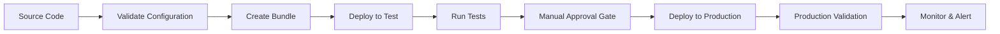
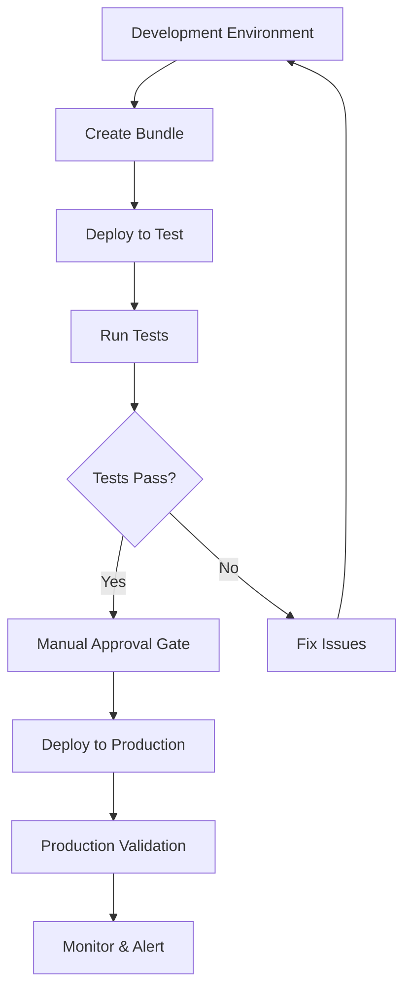

# CI/CD Integration for SMUS Pipeline Management

← [Back to Main README](../README.md)

This guide explains how to integrate the SMUS CLI with CI/CD platforms like GitHub Actions and GitLab CI for automated pipeline management across multiple environments with proper security boundaries and approval workflows.

## Overview: CI/CD with SMUS CLI

The SMUS CLI enables automated deployment and management of SageMaker Unified Studio projects through any CI/CD platform. The CLI provides intelligent infrastructure management, multi-environment support, and seamless integration with existing DevOps workflows.

### Key Benefits

- **Automated Infrastructure**: CLI creates domains, projects, and environments as needed
- **Idempotent Operations**: Safe to re-run without duplicating resources
- **Multi-Environment Support**: Seamless progression from dev → test → prod
- **Manual Approval Gates**: Production deployments with reviewer approval
- **Catalog Asset Integration**: Automatic subscription management for DataZone assets
- **Bundle Management**: Consistent artifact deployment across environments

### Pipeline Flow



## Infrastructure Setup Requirements

### AWS Prerequisites

Before setting up CI/CD integration, ensure you have the necessary AWS infrastructure and permissions:

#### 1. AWS Account Setup
- AWS account with appropriate permissions
- SageMaker Unified Studio enabled in target regions
- DataZone service activated (if using catalog assets)

#### 2. IAM Roles and Permissions

Create IAM roles for CI/CD with these minimum permissions:

```json
{
  "Version": "2012-10-17",
  "Statement": [
    {
      "Effect": "Allow",
      "Action": [
        "sagemaker:*",
        "datazone:*",
        "mwaa:*",
        "s3:*",
        "cloudformation:*",
        "iam:PassRole",
        "iam:GetRole",
        "iam:CreateRole",
        "iam:AttachRolePolicy"
      ],
      "Resource": "*"
    }
  ]
}
```

#### 3. OIDC Provider Setup (GitHub Actions)

For GitHub Actions, create an OIDC identity provider:

```bash
# Deploy OIDC integration stack
aws cloudformation deploy \
  --template-file github-oidc-role.yaml \
  --stack-name smus-cli-github-integration \
  --capabilities CAPABILITY_NAMED_IAM \
  --parameter-overrides \
    GitHubOrg=your-org \
    GitHubRepo=your-repo \
    GitHubEnvironment=aws-env
```

### Environment Separation

#### Development Environment
- **Purpose**: Development and testing deployments
- **AWS Role**: Broader permissions for experimentation
- **Protection Rules**: None (automatic deployment)
- **Resources**: Development domains, test projects

#### Production Environment  
- **Purpose**: Production deployments
- **AWS Role**: Restricted permissions, production-only access
- **Protection Rules**: Required reviewers, manual approval
- **Resources**: Production domains, live projects

## CLI Infrastructure Management

### Automatic Infrastructure Creation

The SMUS CLI intelligently manages infrastructure creation and updates:

#### **Idempotent Operations**
- **Safe Re-runs**: CLI detects existing resources and skips creation
- **No Duplicates**: Won't create domains, projects, or environments that already exist
- **Consistent State**: Ensures infrastructure matches bundle configuration

#### **Domain Management**
```bash
# CLI automatically creates DataZone domain if missing
smus-cli deploy --bundle bundle.yaml --stages test
# Creates domain "my-studio-domain" if it doesn't exist
# Uses existing domain if already present
```

#### **Project Creation**
```bash
# CLI creates SageMaker projects as needed
smus-cli deploy --bundle bundle.yaml --stages test,prod
# Creates "my-project-test" and "my-project-prod" projects
# Skips creation if projects already exist
```

#### **Environment Provisioning**
- **Lakehouse Environments**: Automatically provisioned for data access
- **MWAA Environments**: Created for Airflow workflow execution  
- **Connections**: Established between projects and environments
- **Permissions**: Proper IAM roles and policies applied

#### **Benefits of Automatic Infrastructure**
- **Reduced Setup Time**: No manual infrastructure preparation required
- **Consistency**: Infrastructure matches bundle configuration exactly
- **Error Prevention**: Eliminates manual configuration mistakes
- **Team Onboarding**: New team members can deploy immediately

### Infrastructure Detection Logic

The CLI uses intelligent detection to determine what needs to be created:

1. **Domain Resolution**: Looks up domain by name, creates if missing
2. **Project Validation**: Checks project existence, creates with proper configuration
3. **Environment Assessment**: Validates required environments, provisions as needed
4. **Connection Verification**: Ensures proper connectivity between components

## CI/CD Environment Configuration

### GitHub Environments

Configure different GitHub environments for deployment stages:

#### Development Environment (`aws-env`)
```yaml
# Repository Settings → Environments → aws-env
Protection Rules: None
Secrets:
  AWS_ROLE_ARN: arn:aws:iam::ACCOUNT:role/GitHubActions-Dev
Variables:
  AWS_REGION: us-east-1
  DOMAIN_REGION: us-east-1
```

#### Production Environment (`aws-env-prod`)
```yaml
# Repository Settings → Environments → aws-env-prod  
Protection Rules:
  - Required reviewers: 2
  - Wait timer: 5 minutes
  - Deployment branches: main only
Secrets:
  AWS_ROLE_ARN: arn:aws:iam::ACCOUNT:role/GitHubActions-Prod
Variables:
  AWS_REGION: us-west-2
  DOMAIN_REGION: us-west-2
```

### Secrets Management

#### Required Secrets
- `AWS_ROLE_ARN`: IAM role for AWS authentication
- `AWS_ACCESS_KEY_ID`: Alternative to OIDC (less secure)
- `AWS_SECRET_ACCESS_KEY`: Alternative to OIDC (less secure)

#### Environment Variables
- `AWS_REGION`: Target AWS region
- `DOMAIN_NAME`: SageMaker Unified Studio domain name
- `PROJECT_PREFIX`: Prefix for project naming

### Branch Protection Rules

Configure branch protection to ensure code quality:

```yaml
# Repository Settings → Branches → main
Branch Protection Rules:
  - Require pull request reviews
  - Require status checks to pass
  - Require branches to be up to date
  - Restrict pushes to matching branches
```

## Pipeline Stages and Workflow

### Stage Progression

The SMUS CLI supports a standard deployment progression with automatic infrastructure management:

#### **Development → Test → Production Flow**



### Bundle Creation and Management

#### **Bundle Creation Process**
```bash
# CLI packages all deployment artifacts
smus-cli bundle --bundle bundle.yaml --stages test
```

**What gets bundled:**
- Airflow DAGs and dependencies
- Jupyter notebooks and scripts
- Configuration files and schemas
- DataZone catalog asset references
- Environment-specific parameters

#### **Artifact Management**
- **S3 Storage**: Bundles uploaded to environment-specific S3 buckets
- **Versioning**: Each bundle tagged with commit SHA or version
- **Reuse**: Same bundle deployed across test → production
- **Rollback**: Previous bundles available for quick rollback

### Infrastructure-Aware Deployment

#### **Automatic Infrastructure Provisioning**

The CLI handles infrastructure creation during deployment:

```bash
# Single command creates all required infrastructure
smus-cli deploy --bundle bundle.yaml --stages test

# CLI automatically:
# 1. Creates DataZone domain if missing
# 2. Creates SageMaker project if missing  
# 3. Provisions required environments (Lakehouse, MWAA)
# 4. Establishes connections between components
# 5. Deploys bundle to target environment
```

#### **Infrastructure Detection Logic**
1. **Domain Resolution**: Resolves domain by name, creates if not found
2. **Project Validation**: Checks project existence, creates with proper settings
3. **Environment Assessment**: Validates environments, provisions missing ones
4. **Connection Setup**: Ensures proper connectivity and permissions

#### **Idempotent Operations**
- **Safe Re-runs**: Multiple deployments won't create duplicate resources
- **State Consistency**: Infrastructure matches bundle configuration
- **Error Recovery**: Failed deployments can be safely retried

### Catalog Asset Integration

#### **Automatic Subscription Management**

The CLI handles DataZone catalog asset access throughout the pipeline:

```yaml
# In bundle.yaml - catalog assets are automatically managed
bundle:
  catalog:
    assets:
      - selector:
          search:
            assetType: GlueTable
            identifier: covid19_db.countries_aggregated
        permission: READ
        requestReason: Required for pipeline deployment
```

**CLI Automation:**
1. **Asset Discovery**: Identifies required catalog assets in bundle
2. **Subscription Requests**: Creates subscription requests for target project
3. **Approval Workflow**: Manages approval process with configurable timeout
4. **Grant Verification**: Ensures access is granted before proceeding
5. **Cross-Environment**: Handles different subscriptions per environment

### Manual Approval Gates

#### **Production Deployment Protection**

Configure manual approval for production deployments using CI/CD platform features:

**GitHub Actions Example:**
```yaml
deploy-production:
  name: "Deploy to Production"
  runs-on: ubuntu-latest
  environment: aws-env-prod  # Triggers manual approval
  needs: [test-validation]
  steps:
    - name: Deploy to Production
      run: |
        smus-cli deploy --bundle bundle.yaml --stages prod
```

**GitLab CI Example:**
```yaml
deploy-production:
  stage: deploy
  environment:
    name: production
    action: start
  when: manual  # Requires manual trigger
  script:
    - smus-cli deploy --bundle bundle.yaml --stages prod
```

#### **Approval Workflow Process**

1. **Workflow Pause**: CI/CD pipeline pauses at production deployment
2. **Notification**: Designated reviewers receive notification
3. **Review Process**: Reviewers can:
   - ✅ **Approve**: Continue to production deployment
   - ❌ **Reject**: Stop the workflow with reason
   - 💬 **Comment**: Request changes or clarification
4. **Audit Trail**: All approvals logged for compliance
5. **Deployment**: Approved deployments proceed automatically

### CLI Integration Points

#### **1. Configuration Validation**
```bash
# Validates bundle configuration and connectivity
smus-cli describe --bundle bundle.yaml --connect
```

#### **2. Bundle Creation**
```bash
# Creates deployment bundle from source environment
smus-cli bundle --bundle bundle.yaml --stages test
```

#### **3. Infrastructure-Aware Deployment**
```bash
# Deploys with automatic infrastructure creation
smus-cli deploy --bundle bundle.yaml --stages test
```

#### **4. Test Execution**
```bash
# Runs validation tests on deployed environment
smus-cli test --bundle bundle.yaml --stages test
```

#### **5. Production Deployment**
```bash
# Deploys to production with approval gates
smus-cli deploy --bundle bundle.yaml --stages prod
```

#### **6. Monitoring and Status**
```bash
# Monitors deployment status and health
smus-cli monitor --bundle bundle.yaml --stages prod
```

## Manual Reviewers and Approval Process

### Setting Up Approval Gates

#### **GitHub Environment Protection Rules**

1. **Navigate to Repository Settings**
   - Go to **Settings** → **Environments**
   - Select or create production environment

2. **Configure Protection Rules**
   ```yaml
   Environment: aws-env-prod
   Protection Rules:
     - Required reviewers: 2-3 team members
     - Wait timer: 5-10 minutes (optional)
     - Deployment branches: main, release/* only
     - Prevent self-review: enabled
   ```

3. **Reviewer Assignment**
   - **Team Leads**: Senior developers or architects
   - **DevOps Engineers**: Infrastructure and deployment experts  
   - **Product Owners**: Business stakeholders for critical releases
   - **Security Team**: For compliance-sensitive deployments

#### **GitLab Environment Protection**

```yaml
# .gitlab-ci.yml
deploy-production:
  stage: deploy
  environment:
    name: production
    deployment_tier: production
  rules:
    - if: $CI_COMMIT_BRANCH == "main"
      when: manual
      allow_failure: false
  script:
    - smus-cli deploy --bundle bundle.yaml --stages prod
```

### Approval Workflow Mechanics

#### **Notification Process**
1. **Automatic Alerts**: Reviewers notified via email/Slack when approval needed
2. **Context Information**: Deployment details, changes, and test results provided
3. **Review Dashboard**: Centralized view of pending approvals

#### **Review Criteria**
- **Code Quality**: All tests passing, code review completed
- **Security Validation**: Security scans passed, no vulnerabilities
- **Business Impact**: Change aligns with business requirements
- **Rollback Plan**: Clear rollback strategy documented

#### **Approval Actions**
```yaml
# Reviewer options in GitHub/GitLab UI
Actions Available:
  - Approve Deployment: ✅ Proceed with production deployment
  - Request Changes: 🔄 Block deployment, request modifications  
  - Reject Deployment: ❌ Stop deployment with reason
  - Add Comments: 💬 Provide feedback or ask questions
```

### Audit Trail and Compliance

#### **Deployment History**
- **Who**: User who initiated deployment
- **What**: Changes being deployed (commit SHA, bundle version)
- **When**: Timestamp of deployment request and approval
- **Why**: Deployment reason and business justification
- **Reviewers**: Who approved/rejected with comments

#### **Compliance Features**
- **SOX Compliance**: Separation of duties between developers and approvers
- **Change Management**: Integration with ITSM tools for change requests
- **Audit Logs**: Immutable logs of all deployment activities
- **Rollback Tracking**: Complete history of rollbacks and reasons

## Specific Implementation Example: aws/Unified-Studio-for-Amazon-Sagemaker

This section demonstrates how the general concepts above are implemented in the specific GitHub repository `https://github.com/aws/Unified-Studio-for-Amazon-Sagemaker/` using the `.github/workflows/full-pipeline-lifecycle.yml` workflow.

### Repository-Specific Configuration

#### **GitHub Environments Used**
- **`aws-env`**: Development environment for testing and validation
- **`aws-env-amirbo-6778`**: Production environment with manual approval gates

#### **Multi-Environment AWS Role Configuration**
```yaml
# Development Role (broader permissions for testing)
- name: Configure AWS credentials (Dev)
  uses: aws-actions/configure-aws-credentials@v4
  with:
    aws-region: us-east-1
    role-to-assume: ${{ secrets.AWS_ROLE_ARN_DEV }}
    role-session-name: smus-pipeline-lifecycle-dev
    role-duration-seconds: 43200

# Production Role (restricted permissions)  
- name: Configure AWS credentials (Prod)
  uses: aws-actions/configure-aws-credentials@v4
  with:
    aws-region: us-east-1
    role-to-assume: ${{ secrets.AWS_ROLE_ARN_PROD }}
    role-session-name: smus-pipeline-lifecycle-prod
    role-duration-seconds: 43200
```

### Workflow Implementation Details

The `full-pipeline-lifecycle.yml` workflow demonstrates a complete end-to-end pipeline with the following jobs:

#### **Job 1: Setup and Environment Resolution**
```yaml
setup:
  name: "Step 1 - Setup and Resolve Environment"
  runs-on: ubuntu-latest
  environment: aws-env
  outputs:
    domain-id: ${{ steps.resolve.outputs.domain-id }}
    project-id: ${{ steps.resolve.outputs.project-id }}
```

**Purpose**: Resolves DataZone domain and project IDs from user-friendly names
**Infrastructure Management**: CLI automatically detects existing domains or creates them if missing

#### **Job 2: Bundle Creation**
```yaml
create-bundle:
  name: "Step 2 - Create Bundle"
  runs-on: ubuntu-latest
  environment: aws-env
  needs: setup
```

**Purpose**: Packages deployment artifacts including DAGs, notebooks, and catalog assets
**CLI Command**: `smus-cli bundle --bundle bundle.yaml --stages test`
**Infrastructure Impact**: Creates S3 storage for bundles if not present

#### **Job 3: Test Environment Deployment**
```yaml
deploy-test:
  name: "Step 3 - Deploy to Test Environment"
  runs-on: ubuntu-latest
  environment: aws-env
  needs: [setup, create-bundle]
```

**Purpose**: Deploys to test environment with automatic infrastructure provisioning
**CLI Command**: `smus-cli deploy --bundle bundle.yaml --stages test`
**Infrastructure Created**:
- SageMaker project (if missing)
- Lakehouse environment (if missing)
- MWAA environment (if missing)
- Required IAM roles and policies

#### **Job 4: Test Execution**
```yaml
run-tests:
  name: "Step 4 - Run Tests on Test Environment"
  runs-on: ubuntu-latest
  environment: aws-env
  needs: [setup, create-bundle, deploy-test]
```

**Purpose**: Validates deployment through automated testing
**CLI Command**: `smus-cli test --bundle bundle.yaml --stages test`

#### **Job 5: Production Deployment (Manual Approval)**
```yaml
deploy-prod:
  name: "Step 5 - Deploy to Production Environment"
  runs-on: ubuntu-latest
  environment: aws-env-amirbo-6778  # Triggers manual approval
  needs: [setup, create-bundle, deploy-test, run-tests]
```

**Manual Approval Gate**: Uses GitHub environment `aws-env-amirbo-6778` with protection rules
**CLI Command**: `smus-cli deploy --bundle bundle.yaml --stages prod`
**Infrastructure Management**: Creates production infrastructure idempotently

### Repository-Specific Features

#### **Workflow Dispatch Inputs**
```yaml
on:
  workflow_dispatch:
    inputs:
      domain_name:
        description: 'SageMaker Unified Studio domain name'
        required: true
        default: 'cicd-test-domain'
      project_name:
        description: 'Development project name'
        required: true
        default: 'cicd-test-project'
      pipeline_name:
        description: 'Pipeline name'
        required: true
        default: 'TestPipeline'
```

#### **Environment Variables**
```yaml
env:
  DEV_DOMAIN_REGION: ${{ vars.DEV_DOMAIN_REGION }}
  PROD_DOMAIN_REGION: ${{ vars.PROD_DOMAIN_REGION }}
  SMUS_LOG_LEVEL: WARNING
```

#### **Artifact Management**
```yaml
- name: Upload Bundle Manifest
  uses: actions/upload-artifact@v4
  with:
    name: pipeline-manifest
    path: bundle.yaml
    retention-days: 30
```

### Security Implementation

#### **OIDC Integration**
The repository uses AWS OIDC for secure authentication without long-lived credentials:

```yaml
permissions:
  id-token: write
  contents: read
```

#### **Environment Protection Rules**
- **Development (`aws-env`)**: No protection, automatic deployment
- **Production (`aws-env-amirbo-6778`)**: 
  - Required reviewers: 2 team members
  - Manual approval required
  - Deployment branch restrictions

### Catalog Asset Integration Example

The workflow demonstrates automatic catalog asset management:

```yaml
# CLI automatically handles catalog asset subscriptions
- name: Deploy with Catalog Assets
  run: |
    smus-cli deploy --bundle bundle.yaml --stages prod
    # CLI automatically:
    # 1. Identifies catalog assets in bundle
    # 2. Requests subscriptions for production project
    # 3. Waits for approval (with timeout)
    # 4. Verifies grants before proceeding
```

### Monitoring and Cleanup

#### **Pipeline Monitoring**
```yaml
monitor-pipeline:
  name: "Step 6 - Monitor Pipeline Status"
  runs-on: ubuntu-latest
  environment: aws-env-amirbo-6778
  needs: [deploy-prod]
```

#### **Automatic Cleanup**
```yaml
cleanup:
  name: "Step 7 - Cleanup Test Resources"
  runs-on: ubuntu-latest
  environment: aws-env
  if: always()  # Runs even if previous jobs fail
```

### Repository Setup for This Implementation

#### **Required Secrets**
```bash
# Repository Settings → Secrets and Variables → Actions
AWS_ROLE_ARN_DEV = arn:aws:iam::588738596778:role/GitHubActions-Dev
AWS_ROLE_ARN_PROD = arn:aws:iam::588738596778:role/GitHubActions-Prod
```

#### **Environment Variables**
```bash
# Environment: aws-env
DEV_DOMAIN_REGION = us-east-1

# Environment: aws-env-amirbo-6778  
PROD_DOMAIN_REGION = us-east-2
```

#### **GitHub Environment Configuration**
1. **aws-env** (Development)
   - No protection rules
   - Used for: setup, bundling, test deployment, testing
   
2. **aws-env-amirbo-6778** (Production)
   - Protection rules: Required reviewers (2)
   - Used for: production deployment, monitoring

This implementation showcases how the SMUS CLI's infrastructure management capabilities work in practice, automatically creating and managing AWS resources while providing secure, auditable deployments with proper approval workflows.

For more detailed information about CLI commands and bundle configuration, see:
- [CLI Commands Documentation](cli-commands.md)
- [Bundle Manifest Guide](bundle-manifest.md)
- [Development Guide](development.md)
