# GitHub Actions Integration for SMUS CI/CD

← [Back to Main README](../README.md)

This guide shows how to create GitHub Actions workflows for automated SMUS CI/CD pipeline management using the SMUS CLI with multi-environment deployments, different AWS roles, and manual approval gates.

## Pipeline Overview

The SMUS CI/CD pipeline automates the deployment and management of SageMaker Unified Studio projects across multiple environments with proper security boundaries:

```mermaid
graph LR
    A[GitHub Repository] --> B[Step 1: Setup & Validate]
    B --> C[Step 2: Create Bundle]
    C --> D[Step 3: Deploy to Test]
    D --> E[Step 4: Run Tests]
    E --> F[Step 5: Monitor Test]
    F --> G[Manual Approval Gate]
    G --> H[Step 6: Deploy to Production]
    H --> I[Step 7: Production Tests]
    I --> J[Step 8: Production Monitoring]
```



## Multi-Environment Configuration

### GitHub Environments

The workflow uses different GitHub environments for different deployment stages, each with their own security configurations:

#### Development Environment (`aws-env`)
- **Purpose**: Development and testing deployments
- **AWS Role**: `${{ secrets.AWS_ROLE_ARN_DEV }}`
- **Region**: `${{ vars.DEV_DOMAIN_REGION }}`
- **Protection Rules**: None (automatic deployment)
- **Used for**: Setup, validation, bundling, test deployments

#### Production Environment (`aws-env-amirbo-6778`)
- **Purpose**: Production deployments
- **AWS Role**: `${{ secrets.AWS_ROLE_ARN_PROD }}` (if different from dev)
- **Region**: `${{ vars.PROD_DOMAIN_REGION }}`
- **Protection Rules**: 
  - Required reviewers
  - Manual approval gates
  - Deployment windows
- **Used for**: Production deployments and monitoring

### Environment Variables by Stage

```yaml
# Development Environment Variables
environment: aws-env
env:
  DEV_DOMAIN_REGION: ${{ vars.DEV_DOMAIN_REGION }}
  SMUS_LOG_LEVEL: WARNING

# Production Environment Variables  
environment: aws-env-amirbo-6778
env:
  PROD_DOMAIN_REGION: ${{ vars.PROD_DOMAIN_REGION }}
  SMUS_LOG_LEVEL: WARNING
```

### AWS Role Configuration

Different AWS roles provide appropriate permissions for each environment:

```yaml
# Development Role (broader permissions for testing)
- name: Configure AWS credentials (Dev)
  uses: aws-actions/configure-aws-credentials@v4
  with:
    aws-region: us-east-1
    role-to-assume: ${{ secrets.AWS_ROLE_ARN_DEV }}
    role-session-name: smus-pipeline-lifecycle-dev
    role-duration-seconds: 43200

# Production Role (restricted permissions)
- name: Configure AWS credentials (Prod)
  uses: aws-actions/configure-aws-credentials@v4
  with:
    aws-region: us-east-1
    role-to-assume: ${{ secrets.AWS_ROLE_ARN_PROD }}
    role-session-name: smus-pipeline-lifecycle-prod
    role-duration-seconds: 43200
```

## Manual Approval Gates

### GitHub Environment Protection Rules

Configure manual approval for production deployments:

1. **Repository Settings** → **Environments** → **aws-env-amirbo-6778**
2. **Protection Rules**:
   - ✅ **Required reviewers**: Add team members who can approve production deployments
   - ✅ **Wait timer**: Optional delay before deployment (e.g., 5 minutes)
   - ✅ **Deployment branches**: Restrict to `main` branch only

### Approval Workflow

```yaml
deploy-prod:
  name: "Step 7 - Deploy to Production Environment"
  runs-on: ubuntu-latest
  environment: aws-env-amirbo-6778  # Triggers manual approval
  needs: [setup, execute-workflows-test-target]
```

When this job runs:
1. **Workflow pauses** and shows "Waiting for approval"
2. **Designated reviewers** receive notification
3. **Reviewers can**:
   - ✅ **Approve**: Continue to production deployment
   - ❌ **Reject**: Stop the workflow
   - 💬 **Comment**: Request changes or clarification

## Pipeline Steps Explained

### Step 1: Setup and Validation
- **Environment**: `aws-env` (Development)
- **AWS Role**: Development role with domain/project access
- **Actions**:
  - Validates environment variables
  - Resolves DataZone domain and project IDs
  - Validates pipeline configuration schema
  - Sets up outputs for subsequent steps

### Step 2: Create Deployment Bundle
- **Environment**: `aws-env` (Development)
- **Actions**:
  - Packages Airflow DAGs, notebooks, and data assets
  - **Catalog Asset Integration**: Automatically includes DataZone catalog assets referenced in workflows
  - Uploads bundles to S3 storage
  - Validates workflow syntax and dependencies

### Step 3: Deploy to Test Environment
- **Environment**: `aws-env` (Development)
- **Actions**:
  - Creates or updates test SageMaker project
  - Initializes project with required environments (Lakehouse, MWAA)
  - **Catalog Asset Access**: CLI automatically requests subscriptions for catalog assets
  - Deploys workflows and configurations

### Step 4: Run Tests on Test Environment
- **Environment**: `aws-env` (Development)
- **Actions**:
  - Executes user-defined test suites
  - Validates workflows function correctly
  - Generates test reports

### Step 5: Monitor Test Environment
- **Environment**: `aws-env` (Development)
- **Actions**:
  - Monitors pipeline status and health
  - Checks workflow execution status
  - Validates test environment stability

### Step 6: Execute Test Workflows
- **Environment**: `aws-env` (Development)
- **Actions**:
  - Triggers DAGs in test environment
  - Lists and validates DAG tasks
  - Checks task execution states

### Step 7: Deploy to Production (Manual Approval Required)
- **Environment**: `aws-env-amirbo-6778` (Production)
- **Manual Approval**: ⚠️ **Workflow pauses for reviewer approval**
- **Actions**:
  - Downloads validated deployment bundle
  - Deploys to production SageMaker project
  - **Catalog Asset Access**: Ensures production access to required catalog assets

### Step 8: Run Production Tests
- **Environment**: `aws-env-amirbo-6778` (Production)
- **Actions**:
  - Executes production validation tests
  - Verifies production deployment health

### Step 9: Monitor Production Environment
- **Environment**: `aws-env-amirbo-6778` (Production)
- **Actions**:
  - Monitors production pipeline status
  - Validates production stability

### Step 10: Execute Production Workflows
- **Environment**: `aws-env-amirbo-6778` (Production)
- **Actions**:
  - Triggers production DAGs
  - Validates production workflow execution

## Security Best Practices

### 1. Least Privilege Access
```yaml
# Development role permissions
- DataZone: Full access to dev domain/projects
- S3: Read/write to dev buckets
- MWAA: Manage dev environments
- CloudFormation: Create/update dev stacks

# Production role permissions  
- DataZone: Limited access to prod domain/projects
- S3: Read/write to prod buckets only
- MWAA: Manage prod environments only
- CloudFormation: Update prod stacks only (no create)
```

### 2. Environment Isolation
- **Separate AWS accounts** for dev/prod (recommended)
- **Separate DataZone domains** for dev/prod
- **Separate S3 buckets** for artifacts
- **Network isolation** between environments

### 3. Approval Gates
- **Required reviewers** for production deployments
- **Branch protection** rules (main branch only)
- **Deployment windows** for production changes
- **Audit logging** of all approvals

## Catalog Asset Integration

### Automatic Subscription Management

The CLI automatically handles DataZone catalog asset access:

```yaml
- name: Deploy with catalog assets
  run: |
    smus-cli deploy \
      --pipeline "pipeline.yaml" \
      --targets prod
    # CLI automatically:
    # 1. Identifies catalog assets in bundle
    # 2. Requests subscriptions for target project
    # 3. Manages approval workflows
    # 4. Ensures access before deployment
```

### Bundle Support for Catalog Assets

Deployment bundles can include catalog asset references:

```yaml
# In pipeline.yaml
catalog_assets:
  - asset_id: "dzd_123abc.asset_456def"
    subscription_required: true
  - asset_id: "dzd_123abc.dataset_789ghi"
    subscription_required: true
```

The CLI ensures these assets are accessible in the target environment before proceeding with deployment.

## Example Workflow Configuration

```yaml
name: SMUS Pipeline with Multi-Environment Deployment

on:
  push:
    branches: [ main ]
  pull_request:
    branches: [ main ]

jobs:
  test-deploy:
    environment: aws-env
    steps:
      - uses: aws-actions/configure-aws-credentials@v4
        with:
          role-to-assume: ${{ secrets.AWS_ROLE_ARN_DEV }}
      # ... test deployment steps

  prod-deploy:
    environment: aws-env-prod  # Manual approval required
    needs: [test-deploy]
    steps:
      - uses: aws-actions/configure-aws-credentials@v4
        with:
          role-to-assume: ${{ secrets.AWS_ROLE_ARN_PROD }}
      # ... production deployment steps
```

## Repository Setup

### 1. Create GitHub Environments
```bash
# Repository Settings → Environments
- aws-env (Development)
- aws-env-prod (Production with approval rules)
```

### 2. Configure Secrets
```bash
# Repository Settings → Secrets and Variables → Actions
AWS_ROLE_ARN_DEV=arn:aws:iam::ACCOUNT:role/GitHubActions-Dev
AWS_ROLE_ARN_PROD=arn:aws:iam::ACCOUNT:role/GitHubActions-Prod
```

### 3. Configure Variables
```bash
# Environment Variables
DEV_DOMAIN_REGION=us-east-1
PROD_DOMAIN_REGION=us-west-2
```

This setup provides a secure, auditable, and controlled deployment pipeline with proper separation between development and production environments.
- Applies production-specific configurations
- Monitors deployment status and health

### Step 7: Monitor Workflow
- Tracks workflow execution and performance
- Monitors resource utilization and costs
- Provides alerts and notifications for issues

## Example Workflow

Here's a complete GitHub Actions workflow based on the full pipeline lifecycle:

```yaml
name: SMUS Pipeline Deployment

on:
  workflow_dispatch:
    inputs:
      domain_name:
        description: 'SageMaker Unified Studio domain name'
        required: true
        default: 'my-studio-domain'
      project_name:
        description: 'Development project name'
        required: true
        default: 'my-dev-project'
      pipeline_name:
        description: 'Pipeline name'
        required: true
        default: 'MyDataPipeline'

permissions:
  id-token: write
  contents: read

jobs:
  setup:
    name: "Step 1: Setup Environment"
    runs-on: ubuntu-latest
    environment: aws-env
    outputs:
      domain-id: ${{ steps.resolve.outputs.domain-id }}
      project-id: ${{ steps.resolve.outputs.project-id }}
    
    steps:
    - uses: actions/checkout@v4
    
    - name: Configure AWS credentials
      uses: aws-actions/configure-aws-credentials@v4
      with:
        aws-region: us-east-1
        role-to-assume: ${{ secrets.AWS_ROLE_ARN_DEV }}
        role-session-name: smus-pipeline-setup
        role-duration-seconds: 43200
    
    - name: Set up Python
      uses: actions/setup-python@v4
      with:
        python-version: '3.12'
    
    - name: Install SMUS CLI
      run: |
        cd experimental/SMUS-CICD-pipeline-cli
        pip install -e .
    
    - name: Resolve Domain and Project IDs
      id: resolve
      run: |
        # Get domain ID
        DOMAIN_ID=$(smus-cli describe --pipeline pipeline.yaml --output JSON | jq -r '.domain.id // empty')
        echo "domain-id=$DOMAIN_ID" >> $GITHUB_OUTPUT

  validate:
    name: "Step 2: Validate Manifest"
    runs-on: ubuntu-latest
    environment: aws-env
    needs: setup
    
    steps:
    - uses: actions/checkout@v4
    
    - name: Configure AWS credentials
      uses: aws-actions/configure-aws-credentials@v4
      with:
        aws-region: us-east-1
        role-to-assume: ${{ secrets.AWS_ROLE_ARN_DEV }}
        role-session-name: smus-pipeline-validate
        role-duration-seconds: 43200
    
    - name: Set up Python and install CLI
      run: |
        python -m pip install --upgrade pip
        cd experimental/SMUS-CICD-pipeline-cli
        pip install -e .
    
    - name: Validate Pipeline Manifest
      run: |
        smus-cli describe --pipeline pipeline.yaml
        echo "✅ Pipeline manifest validation completed"

  bundle:
    name: "Step 3: Bundle Code and Workflows"
    runs-on: ubuntu-latest
    environment: aws-env
    needs: [setup, validate]
    
    steps:
    - uses: actions/checkout@v4
    
    - name: Configure AWS credentials
      uses: aws-actions/configure-aws-credentials@v4
      with:
        aws-region: us-east-1
        role-to-assume: ${{ secrets.AWS_ROLE_ARN_DEV }}
        role-session-name: smus-pipeline-bundle
        role-duration-seconds: 43200
    
    - name: Set up Python and install CLI
      run: |
        python -m pip install --upgrade pip
        cd experimental/SMUS-CICD-pipeline-cli
        pip install -e .
    
    - name: Create and Upload Bundle
      run: |
        smus-cli bundle --pipeline pipeline.yaml --targets test
        echo "✅ Bundle created and uploaded"

  deploy-test:
    name: "Step 4: Deploy to Test Environment"
    runs-on: ubuntu-latest
    environment: aws-env
    needs: [setup, validate, bundle]
    
    steps:
    - uses: actions/checkout@v4
    
    - name: Configure AWS credentials
      uses: aws-actions/configure-aws-credentials@v4
      with:
        aws-region: us-east-1
        role-to-assume: ${{ secrets.AWS_ROLE_ARN_DEV }}
        role-session-name: smus-pipeline-deploy-test
        role-duration-seconds: 43200
    
    - name: Set up Python and install CLI
      run: |
        python -m pip install --upgrade pip
        cd experimental/SMUS-CICD-pipeline-cli
        pip install -e .
    
    - name: Deploy to Test Environment
      run: |
        smus-cli deploy --pipeline pipeline.yaml --targets test
        echo "✅ Test environment deployment completed"

  test:
    name: "Step 5: Run Tests"
    runs-on: ubuntu-latest
    environment: aws-env
    needs: [setup, validate, bundle, deploy-test]
    
    steps:
    - uses: actions/checkout@v4
    
    - name: Configure AWS credentials
      uses: aws-actions/configure-aws-credentials@v4
      with:
        aws-region: us-east-1
        role-to-assume: ${{ secrets.AWS_ROLE_ARN_DEV }}
        role-session-name: smus-pipeline-test
        role-duration-seconds: 43200
    
    - name: Set up Python and install CLI
      run: |
        python -m pip install --upgrade pip
        cd experimental/SMUS-CICD-pipeline-cli
        pip install -e .
    
    - name: Run Tests
      run: |
        smus-cli test --pipeline pipeline.yaml --targets test
        echo "✅ Tests completed"

  deploy-production:
    name: "Step 6: Deploy to Production"
    runs-on: ubuntu-latest
    environment: aws-env
    needs: [setup, validate, bundle, deploy-test, test]
    
    steps:
    - uses: actions/checkout@v4
    
    - name: Configure AWS credentials
      uses: aws-actions/configure-aws-credentials@v4
      with:
        aws-region: us-east-1
        role-to-assume: ${{ secrets.AWS_ROLE_ARN_DEV }}
        role-session-name: smus-pipeline-deploy-prod
        role-duration-seconds: 43200
    
    - name: Set up Python and install CLI
      run: |
        python -m pip install --upgrade pip
        cd experimental/SMUS-CICD-pipeline-cli
        pip install -e .
    
    - name: Deploy to Production
      run: |
        smus-cli deploy --pipeline pipeline.yaml --targets prod
        echo "✅ Production deployment completed"

  monitor:
    name: "Step 7: Monitor Workflow"
    runs-on: ubuntu-latest
    environment: aws-env
    needs: [setup, validate, bundle, deploy-test, test, deploy-production]
    
    steps:
    - uses: actions/checkout@v4
    
    - name: Configure AWS credentials
      uses: aws-actions/configure-aws-credentials@v4
      with:
        aws-region: us-east-1
        role-to-assume: ${{ secrets.AWS_ROLE_ARN_DEV }}
        role-session-name: smus-pipeline-monitor
        role-duration-seconds: 43200
    
    - name: Set up Python and install CLI
      run: |
        python -m pip install --upgrade pip
        cd experimental/SMUS-CICD-pipeline-cli
        pip install -e .
    
    - name: Monitor Workflow
      run: |
        smus-cli monitor --pipeline pipeline.yaml --targets prod
        echo "✅ Workflow monitoring completed"
```

## AWS Setup Requirements

### 1. Create GitHub OIDC Provider

Deploy the OIDC provider in your AWS account:

```bash
# Clone the repository
git clone https://github.com/aws/Unified-Studio-for-Amazon-Sagemaker.git
cd Unified-Studio-for-Amazon-Sagemaker/experimental/SMUS-CICD-pipeline-cli/tests/scripts

# Deploy OIDC integration
aws cloudformation deploy \
  --template-file github-oidc-role.yaml \
  --stack-name smus-cli-github-integration \
  --capabilities CAPABILITY_NAMED_IAM \
  --parameter-overrides \
    GitHubOrg=your-org \
    GitHubRepo=your-repo \
    GitHubEnvironment=aws-env
```

### 2. Create GitHub Environment

1. Go to your repository **Settings** → **Environments**
2. Create new environment named `aws-env`
3. Add environment protection rules (optional):
   - Required reviewers
   - Wait timer
   - Deployment branches

### 3. Configure Secrets and Variables

#### Required Secrets:
```
AWS_ROLE_ARN_DEV = arn:aws:iam::ACCOUNT-ID:role/GitHubActionsRole-SMUS-CLI-Tests
```

#### Optional Variables:
```
AWS_REGION = us-east-1
DOMAIN_NAME = your-studio-domain
PROJECT_PREFIX = your-project-prefix
```

### 4. IAM Permissions

The GitHub Actions role needs these permissions:

```json
{
  "Version": "2012-10-17",
  "Statement": [
    {
      "Effect": "Allow",
      "Action": [
        "sagemaker:*",
        "datazone:*",
        "mwaa:*",
        "s3:*",
        "cloudformation:*",
        "iam:PassRole",
        "iam:GetRole",
        "iam:CreateRole",
        "iam:AttachRolePolicy"
      ],
      "Resource": "*"
    }
  ]
}
```

## Environment Variables in Workflows

Use environment variables to make your workflows flexible across different environments:

```yaml
env:
  DOMAIN_NAME: ${{ github.event.inputs.domain_name || 'default-domain' }}
  PROJECT_PREFIX: ${{ vars.PROJECT_PREFIX || 'myproject' }}
  AWS_REGION: ${{ vars.AWS_REGION || 'us-east-1' }}

steps:
- name: Deploy with environment variables
  run: |
    export DEV_DOMAIN_REGION=${{ env.AWS_REGION }}
    smus-cli deploy --pipeline pipeline.yaml --targets dev
```

## Pipeline Manifest Configuration

Create a `pipeline.yaml` that uses environment variables:

```yaml
pipelineName: ${PIPELINE_NAME:MyDataPipeline}

domain:
  name: ${DOMAIN_NAME:my-studio-domain}
  region: ${AWS_REGION:us-east-1}

targets:
  dev:
    stage: DEV
    project:
      name: ${PROJECT_PREFIX:myproject}-dev
  
  test:
    stage: TEST
    project:
      name: ${PROJECT_PREFIX:myproject}-test
  
  prod:
    stage: PROD
    project:
      name: ${PROJECT_PREFIX:myproject}-prod

workflows:
  - workflowName: ${MAIN_WORKFLOW:data_pipeline}
    connectionName: project.workflow_mwaa
    triggerPostDeployment: true
```

For more troubleshooting information, see the [Development Guide](development.md).

**Features**:
- Runs in parallel with dependency management
- Uploads test results and coverage reports as artifacts
- Integrates with Codecov for coverage tracking

### 2. PR Integration Tests (`.github/workflows/pr-tests.yml`)

**Purpose**: Integration testing against real AWS resources

**Triggers**: 
- Pull requests to main/master branches
- Path filter: `experimental/SMUS-CICD-pipeline-cli/**`

**Authentication**: 
- Uses AWS OIDC with GitHub environment `aws-env`
- Assumes IAM role from `smus-cli-github-integration` CloudFormation stack

**Jobs**:
- **Integration Tests**: Full integration test suite with AWS credentials
- **Artifact Upload**: Test results and reports for debugging

**Setup Requirements**:
1. Deploy the GitHub OIDC integration stack (see [tests/integration/github/README.md](../tests/integration/github/README.md))
2. Configure `AWS_ROLE_ARN` secret in GitHub environment `aws-env`

### 3. Full Pipeline Lifecycle Demo (`.github/workflows/full-pipeline-lifecycle.yml`)

**Purpose**: End-to-end demonstration of SMUS CLI capabilities

**Triggers**: 
- Manual workflow dispatch only
- Customizable inputs for domain, project, and pipeline names

**Jobs** (Sequential execution):
1. **Setup**: Resolve domain and project IDs from names
2. **Create Manifest**: Generate pipeline YAML configuration  
3. **Validate Configuration**: Check pipeline setup with workflows/connections
4. **Create Bundle**: Package deployment artifacts for dev target
5. **Deploy Test**: Deploy pipeline to test environment
6. **Run Tests**: Execute test suite on test target
7. **Monitor Pipeline**: Check pipeline status and health
8. **Execute Workflows**: Run Airflow commands (trigger DAG, list tasks, check state)
9. **Cleanup**: Remove test resources (runs even if previous jobs fail)

**Features**:
- Artifact sharing for pipeline manifest between jobs
- Proper error handling and cleanup
- Customizable inputs with sensible defaults
- Follows the exact sequence from `examples/full-pipeline-lifecycle.sh`

## Setup Instructions

### 1. AWS OIDC Integration

Deploy the GitHub OIDC integration to enable AWS authentication:

```bash
cd tests/integration/github
./deploy-github-integration.sh
```

This creates:
- OIDC identity provider for GitHub Actions
- IAM role with appropriate permissions
- CloudFormation stack `smus-cli-github-integration`

### 2. GitHub Environment Configuration

1. Go to repository Settings → Environments
2. Create environment named `aws-env`
3. Add secret `AWS_ROLE_ARN` with the role ARN from CloudFormation output

### 3. Running Workflows

**CI Workflow**: Runs automatically on PRs and pushes

**PR Integration Tests**: Runs automatically on PRs affecting SMUS CLI code

**Full Pipeline Lifecycle Demo**: 
1. Go to Actions tab in GitHub
2. Select "Full Pipeline Lifecycle Demo"
3. Click "Run workflow"
4. Enter custom domain/project/pipeline names or use defaults
5. Click "Run workflow" to start

## Example Custom GitHub Actions Workflow

For your own projects, create `.github/workflows/smus-cicd.yml`:

```yaml
name: SMUS CI/CD Pipeline

on:
  push:
    branches: [ main, develop ]
  pull_request:
    branches: [ main ]

env:
  AWS_REGION: us-east-1
  PIPELINE_FILE: pipeline.yaml

jobs:
  validate:
    runs-on: ubuntu-latest
    steps:
    - uses: actions/checkout@v4
    
    - name: Setup Python
      uses: actions/setup-python@v4
      with:
        python-version: '3.9'
    
    - name: Install SMUS CLI
      run: |
        pip install smus-cicd-cli
    
    - name: Configure AWS Credentials
      uses: aws-actions/configure-aws-credentials@v4
      with:
        aws-access-key-id: ${{ secrets.AWS_ACCESS_KEY_ID }}
        aws-secret-access-key: ${{ secrets.AWS_SECRET_ACCESS_KEY }}
        aws-region: ${{ env.AWS_REGION }}
    
    - name: Validate Pipeline Configuration
      run: |
        smus-cli describe --pipeline ${{ env.PIPELINE_FILE }} --connect

  bundle-from-dev:
    needs: validate
    runs-on: ubuntu-latest
    if: github.ref == 'refs/heads/develop'
    steps:
    - uses: actions/checkout@v4
    
    - name: Setup Python
      uses: actions/setup-python@v4
      with:
        python-version: '3.9'
    
    - name: Install SMUS CLI
      run: pip install smus-cicd-cli
    
    - name: Configure AWS Credentials
      uses: aws-actions/configure-aws-credentials@v4
      with:
        aws-access-key-id: ${{ secrets.AWS_ACCESS_KEY_ID }}
        aws-secret-access-key: ${{ secrets.AWS_SECRET_ACCESS_KEY }}
        aws-region: ${{ env.AWS_REGION }}
    
    - name: Describe Development Environment
      run: |
        smus-cli describe --pipeline ${{ env.PIPELINE_FILE }} --targets marketing-dev-stage --connect
    
    - name: Create Bundle from Development
      run: |
        smus-cli bundle --pipeline ${{ env.PIPELINE_FILE }} --targets marketing-dev-stage
    
    - name: Upload Bundle Artifacts
      uses: actions/upload-artifact@v4
      with:
        name: smus-bundle
        path: ./bundles/

  deploy-staging:
    needs: bundle-from-dev
    runs-on: ubuntu-latest
    if: github.ref == 'refs/heads/develop'
    steps:
    - uses: actions/checkout@v4
    
    - name: Setup Python
      uses: actions/setup-python@v4
      with:
        python-version: '3.9'
    
    - name: Install SMUS CLI
      run: pip install smus-cicd-cli
    
    - name: Configure AWS Credentials
      uses: aws-actions/configure-aws-credentials@v4
      with:
        aws-access-key-id: ${{ secrets.AWS_ACCESS_KEY_ID }}
        aws-secret-access-key: ${{ secrets.AWS_SECRET_ACCESS_KEY }}
        aws-region: ${{ env.AWS_REGION }}
    
    - name: Download Bundle Artifacts
      uses: actions/download-artifact@v4
      with:
        name: smus-bundle
        path: ./bundles/
    
    - name: Deploy to Staging
      run: |
        smus-cli deploy --pipeline ${{ env.PIPELINE_FILE }} --targets marketing-test-stage
    
    - name: Run Staging Tests
      run: |
        smus-cli test --pipeline ${{ env.PIPELINE_FILE }} --targets marketing-test-stage
    
    - name: Monitor Workflow Status
      run: |
        smus-cli monitor --pipeline ${{ env.PIPELINE_FILE }} --targets marketing-test-stage

  deploy-production:
    needs: deploy-staging
    runs-on: ubuntu-latest
    if: github.ref == 'refs/heads/main'
    environment: production
    steps:
    - uses: actions/checkout@v4
    
    - name: Setup Python
      uses: actions/setup-python@v4
      with:
        python-version: '3.9'
    
    - name: Install SMUS CLI
      run: pip install smus-cicd-cli
    
    - name: Configure AWS Credentials
      uses: aws-actions/configure-aws-credentials@v4
      with:
        aws-access-key-id: ${{ secrets.AWS_ACCESS_KEY_ID }}
        aws-secret-access-key: ${{ secrets.AWS_SECRET_ACCESS_KEY }}
        aws-region: ${{ env.AWS_REGION }}
    
    - name: Create Bundle from Development
      run: |
        smus-cli bundle --pipeline ${{ env.PIPELINE_FILE }} --targets marketing-dev-stage
    
    - name: Deploy to Production
      run: |
        smus-cli deploy --pipeline ${{ env.PIPELINE_FILE }} --targets marketing-prod-stage
    
    - name: Run Production Tests
      run: |
        smus-cli test --pipeline ${{ env.PIPELINE_FILE }} --targets marketing-prod-stage
    
    - name: Monitor Production Deployment
      run: |
        smus-cli monitor --pipeline ${{ env.PIPELINE_FILE }} --targets marketing-prod-stage
```

## Workflow Explanation

This GitHub Actions workflow implements a complete CI/CD pipeline for SMUS deployments:

### **Triggers**
- **Push to `develop`**: Deploys to development and staging environments
- **Push to `main`**: Deploys to production (after staging validation)
- **Pull Requests**: Validates pipeline configuration only

### **Pipeline Stages**

1. **Validate** (All branches)
   - Validates pipeline configuration
   - Connects to AWS to verify resources and permissions
   - Runs on every push and PR

2. **Bundle from Development** (develop branch only)
   - Describes the existing development environment
   - Creates bundle from `marketing-dev-stage` (where development work is done)
   - Uploads bundle as GitHub Actions artifact for reuse
   - No deployment - dev environment already exists with latest work

3. **Deploy Staging** (develop branch only)
   - Downloads bundle created from development
   - Deploys to `marketing-test-stage` target
   - Runs comprehensive tests
   - Monitors workflow execution
   - Pre-production validation

4. **Deploy Production** (main branch only)
   - Creates fresh bundle from development environment
   - Uses GitHub Environment protection rules
   - Deploys to `marketing-prod-stage` target
   - Runs production tests
   - Monitors deployment status

### **Required GitHub Secrets**

Configure these secrets in your GitHub repository settings:

- `AWS_ACCESS_KEY_ID`: AWS access key for SMUS CLI
- `AWS_SECRET_ACCESS_KEY`: AWS secret key for SMUS CLI

### **Environment Protection**

The production job uses GitHub's `environment: production` feature, which allows you to:
- Require manual approval before production deployments
- Restrict deployments to specific branches
- Add deployment protection rules

### **Benefits**

- **Automated Testing**: Every deployment is automatically tested
- **Environment Progression**: Code flows through dev (source) → staging → production
- **Bundle Reuse**: Staging uses the same bundle created from dev environment
- **Development Isolation**: Dev environment is the source, not a deployment target
- **Rollback Safety**: Failed tests prevent promotion to next environment
- **Audit Trail**: Complete deployment history in GitHub Actions
- **Team Collaboration**: Pull request validation ensures code quality

This integration transforms your SMUS pipeline into a fully automated CI/CD system that scales with your team's development workflow.
