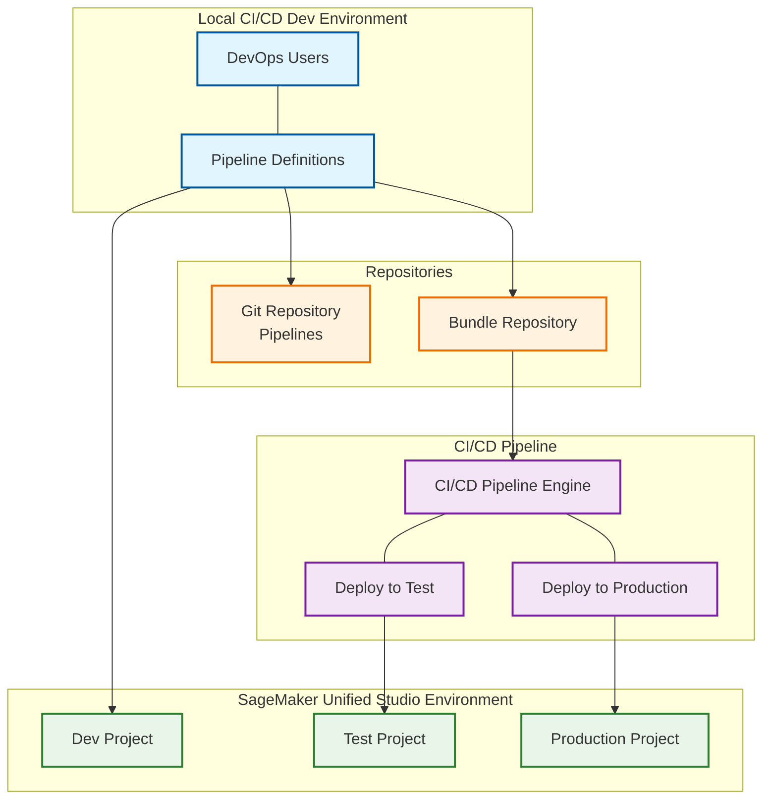

# SMUS CI/CD Pipeline Architecture

← [Back to Main README](../README.md)

## Pipeline Architecture Diagram

## Key Components

### 1. Local CI/CD Dev Environment
- **DevOps Users**: Engineers developing and managing pipelines
- **Pipeline Definitions**: YAML manifests and configuration files
- **Connected to**: Git repositories and bundle storage

### 2. SageMaker Unified Studio Environment  
- **Dev Project**: Development and experimentation
- **Test Project**: Integration testing and validation
- **Production Project**: Live production deployment

### 3. CI/CD Pipeline
- **CI/CD Pipeline Engine**: Automated deployment orchestration
- **Deploy to Test**: Automated test environment deployment
- **Deploy to Production**: Automated production deployment
- **Source**: Bundle repository

### 4. Repositories
- **Git Repository (Pipelines)**: Version control for pipeline definitions
- **Bundle Repository**: Packaged deployment artifacts

## Workflow
1. DevOps users create pipeline definitions locally
2. Definitions are committed to Git repository
3. Bundles are created and stored in bundle repository
4. Dev project receives direct deployments for development
5. CI/CD pipeline pulls bundles and deploys to test and production projects
