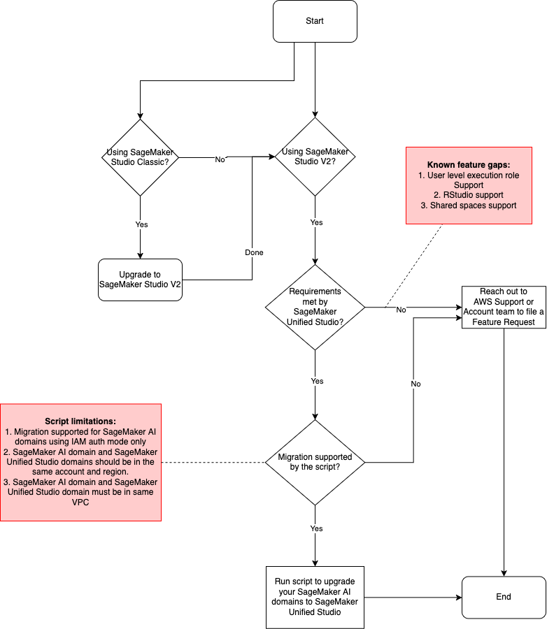

# Migrate SageMaker AI Domains to SageMaker Unified Studio

This directory contains python scripts and step-by-step guide to help [SageMaker Studio](https://docs.aws.amazon.com/sagemaker/latest/dg/studio-updated.html) users migrate their AI domains to [SageMaker Unified Studio](https://docs.aws.amazon.com/sagemaker-unified-studio/latest/userguide/what-is-sagemaker-unified-studio.html), 
which offers a unified web-based development experience that integrates AWS data, analytics, artificial intelligence (AI), and machine learning (ML) services, as well as additional tools and resources.

This will allow users to:
1. Import SageMaker AI domain, along with its associated user profiles and spaces, into the target SageMaker Unified Studio domain.
2. Import other SageMaker AI resources that were accessible in SageMaker Studio, like training jobs, models, inference endpoints, ML pipelines etc., into SageMaker Unified Studio.
3. Retain access to the same resources from SageMaker Studio and SageMaker Unified Studio, until users familiarize themselves with the new experience. It is up to SageMaker AI domain administrators to disable access to SageMaker Studio, once the users are comfortable with the new experience.

## Considerations and Limitations

NOTE: Please review this section carefully before you proceed with executing the migration scripts.

1. Migration is only supported for SageMaker AI domains configured with IAM authentication mode.
2. Migration does not support SageMaker AI domains with user-profile level execution roles.
3. Migration script creates the target Unified Studio project in which to import SageMaker AI domain. It does not support import into a project pre-created from SageMaker Unified Studio.
4. If you are using SageMaker Studio features like RStudio, Shared Spaces etc., note that these are not supported in SageMaker Unified Studio currently.
5. Unified Studio domain and SageMaker AI domain must be in the same AWS region and account, cross-account or cross-region migration is not currently supported.
6. Unified Studio domain must be configured with the same VPC as SageMaker AI domain, to avoid networking issues with different VPCs in the two domains.

Refer the diagram below to figure if your SageMaker AI domains are ready to be migrated to SageMaker Unified Studio experience.



## Prerequisites

### Required Permissions:

1. You need the following IAM permissions to execute the script for configuring permissions and customizing role assignments. 
  - If you have an existing IAM user with these permissions, use it for running the script. If not, then create a new IAM policy with the following permissions.
  - The example below uses wildcard ARNs for Resource as applicable to the corresponding Actions, but you can restrict it according to your security requirements. 
  - These permissions are not needed once you complete executing the script.

```
{
    "Version": "2012-10-17",
    "Statement": [
        {
            "Sid": "DataZone",
            "Effect": "Allow",
            "Action": [
                "datazone:ListSubscriptions",
                "datazone:ListSubscriptionGrants",
                "datazone:UpdateSubscriptionTarget",
                "datazone:ListEnvironments",
                "datazone:ListSubscriptionTargets",
                "datazone:AssociateEnvironmentRole",
                "datazone:ListSubscriptionRequests",
                "datazone:GetEnvironment",
                "datazone:CreateSubscriptionGrant",
                "datazone:CreateProjectMembership",
                "datazone:DeleteSubscriptionGrant",
                "datazone:GetSubscriptionGrant",
                "datazone:ListEnvironmentBlueprints",
                "datazone:GetEnvironmentBlueprintConfiguration",
                "datazone:CreateProject",
                "datazone:CreateProjectProfile",
                "datazone:GetDomain",
                "datazone:GetProject",
                "datazone:ListProjectProfiles",
                "datazone:AddPolicyGrant",
                "datazone:SearchUserProfiles",
                "datazone:ListDomains"
            ],
            "Resource": [
                "arn:aws:datazone:*:*:domain/*"
            ]
        },
        {
            "Sid": "DatazoneDisassociateRole",
            "Effect": "Allow",
            "Action": [
                "datazone:GetEnvironmentRole",
                "datazone:ListEnvironmentRoles",
                "datazone:DisassociateEnvironmentRole"
            ],
            "Resource": [
                "*"
            ]
        },
        {
            "Sid": "Glue",
            "Effect": "Allow",
            "Action": [
                "glue:GetDatabase",
                "glue:GetTable"
            ],
            "Resource": [
                "arn:aws:glue:*:*:catalog",
                "arn:aws:glue:*:*:database/*",
                "arn:aws:glue:*:*:table/*"
            ]
        },
        {
            "Sid": "IAM",
            "Effect": "Allow",
            "Action": [
                "iam:GetRole",
                "iam:UpdateAssumeRolePolicy",
                "iam:PassRole",
                "iam:ListRoleTags",
                "iam:ListAttachedRolePolicies",
                "iam:TagRole",
                "iam:ListRoles",
                "iam:AttachRolePolicy",
                "iam:PutRolePolicy",
                "iam:ListRolePolicies",
                "iam:GetRolePolicy",
                "iam:GetPolicy",
                "iam:GetPolicyVersion",
                "iam:CreatePolicyVersion"
            ],
            "Resource": [
                "arn:aws:iam::*:role/*",
                "arn:aws:iam::*:policy/*"
            ]
        },
        {
            "Sid": "KMS",
            "Effect": "Allow",
            "Action": [
                "kms:Decrypt",
                "kms:GenerateDataKey",
                "kms:CreateGrant",
                "kms:ListGrants",
                "kms:DescribeKey",
                "kms:ListKeys",
                "kms:ListAliases"
            ],
            "Resource": [
                "arn:aws:kms:*:*:key/*",
                "arn:aws:kms:*:*:alias/*"
            ]
        },
        {
            "Sid": "Lakeformation",
            "Effect": "Allow",
            "Action": [
                "lakeformation:GrantPermissions",
                "lakeformation:ListLakeFormationOptIns",
                "lakeformation:ListPermissions",
                "lakeformation:CreateLakeFormationOptIn",
                "lakeformation:ListResources",
                "lakeformation:UpdateResource",
                "lakeformation:GetDataAccess"
            ],
            "Resource": [
                "arn:aws:lakeformation:*:*:resource/*",
                "arn:aws:lakeformation:*:*:catalog:*"
            ]
        },
        {
            "Sid": "SageMaker",
            "Effect": "Allow",
            "Action": [
                "sagemaker:AddTags",
                "sagemaker:DescribeApp",
                "sagemaker:DescribeDomain",
                "sagemaker:DescribeUserProfile",
                "sagemaker:ListApps",
                "sagemaker:ListDomains",
                "sagemaker:ListSpaces",
                "sagemaker:ListTags",
                "sagemaker:ListUserProfiles",
                "sagemaker:DeleteTags",
                "sagemaker:UpdateDomain"
            ],
            "Resource": [
                "arn:aws:sagemaker:*:*:domain/*",
                "arn:aws:sagemaker:*:*:user-profile/*",
                "arn:aws:sagemaker:*:*:app/*",
                "arn:aws:sagemaker:*:*:space/*"
            ]
        },
        {
            "Effect": "Allow",
            "Action": [
                "tag:GetResources"
            ],
            "Resource": "*"
        }
    ]
}
```

2. In the AWS Lake Formation console, add the executor IAM user (with the above permissions) as a Data Lake Administrator. This is required for running the [bring-your-own-role script](https://github.com/aws/Unified-Studio-for-Amazon-Sagemaker/tree/main/migration/bring-your-own-role), which is a dependency for SageMaker AI migration.

### Pre-Migration Template Generation

Execute `ai_domain_pre_migration.py` to create a migration template. 
```bash
python3 ai_domain_pre_migration.py \
    --account-id <account_id> \
    --region <region_name>
```

The script will:

1. Generate a CSV file containing:
   - Existing SageMaker AI domain information
   - User Profile Names in the SageMaker AI domain
   - Empty columns for:
      - SageMaker Unified Studio Domain Name (SMUSDomainName)
      - SageMaker Unified Studio Project Name (SMUSProjectName)
      - SageMaker Unified Studio User Name (SMUSUserName)
      - SageMaker Unified Studio User Role (SMUSUserRole) 
        - Note: By default, all users will be assigned `PROJECT_CONTRIBUTOR`, 
        - For each Unified Studio Project, please ensure atleast one of the Unified Studio users is set as `PROJECT_OWNER` before Migration script is run
2. Fill up the empty columns generated by the pre-migration script to indicate which SageMaker AI Domain should be mapped to which Unified Studio Domain and Project. 
3. Each SageMaker AI domain must be mapped to a single Unified Studio Project.
4. Each SageMaker AI User within a domain should be mapped 1:1 with Unified Studio User.

#### Important Note
- The `MigrationStatus` column is used internally by the script to track migration progress.
Do not modify this column as it determines whether a SageMaker AI domain has been successfully migrated.
- If you're retrying the migration script using a previously attempted configuration file, please ensure the following:
    1. First, ensure that the errors that caused the initial failure are fixed
    2. Then, locate any rows marked as "Failed" in your configuration file
    3. Update their status from "Failed" to "Pending"
  This status reset is necessary because the script only processes entries with "Pending" status, ensuring previously failed migrations are attempted again.

### Source SageMaker AI Domain Requirements:
1. An existing SageMaker AI domain in InService state, fitting the considerations defined above.
2. Intent to migrate the domain to SageMaker Unified Studio.
3. Ensure that this SageMaker AI domain is not associated with another Unified Studio project.

### Target SageMaker Unified Studio Domain Requirements:
If using an existing Unified Studio domain:
1. Tooling Blueprint must be enabled for the domain.
2. Domain must be properly configured for Unified Studio.
3. IAM Identity Center (AWS SSO) or an external Identity Provider (IdP) must be enabled.
4. Domain must be configured with proper authentication settings.
5. Please make sure all the required SSO Users are assigned to your Unified Studio domain before running the script.
   - If your domain requires assignment of users, assign them to the domain from SageMaker [console](https://console.aws.amazon.com/datazone).
   - If your domain does not require assignment of users, make sure that the user has logged in atleast once from SageMaker Unified Studio for them to be assigned to the domain automatically.
   - Refer [Managing Users in SageMaker Unified Studio](https://docs.aws.amazon.com/sagemaker-unified-studio/latest/adminguide/user-management.html) for more information.

Refer [AWS doc](https://docs.aws.amazon.com/sagemaker-unified-studio/latest/adminguide/create-domain-sagemaker-unified-studio-manual.html) for instructions on Unified Studio domain setup from AWS console.

[This directory](https://github.com/aws/Unified-Studio-for-Amazon-Sagemaker/tree/main/cloudformation/domain) also provides cloudformation templates for setting up and configuring a new SageMaker Unified Studio domain.

### User Mapping:
1. Plan your user mapping strategy, i.e. identify which SageMaker AI user-profiles will map to which Unified Studio users.
2. Ensure all required users have appropriate permissions. Migration currently supports only AI domain level execution role, which will be imported as Unified Studio project role.

## Usage

Navigate to the directory containing `ai_domain_migration.py` in the terminal before executing commands.
Run the migration script, which provides detailed logs to help follow the migration steps:

```bash
python3 ai_domain_migration.py \
    --account-id <account_id> \
    --region <region_name> \
    --migration-config-file <file-path-of-the-pre-migration-template-generated-above> \ 
    --iam-profile <AWS-credentials-profile-you-wish-to-use>
```

The `--iam-profile` parameter is optional. When provided, the script uses credentials from the specified AWS profile. 
Otherwise, falls back to default AWS credential resolution (environment variables, default profile, or instance role).

## Important Notes on Post-Migration Experience

1. As a result of migration, end users will be able to access SageMaker AI domain and underlying spaces from both SageMaker Unified Studio and SageMaker Studio. It is upto the administrators to disable SageMaker Studio access once the users are familiarized with Unified Studio experience.
2. As a result of migration, end users will also be able to access other SageMaker AI resources like training jobs, models, inference endpoints, ML pipelines etc. from Unified Studio, that they could access from SageMaker Studio.
3. While the same spaces and associated persistent data will be accessible from both the portals, users will be able to run the space from only one portal at a time.
   Both the portals will detect whether the space is running in the other portal and prompt the user to restart their space to access from the current portal they are accessing.
4. After migration, administrators are recommended not to create new user-profiles directly from SageMaker AI console. New users should be added via SageMaker Unified Studio domain.
5. After migration, end users are recommended not to create spaces from SageMaker Studio as these spaces will not be accessible from Unified Studio.

⚠️ Warning: Verify your SageMaker AI domain Execution Role has `tag:GetResources` permissions.
- These permissions are essential for discovering and viewing your SageMaker AI resources from SageMaker Unified Studio.
- This API action requires `"Resource": "*"` in the IAM policy as it does not support specifying specific resource ARNs.
- This API grants ReadOnly access to all resource ARNs and associated tags in the account
- For detailed information about IAM policies for Resource Groups Tagging API, refer to the [AWS documentation](https://docs.aws.amazon.com/service-authorization/latest/reference/list_amazonresourcegrouptaggingapi.html#amazonresourcegrouptaggingapi-resources-for-iam-policies)

Example policy statement:
```json
{
    "Effect": "Allow",
    "Action": [
        "tag:GetResources"
    ],
    "Resource": "*"
}
```